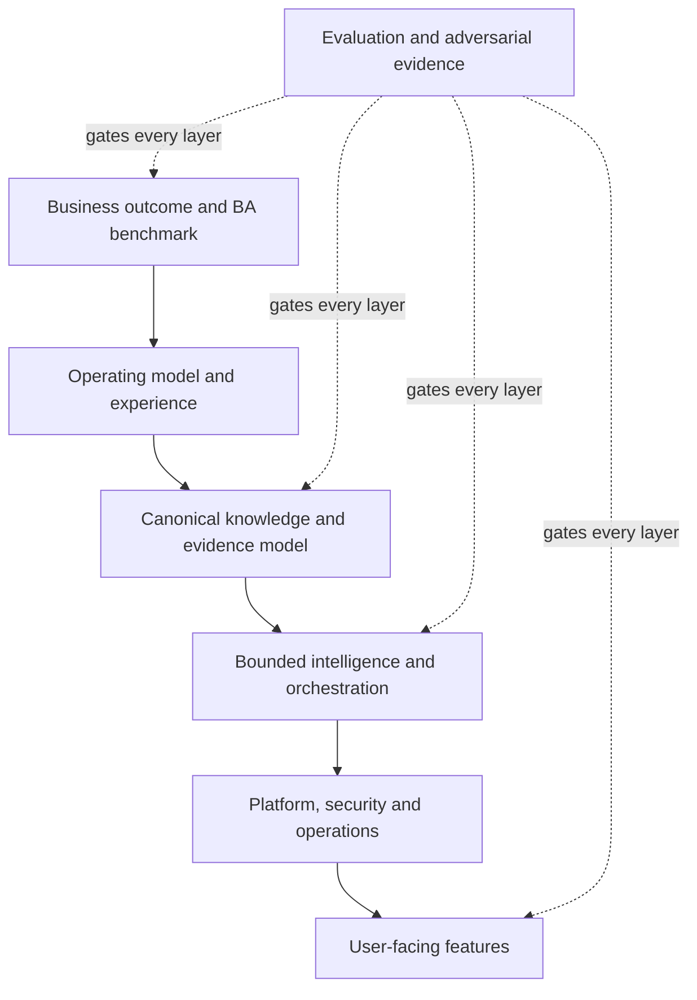

# CollabX design corpus

Status: normative · Baseline: `design-v2` · Effective: 2026-08-11 · Owner: product/architecture council

Read [documentation control and precedence](governance/document-control.md) before using this corpus for implementation. It identifies normative, provisional, delivery, research and historical documents and resolves authority when statements overlap.

## Reading paths

| Reader | Sequence |
|---|---|
| Founder/product | [Vision](product/vision.md) → [BA operating model](product/ba-operating-model.md) → [Full capability map](product/end-to-end-capability-map.md) → [Roadmap](delivery/roadmap.md) |
| BA/product/design | [Artefacts and gates](product/artefacts-traceability-and-gates.md) → [Facilitation](product/conversation-survey-and-facilitation.md) → [Experience](experience/discovery-and-prototyping.md) → [Information architecture](experience/information-architecture-and-design-system.md) |
| Architect | [System architecture](architecture/system-architecture.md) → [Data model](architecture/data-and-knowledge-model.md) → [Integrations](architecture/integration-and-interoperability.md) → [AWS platform](architecture/aws-platform.md) → [AWS operations](architecture/aws-security-resilience-operations.md) |
| AI engineer | [Agents/memory/RAG](intelligence/agents-memory-rag.md) → [Model-agent lifecycle](intelligence/model-agent-and-evaluation-lifecycle.md) → [Evaluation](research/evaluation-and-experiments.md) |
| Software engineer | [Implementation blueprint](engineering/implementation-blueprint.md) → [API/event/state catalogue](engineering/api-event-and-state-catalogue.md) → [Engineering controls](engineering/contracts-observability-security.md) → [NFRs](engineering/non-functional-requirements.md) → [Verification](engineering/verification-strategy.md) |
| Risk/research | [Document control](governance/document-control.md) → [Enterprise controls](governance/enterprise-control-framework.md) → [Technology decisions](research/technology-decisions.md) → [Research sources](research/sources.md) → [Risk register](governance/risk-register.md) → [Gap audit](research/gap-and-coverage-audit.md) → [Completion audit](research/completion-audit.md) |
| Delivery/AI coding agent | [Roadmap](delivery/roadmap.md) → [Build sequence](delivery/build-sequence-and-dependency-graph.md) → [AI playbook](delivery/ai-implementation-playbook.md) → [Backlog](delivery/backlog.md) |

The scope of the destructive redesign is recorded in the [reset manifest](governance/reset-manifest.md).

## Design hierarchy

## Documentation rules

1. Every assertion is one of: observed fact, cited external evidence, stakeholder statement, hypothesis, inference, decision, or superseded claim.
2. Architecture decisions state alternatives, reversal trigger, and validation evidence.
3. “Memory”, “understands”, “autonomous”, and “correct” are never used without an operational definition.
4. Diagrams describe the same canonical entities and state vocabulary as prose.
5. Roadmap items produce evidence; task completion without a gate result is not progress.
6. Markdown links are checked in CI when implementation begins. Dated sources are revalidated quarterly.
7. Implementation agents follow the build sequence and task dossier; prose principles never override typed contracts or accepted ADRs.
8. Document status and precedence are defined only by the document-control registry; historical audits never override active specifications.

## Canonical vocabulary

| Term | Meaning |
|---|---|
| Engagement | Bounded body of BA work for a business change |
| Claim | A proposition whose status and provenance are tracked |
| Evidence | Immutable source span or observation supporting/challenging a claim |
| Knowledge item | Versioned concept, rule, process, requirement, decision, risk, or relationship |
| Domain pack | Reviewed vocabulary, ontology constraints, policies, examples, tests, and elicitation patterns for a domain |
| Work graph | Durable state machine for an engagement |
| Cognitive run | Bounded agent execution within one work-graph step |
| Baseline | Approved, immutable snapshot of mutually consistent knowledge items |
| Sufficiency | Measured readiness for a named decision—not generic confidence |
