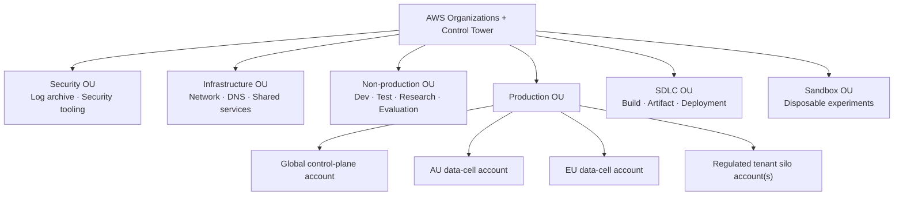
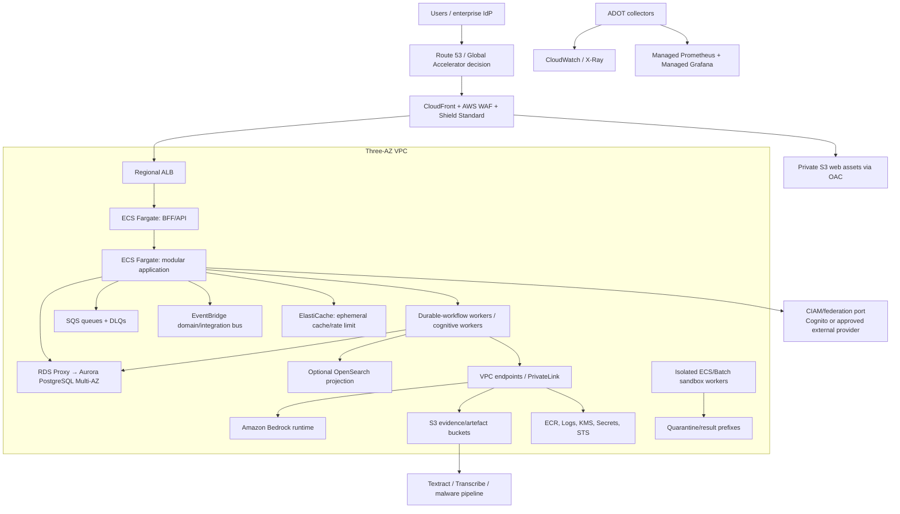

# AWS enterprise platform architecture

Status: provisional normative · Baseline: `design-v3` · Effective: 2026-08-11 · Owner: cloud architecture council

Validate service availability, quotas and pricing in each target Region before ADR acceptance.

## Deployment intent

CollabX runs as a globally governed SaaS with independently deployable **regional data cells**. A tenant is pinned to a home cell; its source content, prompts, embeddings, knowledge, telemetry payloads and backups stay inside its approved residency boundary. The global control plane contains only tenant routing, commercial metadata, deployment catalogues and non-sensitive health summaries.

Multi-AZ is mandatory. Multi-Region is selected by explicit regulatory, latency or disaster-recovery need; AWS guidance notes that a well-designed multi-AZ Region is sufficient for many workloads and that multi-Region adds cost and consistency complexity ([AWS multi-Region guidance](https://docs.aws.amazon.com/prescriptive-guidance/latest/security-reference-architecture/multi-region-architecture.html)).

## Organisation and accounts

AWS accounts are hard boundaries. Separate production from non-production, security administration from workload operation, and build provenance from runtime. Control Tower establishes the landing zone; Organizations SCPs restrict Regions/services, prohibit disabling security logs, constrain public resources and protect KMS/backup controls ([account separation](https://docs.aws.amazon.com/wellarchitected/latest/security-pillar/aws-account-management-and-separation.html)). Root users have hardware MFA and monitored break-glass only.

## Regional cell

Only CloudFront and the ALB are internet-reachable. Application, worker, database, cache and endpoints use private subnets across three AZs. Security groups reference security groups, not broad CIDRs. Egress is routed through inspected, allowlisted paths; AI and connector workers have distinct egress policies. Use VPC Flow Logs, DNS query logging and Reachability Analyzer.

## Service selection and responsibility

| Capability | AWS baseline | CollabX responsibility / caveat |
|---|---|---|
| Edge/DNS | Route 53, CloudFront, WAF, Shield Standard, ACM | tenant-home routing, rate/bot rules, CSP/HSTS, fail-closed residency |
| Web/API | S3 private origin, ALB, ECS Fargate | React assets; streaming/WebSocket-capable BFF; health/readiness |
| Container registry | ECR + Inspector enhanced scanning | immutable digest promotion, SBOM/signature and critical-CVE gates |
| Transactional data | Aurora PostgreSQL provisioned, Multi-AZ; RDS Proxy | bitemporal/RLS schema, migrations, PITR; do not start on Limitless because Proxy, Global DB and Backup constraints exist |
| Vector retrieval | pgvector in Aurora initially | exact baseline, HNSW only after recall tests; tenant/time/ACL filtering |
| Search | PostgreSQL FTS initially; OpenSearch Serverless only after X06 | rebuildable index; collection access policies do not replace row/tenant controls |
| Graph | relational edge model initially; Neptune optional | projection only; benchmark traversal and tenant isolation before adoption |
| Object evidence | S3, KMS, Object Lock where required | separate quarantine/original/derived/export/log buckets and policies |
| Cache | ElastiCache Redis/Valkey | non-authoritative sessions, locks, quotas and short cache; encryption/auth/failover |
| Async | SQS FIFO/standard + DLQ; EventBridge | commands vs facts, dedupe, ordering scope, replay/archive policy |
| Durable work | Temporal Cloud with private connectivity where acceptable, or self-hosted Temporal on ECS/EKS after spike | long-lived workflow semantics, encryption codec, namespace/environment isolation |
| AI models | Bedrock Converse/InvokeModel via VPC endpoint | own gateway, model routing, context, contracts, evaluation and fallback |
| Safety | Bedrock Guardrails plus CollabX policy/evidence gates | Guardrails are defence in depth; contextual grounding has use-case limitations; automated reasoning is detect-only |
| Document AI | Textract; Transcribe/MediaConvert as needed | confidence thresholds, exact anchors, human verification, consent/retention |
| Preview/code sandbox | isolated ephemeral ECS/Batch workers and separate restricted preview origin | no ambient credentials/general network; exact repository base/path/dirty-state; pinned dependencies; resource/expiry limits; scanned output and structured tool/patch receipts |
| Secrets/keys | Secrets Manager, KMS, ACM Private CA if needed | per-service roles, rotation, key policy, tenant CMK tier |
| Identity | Cognito federation/CIAM or customer IdP; IAM Identity Center for workforce | immutable tenant binding, SCIM/JIT, step-up MFA, session revocation |
| Authorisation | Engine-neutral PDP + RLS; Verified Permissions is the favoured managed candidate | T2.06 compares AVP/embedded Cedar/OPA; PEP in every ingress/service/tool |
| Telemetry | ADOT, CloudWatch, X-Ray, AMP, Managed Grafana | content-off defaults, trace correlation, SLOs, evaluation and audit separation |
| Security | CloudTrail, Config, GuardDuty, Security Hub, Inspector, Macie, Access Analyzer | organisation aggregation, triage/runbooks, evidence retention |
| Backup/DR | AWS Backup, Aurora PITR/Global DB where chosen, S3 versioning/CRR | application-consistent restore, quarterly game days, deletion/legal-hold policy |
| Delivery | GitHub OIDC or CodePipeline, CodeBuild, ECR, CDK/CloudFormation | isolated build account, provenance, policy-as-code, progressive deployment |

## Tenant deployment tiers

| Tier | Compute | Data | Key/policy | Use |
|---|---|---|---|---|
| Pool | shared services with tenant context | shared cluster, RLS/partition, prefixed S3 | cell CMK, pooled policy store | standard tenants |
| Bridge | shared stateless compute | tenant DB/schema/bucket/access point | tenant CMK and optional policy store | enhanced isolation/residency |
| Silo | dedicated account/cell stack | dedicated Aurora/S3/index | tenant-owned or dedicated CMKs | regulated, very large or contractual isolation |

Partitioning is not isolation. Tenant identity is bound at authentication, signed into service context, revalidated at each policy enforcement point, and included in DB session/RLS, cache/queue keys, S3 access, search filters, traces and budgets. AWS likewise distinguishes data partitioning from tenant isolation ([SaaS data partitioning](https://docs.aws.amazon.com/prescriptive-guidance/latest/multi-tenancy-amazon-neptune/data-partitioning-models.html)).

## Network and private access

- Create interface endpoints for Bedrock runtime, ECR API/DKR, CloudWatch Logs, KMS, Secrets Manager, STS and other supported services; gateway endpoint for S3. Bedrock recommends PrivateLink to keep calls on AWS networking ([Bedrock endpoints](https://docs.aws.amazon.com/bedrock/latest/userguide/endpoints.html)).
- Deny resources outside approved VPC endpoints with endpoint/resource policies where supported.
- Use NAT only for explicit external SaaS connectors; route through Network Firewall/proxy with domain allowlists and separate subnets/roles.
- Cross-account access uses STS external IDs/resource policies or PrivateLink; never static keys or transitive peering.
- Administrative database access uses SSM Session Manager through audited roles, not public bastions.

## Storage layout

Buckets are separated by risk and lifecycle: `landing-quarantine`, `original-evidence`, `derived-renditions`, `published-exports`, `model-eval`, `audit-log`, and `backup-vault`. Enable Block Public Access organisation-wide, bucket-owner-enforced ownership, TLS-only, SSE-KMS/DSSE-KMS where required, versioning, access logs/data events, lifecycle transitions and Object Lock for immutable audit evidence. AWS recommends disabled ACLs, Block Public Access, roles, TLS and versioning ([S3 security](https://docs.aws.amazon.com/AmazonS3/latest/userguide/security-best-practices.html)).

Presigned upload URLs are short-lived and bind tenant, expected content type/size/checksum and quarantine prefix. Promotion occurs only after malware, file-signature, decompression-bomb, DLP and parser-sandbox checks.

## Model plane

Use Bedrock as the first provider behind a `ModelGateway`; allow approved external providers only through a controlled egress adapter. Bedrock provider model vendors do not have access to customer prompts/completions in Bedrock deployment accounts, but CollabX remains responsible for configuration and data minimisation ([Bedrock data protection](https://docs.aws.amazon.com/bedrock/latest/userguide/data-protection.html)).

The current local research/evaluation profile is Azure OpenAI-compatible, not Bedrock. It exercises the provider-neutral contract using the variables defined in [model provider and environment profiles](../engineering/model-provider-and-environment-profiles.md). Its results qualify only the exact Azure deployments and capability manifests tested. Before AWS production, the same conformance, safety, quality, residency, quota, latency and cost suites must pass against the selected Bedrock model route; equivalence is never assumed.

Model invocation logging of full content is disabled by default because it can copy prompts, completions and documents to CloudWatch/S3. Emit application-owned metadata traces; enable restricted sampling only with purpose, classification, expiry and dedicated KMS bucket. AWS documents that invocation logging can capture full payloads and is disabled by default ([invocation logging](https://docs.aws.amazon.com/bedrock/latest/userguide/model-invocation-logging.html)).

## Scaling and quotas

Scale APIs on request concurrency/latency, workers on queue age and weighted token backlog, sandbox workers on job queue, and databases on measured connections/CPU/I/O/replica lag. Enforce tenant concurrency and cost quotas before shared capacity. Reserve Bedrock throughput only after utilisation economics; request quotas through IaC/account vending before launch. Backpressure degrades to queued analysis and human workflows, never uncontrolled retries.

## Environment promotion

Ephemeral preview → integration → evaluation → staging → production. Production receives the exact signed image digest, schemas, migrations, prompts, policies, domain packs and evaluation manifest proven in staging. ECS blue/green deployment supports validation, traffic shifting, bake time and rollback; budget temporary double capacity ([ECS blue/green](https://docs.aws.amazon.com/AmazonECS/latest/developerguide/deployment-type-blue-green.html)). Database expand/migrate/contract spans releases and remains backward compatible during bake/rollback.
