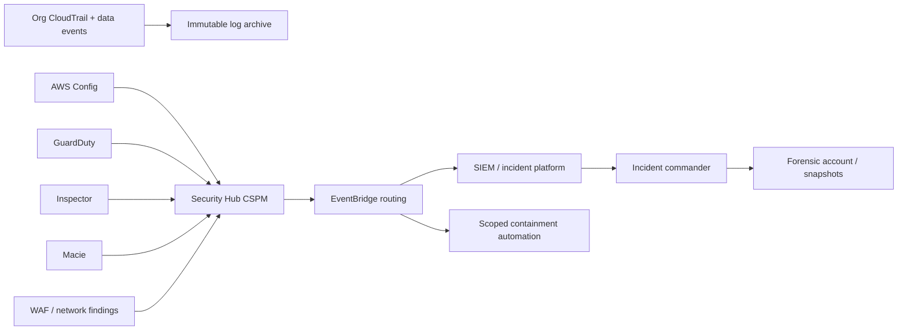

# AWS security, resilience, and operations

Status: normative · Baseline: `design-v3` · Effective: 2026-08-12 · Owner: security and reliability councils

## Preventive control baseline

At organisation level, deny unapproved Regions, public S3/RDS, disabling CloudTrail/Config/GuardDuty/Security Hub, unencrypted storage, unapproved Bedrock models, IAM users/access keys, and KMS/backup-vault deletion outside break-glass. Use Control Tower controls plus custom SCPs and resource control policies. Exceptions are tagged, time-bound, ticket-linked and detected continuously.

## Key hierarchy

- Separate CMKs for database, evidence, logs, backups, evaluation and secrets per cell/environment.
- Silo/contractual tenants receive dedicated CMKs; customer-managed/external key store is a separately priced tier.
- Key policies grant workload roles directly and deny broad administrators decrypt access.
- Rotation, grants, multi-Region key choice, pending-deletion alarms and cryptographic erasure implications are documented.
- Encryption context includes tenant/cell/purpose where the service supports it; never sensitive plaintext in aliases/tags.

## Detection and response flow

High-confidence containment can quarantine an ECS task/image, revoke a connector grant, block a WAF indicator or disable one agent/tool version. Account isolation, KMS disablement and destructive evidence actions require incident-authority approval except a pre-authorised existential breach scenario. Preserve chain of custody and tenant notification evidence.

## Availability classes

| Class | Examples | Contract source | Design |
|---|---|---|---|
| A interactive | authentication, project/evidence read, answer autosave | NFR AVL-01 | multi-AZ, redundant tasks, ALB, Aurora failover, graceful AI degradation |
| B orchestration | accepted commands, workflow signals, approvals | NFR AVL-01 and AVL-02 | durable DB/outbox/SQS/workflow runtime, idempotent replay |
| C intelligence | model, retrieval, prototype generation | NFR AVL-05 and approved tier contract | queued, multi-model fallback, partial results, human/manual path |
| D batch | re-index, evaluation, exports | approved tier contract | checkpoint, retry/DLQ, Fargate Spot only if interruption-safe |

The [non-functional requirements](../engineering/non-functional-requirements.md) are the sole numeric SLO catalogue. SLOs are measured from the user boundary. Dependency SLAs inform but do not establish CollabX availability.

## Failure-mode design

| Failure | Behaviour | Recovery evidence |
|---|---|---|
| Bedrock model throttled/unavailable | bounded retry, alternate approved model, queue or human path | chaos injection; semantic equivalence gate |
| Aurora writer failover | reconnect through RDS Proxy, idempotent transaction retry | forced failover without duplicate effects |
| SQS duplicate/reorder | inbox dedupe and aggregate sequence/precondition | property-based replay test |
| durable-workflow worker deploy/crash | history replay; activities idempotent | kill during every activity boundary |
| bad prompt/model/domain pack | version pin, canary, disable switch, rollback | production-shadow regression alarm |
| poisoned upload | quarantine; no indexing/model context | malware/injection corpus |
| AZ loss | ALB/ECS rebalance, Aurora failover, cache multi-AZ | zonal game day |
| Region loss | tenant-tier DR route and warm cell/restore | annual regional game day |
| identity provider outage | existing short session policy or fail closed by risk | simulated IdP failure |
| connector outage/revocation | cursor checkpoint, exponential backoff, reconciliation | revocation and partial-page tests |

## DR strategies

The tenant contract records `availability_class`, RTO, RPO, recovery Region, residency permission and failover authority.

- Standard: backup/restore to an approved Region; targets follow NFR AVL-04.
- Business critical: pilot light/warm standby using an evidence-selected Aurora replication/restore strategy, S3 CRR and replicated ECR/config; targets follow NFR AVL-04 after validation.
- Mission critical: active/passive warm or active/active only if data conflict, workflow ownership and model availability are proven; custom targets.

Global data never fails over across a prohibited residency boundary. Route 53/ARC routing follows a runbook and recovery authority; health checks cannot autonomously move regulated data. Backups use cross-account vault lock, separate CMKs, PITR and restore validation. RPO/RTO are claims proved by game-day timestamps.

## Observability and SRE

ADOT emits traces/metrics/logs to region-local collectors. CloudWatch handles infrastructure logs/alarms and X-Ray trace storage; AMP/Managed Grafana provide SLO and workload views. Export to a customer/SIEM backend through a redacted, versioned pipeline. Separate:

- immutable audit facts (who did what under which authority);
- operational telemetry (health/performance);
- AI evaluation records (quality/safety/cost);
- product analytics (consented behaviour/outcomes).

Dashboards cover golden signals, workflow queue/age/stalls, Aurora saturation/replica lag, Bedrock quota/tokens/errors, retrieval quality, connector drift, sandbox failures, tenant noisy-neighbour share, SLO burn and unit economics. Pages must be actionable and link to a runbook/owner.

## Operational readiness review

Before production: service catalogue and owners; architecture/threat/privacy reviews; quota and load evidence; dashboards/alerts; runbooks; backup restore; region/AZ/model/connector chaos; security scanning and pen test; data lifecycle; customer support/escalation; on-call rota; capacity and cost forecast; dependency status handling; rollback; and signed residual-risk record.

## FinOps

Tag and CUR-allocate account, environment, cell, tenant tier, capability, model and evaluation workload without sensitive names. Track cost per validated decision, stakeholder hour saved, 1k indexed pages, cognitive run and tenant. Budgets/Anomaly Detection alert at account and capability levels. Optimise in order: eliminate waste/retries/context, model-route/cache/batch, right-size Fargate/Aurora, schedule non-prod, then commitments. Do not trade retrieval recall, isolation or audit retention for savings without a risk decision.

## Regional launch checklist

Confirm Bedrock model/guardrail feature availability, Textract/Transcribe language capability, service quotas, compliance scope, data transfer, KMS/backup/CloudTrail design, customer IdP, DNS/certificates, external connector endpoints, evaluation slices for locale/domain, support hours, legal documents and tested failover restrictions. A Region is not launch-ready because IaC deployed successfully.
