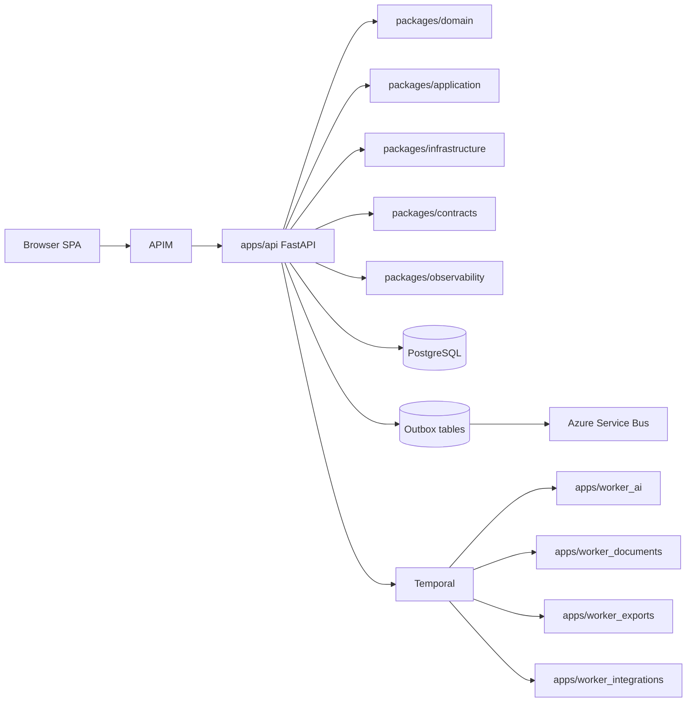

# Container View

The first deployable shape is a modular monolith for synchronous HTTP with independently deployable workers. Domain packages remain provider-free; infrastructure packages hold database, Azure, Temporal and identity adapters.

