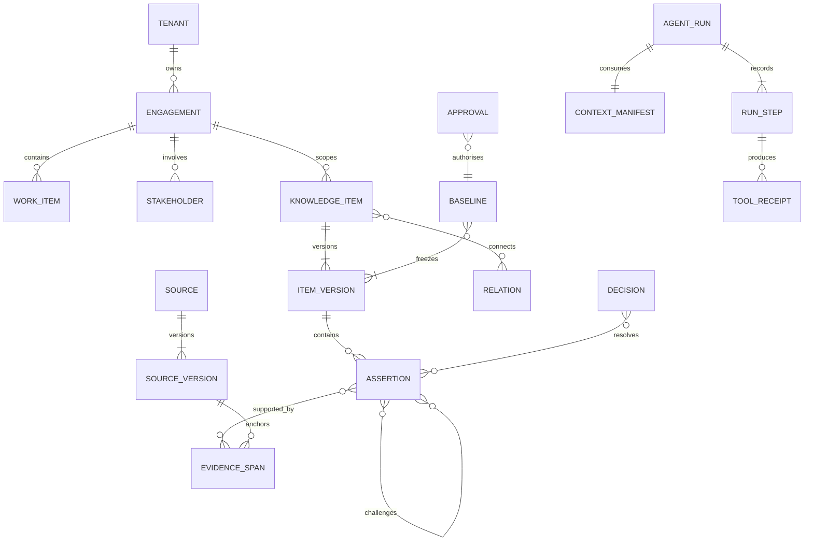
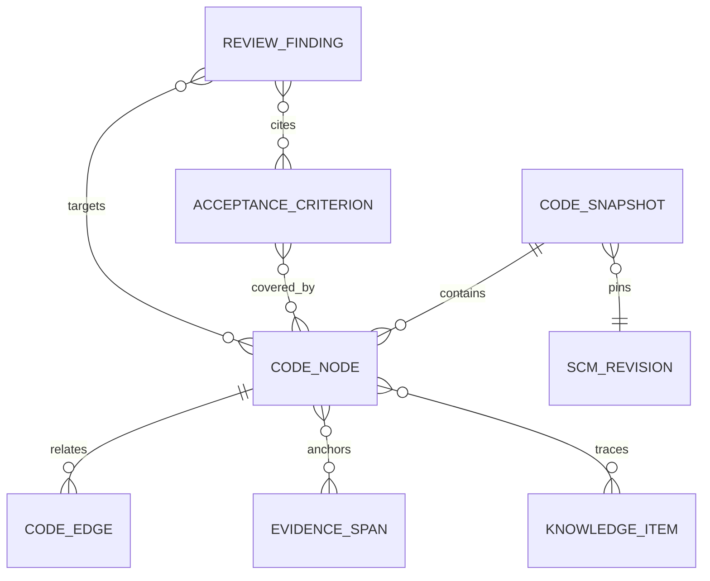

# Data and knowledge architecture

Status: normative · Baseline: `design-v3` · Effective: 2026-08-12 · Owner: data and architecture councils

## Persistence strategy

PostgreSQL is the transactional source of truth and initial retrieval platform; `pgvector` supports colocated exact and approximate similarity search while relational predicates enforce tenant, time, authority, and document ACL filters. Object storage holds immutable originals and derived renditions. A graph engine is a projection introduced only if measured multi-hop workloads exceed relational recursive-query performance. MongoDB is not baseline: a second operational database adds consistency and governance cost without a demonstrated access pattern.

Embeddings, search indexes, graph projections (including CodeKnowledgeGraph), caches, summaries, and generated artefacts are rebuildable projections. They never outrank the canonical record.

## Core model

Knowledge-item kinds include objective, outcome measure, capability, concept, term, actor, process, event, rule, policy, data entity, requirement, design, scenario, assumption, constraint, dependency, risk, issue, action, decision, question, integration, test, **code_symbol**, **code_module**, **config_object**, **ac_coverage**, and **review_finding**.

## CodeKnowledgeGraph

The CodeKnowledgeGraph is a versioned, tenant-ACL’d projection used by BA archaeology and coding/review agents. Canonical meaning of business rules and requirements remains in knowledge items; the graph supplies structural navigation and evidence anchors.

| Node kinds | Edge kinds |
|---|---|
| file, symbol, type, test, config_object, api_route, schema, erp_object, workflow_def, package | defines, references, calls, implements, tests, configures, depends_on, migrates, authorises |

Each snapshot pins `scm_revision` or `erp_export_id`, `index_generation_id`, content hashes and ACL. Reindex is incremental (Merkle/content-hash). Query paths must pre-filter by tenant/path/purpose.

### ERP / CRM / SAP evidence classes

| Class | Examples | Ingestion |
|---|---|---|
| `code_customization` | ABAP/exits, plugins, custom scripts | SCM or export adapter |
| `config_as_code` | YAML/XML/transportable config | SCM or system export |
| `metadata_catalog` | CRM entities/fields, SAP data dictionary | read API |
| `process_definition` | workflow templates, approval chains | read API / export |
| `integration_contract` | BAPI/RFC/IDoc/API maps | docs + code + adapter |
| `event_log_slice` | process-mining case/activity exports | read-only connector (Capability process intelligence) |

Extracted as-is statements become assertions with modality and citations; they do not auto-confirm.

## Bitemporal and epistemic model

Each version has `valid_from/valid_to` (when true in the business) and `recorded_at/superseded_at` (when CollabX knew it). This permits “what policy applied on date X?” and “what did we believe when decision Y was made?”. Append-only versions replace in-place semantic edits.

Every assertion carries:

- lifecycle: proposed, observed, inferred, confirmed, contested, rejected, superseded;
- modality: fact, definition, obligation, permission, prohibition, preference, prediction;
- scope: tenant, domain, process, jurisdiction, product, segment, scenario;
- confidence as calibrated probability or ordinal band plus method—not model vibes;
- authority and claimant distinct from recorder;
- supporting and challenging evidence;
- effective interval, sensitivity, retention class, and downstream impact.

## Provenance chain

Adopt W3C PROV concepts (Entity, Activity, Agent) internally and SKOS-style preferred/alternate labels; validate ontology projections with SHACL-like constraints. See [PROV-O](https://www.w3.org/TR/prov-o/), [SKOS](https://www.w3.org/TR/skos-reference/), and [SHACL](https://www.w3.org/TR/shacl/).

`source_version → exact evidence span → extraction activity → assertion → reviewed item version → decision/baseline → design/prototype → test → release outcome`

Code path: `scm_revision/erp_export → code_node/span → archaeology or review activity → assertion/review_finding → AC coverage → change_set/patch → test → promotion receipt`

An evidence span stores stable source ID/version, structural anchor, character/time/page/symbol coordinates, content hash, excerpt permitted by policy, extraction method, and access label. Re-parsing never silently moves an anchor.

## Enterprise semantic layer

The domain pack contains:

1. Lexicon: preferred terms, aliases, acronyms, forbidden ambiguity, language/locale.
2. Concept model: stable identifiers, definitions, types and scoped meanings.
3. Taxonomy/ontology: is-a, part-of, performs, governs, consumes, produces and domain relations.
4. Rules: natural-language statement plus decision-table/expression representation, exceptions and tests.
5. Evidence policy: authoritative-source ranking, expiry/freshness and conflict rules.
6. Elicitation library: domain risks, scenarios, stakeholder roles and question strategies.
7. Evaluation set: gold examples, counterexamples, ambiguity, historical changes and adversarial cases.

Automatic extraction proposes pack changes in a quarantine branch. A steward reviews definitions, merge/split, relationships and impacts; tests run; an authority publishes a semantic release. Domain learning is therefore progressive but controlled.

## Conflict and resolution

Conflicts are typed: direct negation, incompatible value, scope mismatch, temporal mismatch, authority disagreement, policy-versus-practice, goal conflict, or duplicate identity. The system must first test scope/time differences before declaring contradiction. Resolution is a decision record; evidence is retained, never rewritten to simulate consensus.

## Data quality contracts

| Dimension | Example invariant |
|---|---|
| Identity | stable IDs; aliases never used as keys |
| Completeness | approved requirement has owner, rationale, scenario, evidence and test |
| Validity | state transitions and relation endpoints pass versioned schema |
| Consistency | one active preferred term per concept/scope/locale |
| Timeliness | source freshness evaluated at retrieval and baseline |
| Lineage | every generated material claim resolves to evidence or unsupported label |
| Isolation | all rows and retrieval projections carry tenant and access partition |

## Retention and deletion

Classify content at ingestion. Consent, purpose, legal hold, residency, minimum retention, deletion due date and derived projections are recorded. Verified deletion traverses originals, chunks, embeddings, caches, summaries, exports and backups according to policy and emits a non-sensitive deletion certificate. Audit records prove the action without retaining deleted payloads.
