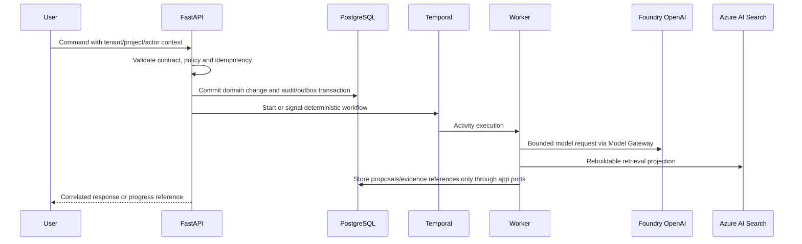

# Data Flow

Authoritative data lives in PostgreSQL and immutable blob versions. Search indexes, Redis caches, provider threads, LangGraph checkpoints and generated summaries are rebuildable projections.

