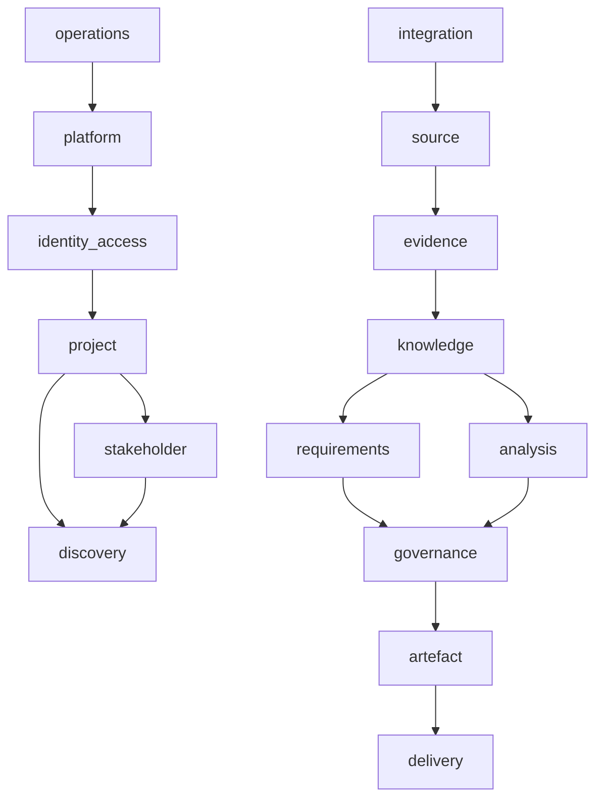

# Domain Dependencies

Dependency direction follows evidence accumulation and governance. Lower-level shared modules may expose ports and value objects, but domain modules do not import HTTP, SQL, Azure SDKs, mutable globals or provider-specific code.

