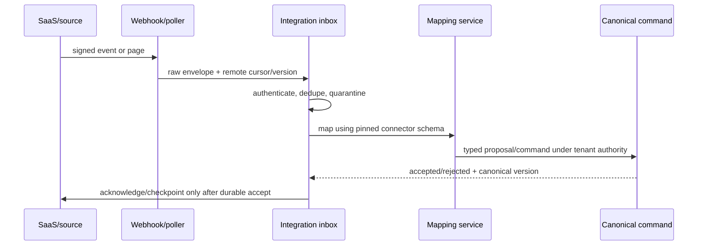

# Integration and interoperability architecture

Status: normative · Baseline: `design-v3` · Effective: 2026-08-11 · Owner: architecture council

## Connector principle

Connectors are untrusted boundary adapters. They never define canonical CollabX meaning and never grant an agent the end user’s full SaaS authority. Each connection is tenant-owned, purpose-scoped, least-privilege, revocable, observable and reconciled.

## Connector contract

| Area | Required fields/behaviour |
|---|---|
| Identity | connector/type/version, tenant, installing actor, service principal, owner |
| Authority | OAuth scopes/delegation, allowed resources/actions, purpose, expiry, step-up |
| Data | source classes, mapping/schema version, residency, classification, retention |
| Inbound | webhook signature/replay window or polling cursor, page/checkpoint, rate limit |
| Outbound | preview/diff, idempotency, expected remote version, approval and receipt |
| Reliability | timeout, retry/backoff/jitter, circuit breaker, DLQ, reconciliation |
| Security | secret reference, rotation/revocation, egress allowlist, content trust label |
| Operations | health, last success/cursor, lag, errors, quota, owner/runbook |

## Ingestion flow

Raw remote payload has limited retention and is never instruction-authoritative. Mapping failures preserve cursor and payload reference for review. Deletions/tombstones propagate according to source authority and CollabX legal-hold policy.

## Outbound/write flow

Agent proposes change → CollabX renders human-readable and machine diff → policy determines approval → connector checks current remote version → executes idempotently with scoped token → stores remote receipt/version → reads back/reconciles → records success/partial/conflict. Approval is invalidated if proposal, mapping, token scope or remote target version changes.

## Synchronisation semantics

Choose one ownership rule per field/entity: source-owned, CollabX-owned, or explicitly bidirectional. Bidirectional sync requires three-way merge between last common snapshot, remote and local; unresolved semantic conflicts enter review. Never use timestamp-only last-write-wins for requirements, decisions or approvals.

## Interface families

- Documents/files: SharePoint/OneDrive, Google Drive, S3 and secure upload; preserve remote IDs, versions, ACL snapshots and deletion.
- Work management: Jira, Azure DevOps, GitHub, Linear; map outcomes/requirements/release items while CollabX remains semantic authority.
- Communication: Teams/Slack/email/calendar; opt-in ingest, thread/message provenance, bot disclosure and send approval.
- CRM/portfolio: account/project/stakeholder references and outcomes; minimise personal data.
- Data/catalog/process: databases, APIs, data catalogues and process repositories through read-only views first.
- Identity: OIDC/SAML federation and SCIM provisioning/deprovisioning; tenant mapping cannot rely on email domain alone.
- Export: OpenAPI/AsyncAPI/JSON Schema, BPMN, CSV/XLSX, DOCX/PDF, trace manifests and audit streams.
- Code/design workspaces: GitHub/GitLab/Azure Repos and design-system/package registries through read/patch/PR-capable adapters; bind exact repository/ref/revision, path policy and approval. Start read-only or isolated worktree; never inherit a user’s unrestricted repository or CI/deployment authority.

## MCP and agent tools

MCP servers are registered, reviewed and pinned like connectors. Record publisher/origin, transport, auth audience/scopes, tool schemas, side effects, data destinations, timeouts, rate/cost, version/hash and test evidence. Tool descriptions and returned content are untrusted. Gateway validates arguments/results, binds tenant/actor/purpose, strips credentials, enforces confirmation and produces a receipt. Dynamic server discovery is prohibited in production.

## Webhook security

TLS, provider signature, timestamp/replay window, body-size/type limits, source/network signals where reliable, secret rotation overlap, event ID dedupe, quarantine and asynchronous acknowledgement. Do not perform domain mutation in the edge handler. Unknown event type/version is retained safely and alerts mapping ownership.

## Reconciliation

Scheduled and on-demand jobs compare remote inventory/version/hash with connector ledger and canonical mappings. Outcomes: consistent, remote-ahead, local-ahead, divergent, missing, unauthorised or mapping-invalid. Reconciliation is mandatory after token restoration, webhook gap, outage, mapping upgrade and bulk change.

Repository reconciliation compares the authorised base revision, inspected-file hashes, applied patch, generated artefacts and current remote ref. A changed base invalidates pending patch approval. Merge/commit/push/PR/deploy are distinct side effects with distinct receipts and authority.

## Connector certification

Contract fixtures; provider sandbox; scope-negative tests; signature/replay; pagination/rate limit; duplicate/reorder; partial batch; token expiry/revocation/rotation; schema drift; delete/tombstone; Unicode/large/adversarial content; network timeout; write conflict/read-back; tenant isolation; telemetry redaction; accessibility of consent/error UX; and uninstall/deletion.
