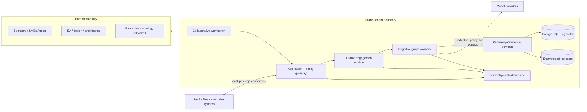
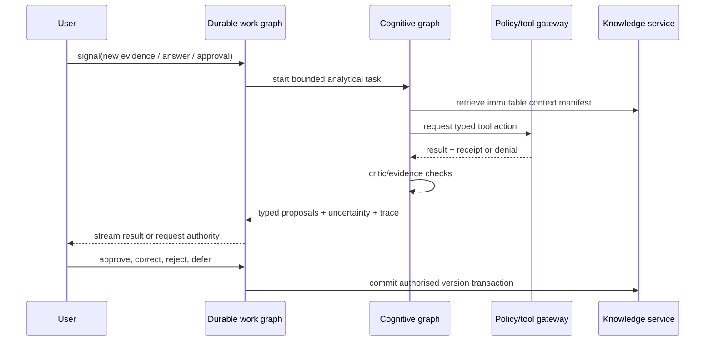
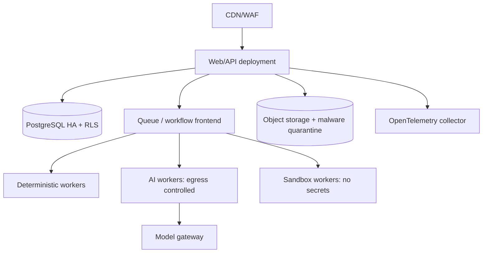

# System architecture

Status: normative · Baseline: `design-v3` · Effective: 2026-08-11 · Owner: architecture council

## Architectural thesis

CollabX is a data product with agentic interfaces. The canonical record is a temporal, provenance-rich work graph; agents are replaceable workers that read bounded context and submit typed change proposals. This prevents framework state, chat history, prompts, and embeddings from becoming accidental sources of truth.

## Context and trust boundaries

Trust boundaries exist at browser/API, tenant, connector, model provider, customer/repository workspace, worker sandbox, preview origin, object rendering, and telemetry export. Source and repository content are untrusted even when internal; instructions within them are scoped data, never authority to bypass platform security or the authorised change boundary.

## Logical components

| Component | Owns | Must not own |
|---|---|---|
| Experience shell | conversations, canvases, source viewer, reviews, prototypes | canonical knowledge |
| Engagement service | tenant/project/authority, work items, baselines, approvals | model-specific state |
| Knowledge service | claims, concepts, relations, evidence, temporal versions, retrieval | raw binaries |
| Elicitation service | plans, sessions, questions, coverage, fatigue/consent | final approval |
| Artefact/prototype service | projections, generated variants, annotations, diffs | source-of-truth requirements |
| Experience-generation service | intent/route/component/state graph, mock data, fidelity/change sets and validation evidence | silent approval or unrestricted repository access |
| Code-workspace gateway | authorised repository snapshot, scoped inspect/patch/validate tools and receipts | business meaning, credentials or implicit commit/push/deploy authority |
| Policy/tool gateway | identity, authorisation, budgets, schemas, idempotency, receipts | agent reasoning |
| Durable runtime | timers, retries, signals, compensation, long-lived lifecycle | semantic reasoning |
| Cognitive runtime | bounded plan/act/critique graph and specialist delegation | business authority |
| Evaluation plane | datasets, experiments, graders, releases, regressions | mutable production truth |
| Observability plane | traces, metrics, logs, audit correlation | unrestricted prompt content |

## Two-runtime model

Use Temporal (or a proven equivalent selected by experiment) for engagements that survive deploys, wait on humans, retry activities, and run for months. Use LangGraph-style state graphs for cognitive loops, checkpoints, interrupts, and specialist subgraphs. LangGraph documentation confirms checkpointed interrupts restart a node, so every side effect is isolated behind idempotent activities ([interrupts](https://langchain-ai.github.io/langgraph/how-tos/human_in_the_loop/breakpoints/), [persistence](https://langchain-ai.github.io/langgraph/concepts/time-travel/)).

## Deployment evolution

Start as a modular monolith plus isolated workers, one regional cell per data-residency boundary. PostgreSQL, object storage, queue, telemetry collector, and sandboxed render/browser workers are separate runtime concerns. Extract services only on measured scaling, isolation, ownership, or release-frequency pressure.

The concrete AWS account, network, compute, storage and model-service mapping is defined in [AWS enterprise platform architecture](aws-platform.md); security operations, availability, backup and disaster recovery are defined in [AWS security, resilience, and operations](aws-security-resilience-operations.md). Those documents govern cloud implementation over this provider-neutral view.

## Reliability invariants

- All writes are tenant-scoped and authorised at API and database policy layers.
- Every command has idempotency key; external effects have prepare/authorise/execute/receipt phases.
- Outbox/inbox patterns bind database state to asynchronous events.
- Cognitive outputs are proposals; commits use optimistic concurrency against source versions.
- Checkpoints reference versioned prompts, tools, models, policies, schema and context manifest.
- Cancellation, deadlines, budgets, retries, circuit breakers, backpressure, and dead-letter recovery are first-class.
- Restore testing, not backup existence, establishes recoverability.
- Prototype and repository-generation runs bind exact base revision, context/instruction manifest, tool policy, patch receipts and validation; no agent may commit, push, deploy or contact external systems by implication.

## Reliability objectives

The sole source for numeric service levels, measurement windows and release thresholds is the [non-functional requirements](../engineering/non-functional-requirements.md). This architecture must provide prompt progress feedback, bounded non-model latency, durable acknowledged commands, responsive retrieval, resumable workflows and zero loss of approved decisions. Do not duplicate numeric targets here: capacity experiments and the NFR change process own their revision.
