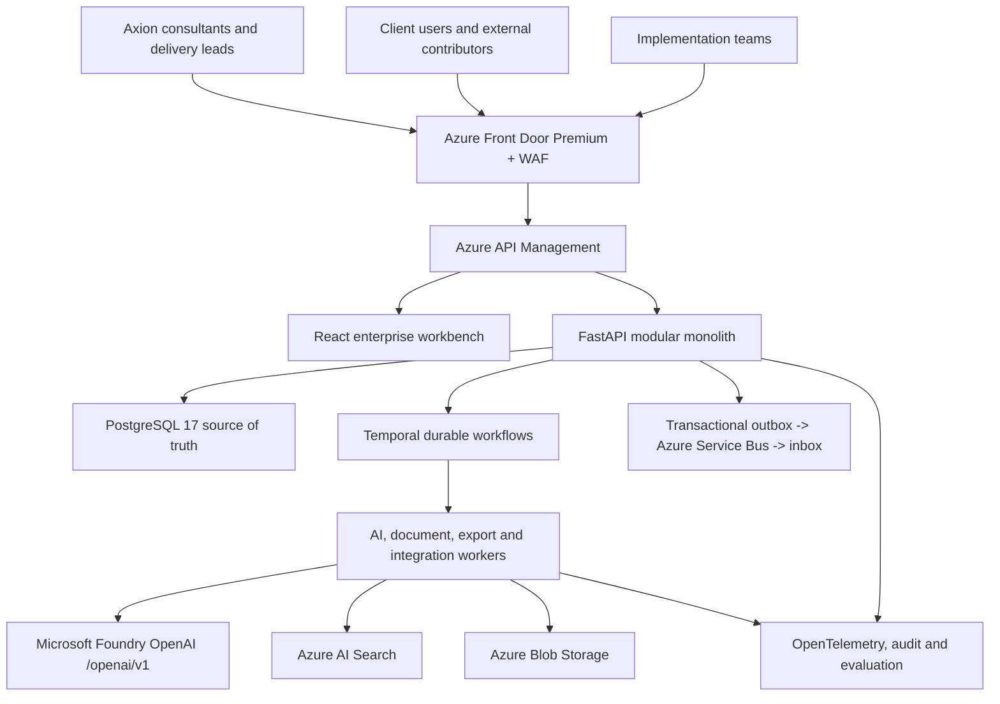

# System Context

Stakeholder CRM is Axion's AI-assisted consulting operating system for evidence-led discovery, analysis, requirements, delivery handover and controlled change.

Human approval is mandatory for privileged domain transitions including baseline approval, artefact publication, change acceptance and equivalent commercial/security decisions. AI components return bounded proposals and never own authoritative project state.

