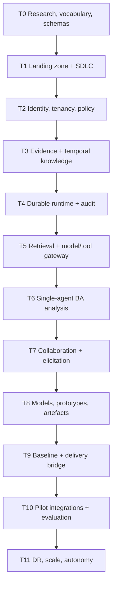

# Build sequence and dependency graph

Status: delivery control · Baseline: `design-v3` · Effective: 2026-08-12 · Owner: engineering delivery council · 173 numbered work packages

This sequence decomposes the portfolio epics into implementation evidence. The [roadmap](roadmap.md) owns outcome gates: R0 maps to T0, R1 to T1–T4, R2 to T5–T6, R3 to T7–T8, R4 to T9–T10, and R5 to T11. Capability 18 adds T0.15–T0.17, T1.15–T1.17, T6.15–T6.17, T8.18–T8.19, T10.15–T10.16 (13 packages; 160→173).

## Release trains

## T0 — Specification and research foundation

`T0.01` glossary/semantic keywords; `T0.02` capability and journey trace matrix; `T0.03` JSON Schema conventions; `T0.04` event/problem envelope; `T0.05` domain state catalogue; `T0.06` BA benchmark/rubrics; `T0.07` synthetic three-domain cases; `T0.08` threat/privacy/data classification; `T0.09` AWS Region/service/quota spike; `T0.10` X07-A workflow/cognitive replay feasibility spike; `T0.11` retrieval/storage spike; `T0.12` R0 decision and accepted or explicitly provisional ADRs; `T0.13` enterprise frontend dual-portal role/surface/journey/visual benchmark; `T0.14` progressive experience-generation and coding-agent benchmark/threat study (X10 polyglot/brownfield); `T0.15` brownfield/ERP-like research corpus and IP protocol; `T0.16` X11 AC-gated review benchmark and rubric; `T0.17` X12 archaeology→BA model benchmark.

## T1 — AWS landing zone and software supply chain

`T1.01` Organizations/Control Tower/OUs/accounts; `T1.02` IAM Identity Center and break-glass; `T1.03` org CloudTrail/Config/log archive; `T1.04` delegated security services; `T1.05` network/DNS/IP plan; `T1.06` cell VPC/endpoints/egress; `T1.07` KMS hierarchy; `T1.08` build/artifact accounts and OIDC; `T1.09` ECR/SBOM/signing/scanning; `T1.10` CDK pipeline and policy tests; `T1.11` preview/integration environments; `T1.12` cost/tag/budget baseline; `T1.13` dual-portal frontend shells/design-system/component/visual-test foundation; `T1.14` isolated preview/code-workspace and exact-base patch substrate; `T1.15` code-index service Merkle/reindex + hybrid map storage; `T1.16` CodeKnowledgeGraph schema/contract tests; `T1.17` review-run/archaeology-run receipt replay harness.

## T2 — Identity, tenant and authority foundation

`T2.01` tenant/residency/tier aggregates; `T2.02` CIAM port plus Cognito/external-provider spike; `T2.03` SaaS identity/session context; `T2.04` membership/group/delegation; `T2.05` action/resource catalogue; `T2.06` engine-neutral PDP and AVP/embedded-Cedar/OPA comparison; `T2.07` API PEP middleware; `T2.08` PostgreSQL tenant wrapper/RLS; `T2.09` S3 tenant access pattern; `T2.10` entitlements/quotas; `T2.11` access review/revocation; `T2.12` full tenant-isolation matrix.

## T3 — Evidence and knowledge substrate

`T3.01` upload/quarantine workflow; `T3.02` source/version/hash/retention; `T3.03` parser/Textract sandbox; `T3.04` stable evidence anchors/viewer; `T3.05` bitemporal item/assertion/relation store; `T3.06` provenance activities/agents; `T3.07` vocabulary/concept/rule models; `T3.08` conflict engine; `T3.09` review/confirmation queue; `T3.10` domain-pack branch/release; `T3.11` impact traversal; `T3.12` deletion/legal-hold traversal.

## T4 — Durable application runtime

`T4.01` command/UoW/idempotency; `T4.02` outbox/inbox; `T4.03` SQS/EventBridge routing/DLQ; `T4.04` provisional durable-runtime namespace/security/codec; `T4.05` engagement workflow; `T4.06` human signal/approval activity; `T4.07` cancellation/compensation; `T4.08` notification scheduler; `T4.09` audit ledger/export; `T4.10` ADOT trace conventions; `T4.11` failure console/reconciliation; `T4.12` X07-B replay/upgrade/chaos and operational qualification.

## T5 — Intelligence platform

`T5.01` Bedrock private access and model catalogue; `T5.02` model gateway/routing/budget; `T5.03` structured-output adapter; `T5.04` tool registry/gateway/receipts; `T5.05` prompt/policy release registry; `T5.06` hybrid lexical/vector retrieval; `T5.07` ACL/time/counterevidence reranking; `T5.08` context manifests/compiler; `T5.09` working/episodic memory store; `T5.10` semantic-memory promotion; `T5.11` evaluation runner/result registry; `T5.12` safety/injection/adversarial qualification; `T5.13` experience-intent/build-context/mock-data/change-set contracts; `T5.14` code-workspace tool/patch/validation gateway and receipts.

## T6 — Senior BA analytical core

`T6.01` cognitive runtime adapter; `T6.02` lead BA framing/planning; `T6.03` evidence extraction; `T6.04` domain modeller; `T6.05` current/root-cause analyst; `T6.06` outcome/future-state analyst; `T6.07` requirement/scenario/NFR analyst; `T6.08` option/feasibility/decision analyst; `T6.09` critic/counterexample; `T6.10` sufficiency/gate evaluator; `T6.11` repair/escalation/budget; `T6.12` blinded baseline qualification; `T6.13` progressive experience-question and coding-agent run graph; `T6.14` generation/coding topology ablation and real-model qualification; `T6.15` Archaeologist cognitive core + X12 confirmatory; `T6.16` AC-gated Reviewer + hybrid coding retrieval + X11 confirmatory; `T6.17` polyglot/non-UI change-class proposal qualification.

## T7 — Collaboration and elicitation

`T7.01` stakeholder/authority/coverage graph; `T7.02` discovery plan; `T7.03` question candidate/ranker; `T7.04` text live session protocol; `T7.05` voice/transcript/consent; `T7.06` recap/correction/confirmation; `T7.07` adaptive survey definition/runtime; `T7.08` workshop/collaborative canvas; `T7.09` tasks/comments/mentions/actions; `T7.10` notifications/digests/escalations; `T7.11` accessibility/localisation; `T7.12` elicitation human study.

## T8 — Dual-portal Business/Build experience, prototype and artefacts

`T8.01` dual-portal Business/Build shells; `T8.02` source/disagreement views; `T8.03` shared-terms/knowledge views; `T8.04` process/state/rule modeller; `T8.05` expected-behaviour/why-this-exists views; `T8.06` journey/service blueprint; `T8.07` prototype graph; `T8.08` sandbox renderer; `T8.09` scenario telemetry/element feedback; `T8.10` artefact/template DSL; `T8.11` document/spreadsheet/diagram render + visual QA; `T8.12` prototype/evidence UX studies; `T8.13` complete dual-portal enterprise frontend surface/state catalogue; `T8.14` integrated progressive intention/Q&A inside Understand/Design/Contribute; `T8.15` coherent mock-data packs and L0–L4 fidelity pipeline; `T8.16` governed Build Workspace coding-agent mode with rationale/diff/rollback/coverage panel; `T8.17` full frontend/generation browser/visual/accessibility/security E2E qualification; `T8.18` Build Review journey UI (findings, requirements coverage, exception reason codes); `T8.19` code-discovery surfaces and claim review.

## T9 — Governance and delivery bridge

`T9.01` review queue/disposition; `T9.02` approval/delegation/waiver; `T9.03` signed baseline manifest; `T9.04` semantic/version diff; `T9.05` change request/impact/rebaseline; `T9.06` prioritisation/release slicing; `T9.07` RAID/actions/decisions; `T9.08` developer question workflow; `T9.09` implementation deviation; `T9.10` test/release evidence ingestion; `T9.11` solution evaluation/outcome loop; `T9.12` governance E2E qualification.

## T10–T11 — Pilot, enterprise and scale

`T10.01` connector SDK; `T10.02` Microsoft/Google document source; `T10.03` Jira/Azure DevOps/GitHub work sync; `T10.04` email/calendar/session integration; `T10.05` pilot tenant onboarding; `T10.06` product/support/usage operations; `T10.07` security/accessibility/penetration; `T10.08` load/soak/cost; `T10.09` restore/DR game day; `T10.10` pilot outcome study; `T10.11` system card/control evidence; `T10.12` go/narrow/stop; `T10.13` production frontend RUM/usability/accessibility/degradation qualification; `T10.14` governed client prototype/repository coding-agent pilot; `T10.15` brownfield ERP/CRM/SAP read and/or process-mining connector certification; `T10.16` CAB/transport dual-control gate rehearsal.

`T11.01` bridge/silo automation; `T11.02` second regional cell; `T11.03` warm-standby failover; `T11.04` domain transfer/multilingual; `T11.05` search/graph extraction decision; `T11.06` customer keys/audit export; `T11.07` connector certification; `T11.08` autonomy class rollout; `T11.09` capacity/commitments; `T11.10` compliance assurance; `T11.11` independent BA benchmark; `T11.12` scale release; `T11.13` continuous frontend/generation/coding-agent/X10–X12 drift, topology and action-class assurance.

## Task evidence

Each numbered task creates a dossier per [AI implementation playbook](ai-implementation-playbook.md). A train exits only when all tasks required by its gate pass; skipped tasks require an explicit applicability decision. Parallel work may begin only when it does not assume an unaccepted upstream contract.
