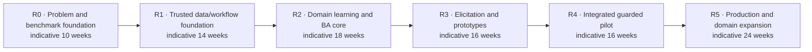

# Research-to-production roadmap

Status: delivery control · Baseline: `design-v3` · Effective: 2026-08-12 · Owner: product delivery council

Dates are established only through an approved release plan.

## Delivery rule

This roadmap is capability- and evidence-gated, not date-promised. Calendar ranges are planning envelopes after staffing. A phase cannot be declared complete because its code exists; its exit evidence must pass independent review.

The durations are estimation envelopes, not commitments. Entry dates are assigned only after the preceding evidence gate passes and capacity is approved.

## Delivery hierarchy and traceability

| Outcome phase | Principal implementation trains | Portfolio scope |
|---|---|---|
| R0 | T0 | research, benchmark, high-risk spikes and provisional ADRs |
| R1 | T1–T4 | repository, contracts, tenancy, temporal data and durable workflow foundation |
| R2 | T5–T6 | model gateway, retrieval, context, BA cognition and semantic qualification |
| R3 | T7–T8 | dual-portal collaboration, Understand/Design and traceable prototypes |
| R4 | T9–T10 | baselines, delivery feedback, connectors and guarded pilot operations |
| R5 | T11 | regional scale, reliability, compliance and qualified autonomy |

The 53 [portfolio epics](backlog.md) express investment outcomes. The 173 numbered work packages in the [build sequence](build-sequence-and-dependency-graph.md) express implementation order and evidence. An epic may span several work packages; neither identifier set replaces the other.

The executable five-stage view is defined in [milestone 1](../milestones/milestone_1.md), [milestone 2](../milestones/milestone_2.md), [milestone 3](../milestones/milestone_3.md), [milestone 4](../milestones/milestone_4.md), and [milestone 5](../milestones/milestone_5.md). M1 maps R0; M2 maps R1; M3 maps R2; M4 maps R3 plus baseline-readiness tasks; M5 contains separate pilot, production and scale decisions for R4–R5. The milestone plans refine execution but cannot weaken roadmap outcome gates.

## R0 — Problem, benchmark, and architecture foundation

Goal: prove that the proposed intelligence can be measured and that the problem is valuable before building a platform.

Deliver:

- 25+ interviews across senior BAs, sponsors, SMEs, designers, engineers, risk and buyers; observational study of at least five real discovery sessions.
- Three-domain benchmark design, rubrics, consent/de-identification protocol, initial synthetic cases and expert panel.
- Journey prototypes for evidence-first contribution, Understand disagreement review, Design mocks and linked participant feedback.
- X09 role/page/design-system benchmark and X10 progressive experience-generation/coding-agent benchmark, including stale/hostile repository safety and polyglot/brownfield fixtures.
- X11 AC-gated review and X12 archaeology→BA model thin feasibility experiments; ERP-like research corpus with IP protocol.
- X01–X06 thin experiments plus X07-A workflow feasibility; total-cost and domain-pack maintenance model.
- Threat/privacy/data-flow models; canonical vocabulary and first schema prototypes.
- ADRs for database, retrieval, contracts and tenancy, plus a provisional workflow/cognitive split ADR based on X07-A evidence.

Exit: a credible buyer/problem, measurable BA benchmark, usable experience direction, coding-intelligence invest/narrow scope, and no unmitigated architectural fatal flaw. X07-A must establish replay, interrupt and idempotency feasibility, but does not qualify the runtime for production. Otherwise narrow the product to the capability that demonstrated value.

## R1 — Trusted foundation

Goal: create a model-independent substrate that cannot silently lose authority, provenance, time or tenant boundaries.

Deliver canonical identity/tenant/engagement model; source/version/span ingestion; bitemporal knowledge item and assertion graph; authorisation/RLS; schema registry; outbox/inbox; durable workflow spike-to-production; audit/provenance; context manifest; model/tool gateway skeleton; OpenTelemetry; retention/deletion; restore and isolation harness; accessible dual-portal frontend shells/design system; isolated preview/code-workspace with exact-base patch primitives; **code-index Merkle/reindex, CodeKnowledgeGraph schemas and review/archaeology receipt harness**. Run X07-B in a production-shaped environment to qualify failure recovery, deployment compatibility, history evolution and operational ownership.

Provision the AWS multi-account landing zone, security/log archive, SDLC account, first three-AZ regional cell, private endpoints, key hierarchy, signed supply chain and cost controls described in the [AWS platform](../architecture/aws-platform.md). Follow the detailed [build sequence](build-sequence-and-dependency-graph.md).

Exit: deterministic acceptance suite proves tenant isolation, append-only provenance, schema evolution, replay/idempotency, deletion traversal, backup restore and trace correlation; X07-B passes and the workflow ADR is accepted or replaced. No autonomous external writes.

## R2 — Domain learning and single-agent BA core

Goal: beat a strong RAG assistant on grounded analysis before adding a broad multi-agent experience.

Deliver hybrid retrieval and reranking; contradiction/time/scope handling; domain-pack branch/review/release; context compiler; bounded lead-BA graph; claim/evidence extraction; glossary/process/rule/requirement models; prompt/policy/evaluation registry; critic and repair loop; expert review surfaces; experience-intent/question graph; governed coding-agent plan/patch/validate proposal loop; **Archaeologist and always-on AC-gated Reviewer cores; polyglot change-class proposals**.

Exit: blinded R2 benchmark meets grounding, contradiction, temporal and requirements thresholds; X11/X12 confirmatory targets met for approved paths; correction retention passes; cost/latency budgets hold. Multi-agent implementers remain disabled unless X03 proves gains; Reviewer is always-on when approved.

## R3 — Elicitation and interactive validation

Goal: demonstrate senior-quality discovery behaviour and materially better intent confirmation.

Deliver stakeholder/authority topology; research planner and question-ranking policy; live/async sessions, surveys, transcripts and coverage; complete coherent Business and Build portal surfaces; Understand/Design disagreement and mock views; progressive mixed-format experience Q&A; coherent mock data; L0–L4 prototype graph/runtime; bounded L5 repository patch mode with requirements coverage panel; **Build Review and code-discovery journeys**; element-level feedback; accessibility/localisation; approval and approved delivery packages.

Exit: controlled user studies pass X01/X04/X05/X09/X10/X11/X12 confirmatory slices as applicable, WCAG 2.2 AA audit, stakeholder burden and trust-calibration guardrails; external messaging stays preview/approve.

## R4 — Guarded end-to-end pilot

Goal: improve one real business change from framing through delivery feedback.

Deliver enterprise connectors for pilot only (including brownfield ERP/CRM/SAP read and/or process-mining when required); change impact/baselining; developer question/deviation loop; AC-gated review in CI; CAB/transport dual-control rehearsal; operational dashboards/runbooks; production frontend RUM/degradation; governed client prototype/repository-patch pilot; canary/shadow evaluation; security assessment; support/training; export of standards-aligned artefacts.

Exit: 2–3 pilots across distinct risk profiles show equal-or-better quality, ≥30% stakeholder-efficiency hypothesis or another agreed economic value, no critical safety/privacy issue, acceptable stewardship TCO, and sponsor/participant evidence. Publish system card and known limitations.

## R5 — Production hardening and expansion

Goal: scale only proven capabilities.

Deliver regional cells/data residency, capacity/chaos/DR, domain-pack marketplace governance, connector certification, optional graph/search service based on measured need, progressive low-risk automation, continuous frontend/generation/coding-agent/**X10–X12** drift/topology assurance, multilingual/domain transfer evaluation, customer-controlled keys/export/deletion, operational compliance evidence.

Exit: SLO/error-budget history, DR game day, external penetration test, model/provider failover, quarterly evaluation drift process, sustainable unit economics and explicit go/no-go for each autonomy class.

## Team topology

Initial cross-functional nucleus: product lead, principal BA/research lead, domain/knowledge engineer, agent/retrieval engineer, **coding-intelligence engineer**, platform/security engineer, product designer/researcher, full-stack engineer, evaluation/data scientist, and fractional privacy/accessibility/SRE expertise. Add domain stewards and customer success for pilots. Avoid splitting into component teams before the end-to-end learning loop works.

## Dependency spine

`benchmark → epistemic schema → provenance/authority → workflow/replay → retrieval/context → code-index/graph → single-agent BA → archaeology/review cores → semantic governance → elicitation UX → prototype traceability → AC-gated baseline/change → brownfield connectors/pilot → autonomy/scale`

Features may explore ahead in disposable prototypes, but production dependencies follow this spine.

## Program metrics

Maintain a benefit/risk/cost scorecard per capability; experiment throughput and invalidated assumptions; escaped semantic defects; human review time; evaluation freshness; architecture decision age; domain-pack maintenance burden; and technical debt tied to a reversal trigger. Report null results.
