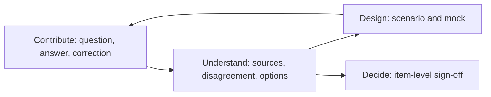

# Discovery and interactive prototyping experience

Status: normative · Baseline: `design-v4` · Effective: 2026-08-12 · Owner: product and design councils

The governed implementation of mock data, progressive fidelity, intent questioning, prototype and code generation, and multi-agent validation is specified in [experience generation and coding agent](../intelligence/experience-generation-and-coding-agent.md). Portal placement and navigation are owned by the [enterprise frontend experience](enterprise-frontend-experience.md) and [information architecture](information-architecture-and-design-system.md) documents.

## Experience thesis

Discovery and design happen through focused Business portal surfaces, not a permanent multi-panel analysis room.

- **Contribute** captures answers, corrections, and scenario feedback in a distraction-free flow.
- **Understand** compares sources, people, disagreements, and options around one selected issue with assistant guidance.
- **Design** tests the lowest-fidelity mock that can answer the next uncertainty.

Users may answer naturally, inspect structured views, or point at a design element. Every action updates draft linked records. Nothing becomes approved truth without a decision owner.

## Workspace behaviour

The facilitator or analyst explains why a question is asked, supports skip/defer/private response, remembers consented accessibility and language preferences, watches fatigue, provides a short recap, and makes correction easier than agreement. Async contributors receive focused questions with context and expiry rather than full transcripts.

## Progressive disclosure

1. Start with the business outcome and one representative story.
2. Capture current work while the participant speaks or answers.
3. Show inferred rules and unknowns as drafts.
4. Walk happy path, exceptions, failures, recovery, permissions, data, and scale.
5. Show competing interpretations side by side.
6. Generate the lowest-fidelity representation that can answer the next uncertainty.
7. Raise fidelity only after structure and flow stabilise.

## Prototype contract

A prototype is a versioned set of screens or steps, states, transitions, fixtures, validation rules, permissions, accessibility semantics, and annotations. Each element links to scenario, expected behaviour, decision, and source. Generated UI runs in a sandbox with no credentials or production data.

Support click-through sketches first, then interactive mocks, then technical thin slices. Variants must differ on an explicit hypothesis. Visual polish never implies feasibility or approval.

Advanced fidelity labels may exist for specialists (story, sketch, interactive mock, technical prototype, sandbox build, code change). Business users see plain names and collapsed advanced details.

## Feedback capture

Record scenario, participant role, prototype version, element or step, task outcome, observation versus opinion, severity, quote or consent, impact on expected behaviour, analyst interpretation, and confirmation. Replay captures behaviour only with explicit consent and aggressive sensitive-data filtering.

## Required journeys

- Sponsor frames need and accepts the initiative brief.
- Analyst prepares a mixed live and async research plan.
- SME teaches terminology and resolves a scoped disagreement.
- Frontline user completes a scenario against a mock and corrects a rule.
- Analyst inspects sources, updates a draft model, and compares approved versions.
- Engineer asks a clarification and traces the answer to source and decision.
- Approver reviews changes, risks, exceptions, and signs selected items.
- Data subject accesses, corrects, or deletes eligible information.

## Accessibility and inclusion

Target WCAG 2.2 AA; keyboard and screen-reader operation; captions and transcripts; no colour-only states; plain-language and translated views with canonical-term mapping; low-bandwidth async mode; timezone-aware scheduling; and a non-conversational form path. Test with people with disabilities, not only automated scanners.

## Anti-patterns

Avoid endless chat, unsolicited interrogation, fake empathy, dark-pattern confirmation, auto-resolving disagreement, dashboard confidence theatre, inaccessible node graphs, premature high-fidelity mocks, approve-all workflows, em dashes in interface copy, and exposing internal codes to business participants. A seamless experience preserves user control and evidence clarity. It does not hide the work.
