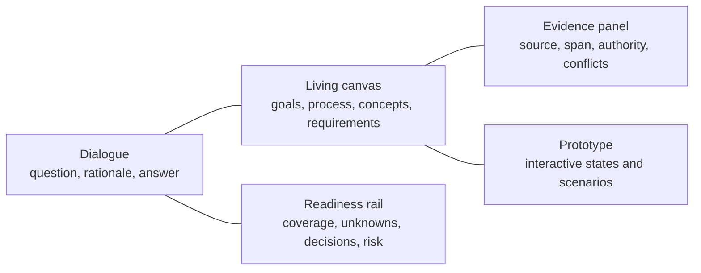
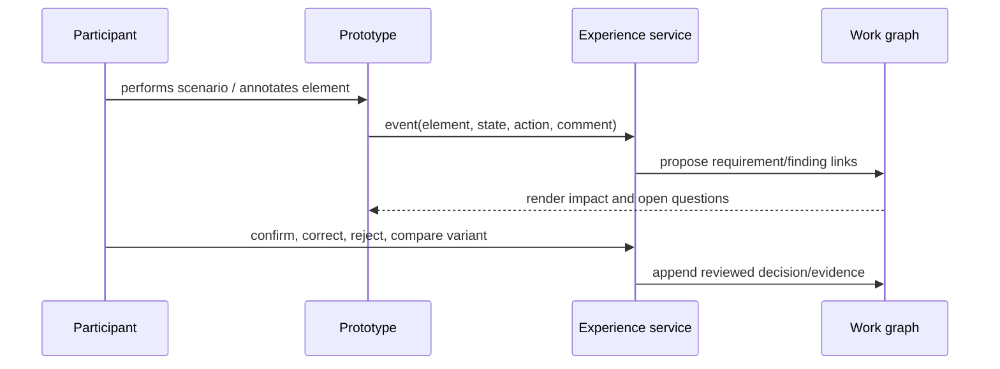

# Discovery and interactive prototyping experience

Status: normative · Baseline: `design-v2` · Effective: 2026-08-11 · Owner: product and design councils

## Experience thesis

The primary interface is a shared analysis room: conversation, structured canvases, evidence, unknowns, decisions, and prototype are synchronised views of one work graph. Users can answer naturally, manipulate models directly, or point at a prototype element; every action updates traceable candidates rather than burying meaning in chat.

## Workspace layout

The facilitator explains why it is asking, supports skip/defer/private response, remembers consented accessibility and language preferences, recognises fatigue, provides session recap, and makes correction easier than agreement. Async contributors receive focused questions with context and expiry rather than entire transcripts.

## Progressive disclosure

1. Start with the business outcome and one representative story.
2. Draw the current-state journey/process while the participant speaks.
3. Surface inferred rules and unknowns as visibly provisional.
4. Traverse happy path, exceptions, failures, recovery, permissions, data and scale.
5. Show competing interpretations side-by-side.
6. Generate the lowest-fidelity representation that can answer the next uncertainty.
7. Increase fidelity only after structure and flow stabilise.

## Prototype contract

A prototype is a versioned graph of screens/components, states, transitions, fixtures, validation rules, permissions, accessibility semantics and annotations. Each element links to scenario, requirement, decision and evidence. Generated UI runs in a sandbox with no credentials or production data.

Support click-through wireframes first, then stateful component prototypes, then API-backed thin slices. Variants must differ on an explicit hypothesis. Never let generated visual polish imply feasibility or approval.

## Feedback capture

Record scenario, participant role, prototype version, element/state, task outcome, observation versus opinion, severity, quote/consent, requirement impact, analyst interpretation and confirmation. Replay captures behaviour only with explicit consent and aggressive sensitive-data filtering.

## Required journeys

- Sponsor frames need and approves charter.
- Facilitator prepares/runs a mixed live and async discovery plan.
- SME teaches terminology and resolves a scoped conflict.
- Frontline user completes a scenario against a prototype and corrects a rule.
- Analyst inspects evidence, edits a model, and compares baselines.
- Engineer asks a requirement question and traces the answer to source/decision.
- Approver reviews changes, risks, waivers and signs a baseline.
- Data subject accesses/corrects/deletes eligible information.

## Accessibility and inclusion

Target WCAG 2.2 AA; keyboard and screen-reader operation; captions/transcripts; no colour-only states; plain-language and translated views with canonical-term mapping; low-bandwidth async mode; timezone-aware scheduling; and a non-conversational form path. Test with people with disabilities, not only automated scanners.

## Anti-patterns

Avoid endless chat, unsolicited interrogation, fake empathy, dark-pattern confirmation, auto-resolving disagreement, dashboard confidence theatre, inaccessible node graphs, premature high-fidelity mockups, and “approve all” workflows. A seamless experience preserves user control and epistemic clarity; it does not hide the work.
