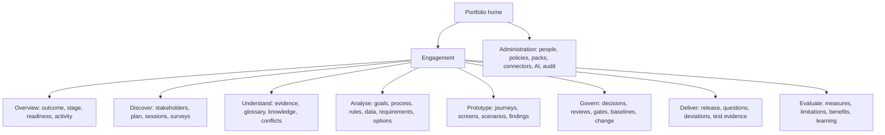

# Information architecture and design-system contract

Status: normative · Baseline: `design-v3` · Effective: 2026-08-11 · Owner: design council

This document owns navigation and design-system semantics. The full role/page catalogue, visual character, cross-user journeys, responsive behaviours and measurable frontend release gates are defined in the [enterprise frontend experience specification](enterprise-frontend-experience.md).

## Product navigation

Conversation is available contextually but is not top-level information architecture. Every chat claim opens its structured item and source; every canvas item opens history, relations and authority.

Experience generation is a governed mode within `Prototype` and `Deliver`, not a disconnected top-level “AI builder”. The same intent, scenario, evidence, prototype version and change set move from mock exploration to authorised repository patch; administration of model/tool/sandbox policy remains under `Administration`.

## Core page anatomy

Global bar: tenant/engagement, search/command, notifications, help/status, user. Engagement header: outcome, stage, baseline, data classification and active context. Main workspace: primary task view. Inspector: source/provenance/version/relations. Readiness rail: blockers, unknowns, coverage, conflicts and next decisions. Activity panel: comments/actions/run state. Panels collapse/reorder while keyboard reading order remains coherent.

## Interaction vocabulary

| Visual state | Meaning |
|---|---|
| neutral outline | candidate/unreviewed |
| evidence marker | source-linked, not necessarily confirmed |
| green confirmation | named authority confirmed exact version |
| amber contested | material disagreement/uncertainty |
| red blocker | gate prevents named transition |
| grey superseded | historical; never silently hidden |
| AI sparkle/label | generated or transformed by AI; no quality implication |

Colour is redundant with icon/text. “Approved”, “confirmed”, “validated” and “AI-generated” are never visually conflated.

## High-UX response contract

- User action receives local feedback <100 ms; server acknowledgment/progress meets NFR targets.
- Preserve draft across refresh/network loss; show saved/sync/conflict state.
- Long agent operations expose plan summary, current stage, elapsed/budget, partial safe result, pause/cancel and notification.
- Errors state what happened, what was preserved, what user can do and correlation ID; never blame user/model generically.
- Destructive/consequential actions show exact scope and effect; confirmation is proximal and accessible.
- Empty states teach the next meaningful action; no fake dashboard data.
- Progressive disclosure keeps routine work simple while evidence, uncertainty and history stay one action away.

## Collaborative editing

Presence indicates who views/edits without implying approval. Edits use version preconditions; non-overlapping structured changes may merge, semantic conflicts require comparison. Comments anchor to stable item/element/version and become stale/resolved explicitly. Mentions create governed notifications, not authority. Offline mode is read/draft-first; consequential transitions require online revalidation.

## Search and command palette

Search respects tenant, purpose, ACL and as-of time before ranking. Results group exact terms, knowledge, evidence, people, artefacts and actions; display source, status, scope/time and why matched. Command actions reflect current permissions and require normal confirmation. Recent history cannot leak inaccessible resource names.

## Design system

Token layers: primitive → semantic → component → tenant theme. Tenant theming cannot reduce accessibility or change semantic status colours/icons. Components include evidence citation, epistemic badge, version chip, conflict pair, authority avatar, gate summary, agent-run progress, model canvas node/edge, source anchor, review disposition and destructive-action preview. Components have documented keyboard, screen-reader, responsive, localisation, loading and error contracts.

## Responsive strategy

Desktop supports multi-panel analysis/canvas. Tablet uses primary view plus drawer. Mobile supports participation, review, notification, evidence reading and lightweight edits; complex graph modelling offers accessible table/tree alternatives, not unusable mini-canvas. Live sessions prioritise question/answer/recap and allow evidence/canvas drill-down.

## Trust and explainability UX

For any proposal show: status, concise rationale, evidence for/against, source authority/freshness, scope/time, uncertainty, agent/model capability version, checks performed, affected items and required human decision. Do not expose chain-of-thought. Users can challenge evidence, correct scope, add counterexample, route to authority or mark “unknown”.

## UX evaluation

Measure task success/time/error, comprehension of status/authority, correction success, evidence inspection, trust calibration, question burden, accessibility, collaboration conflict and perceived control. Segment by role, domain expertise, language, disability and device. Design does not pass because stakeholders say the demo “looks good”.
