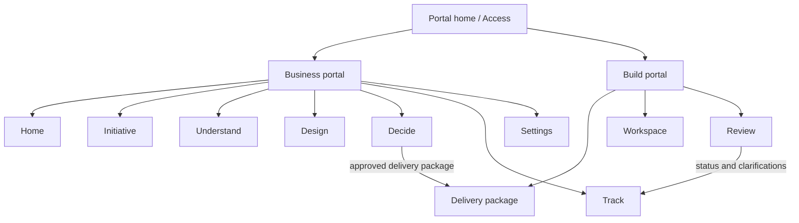

# Information architecture and design-system contract

Status: normative · Baseline: `design-v4` · Effective: 2026-08-12 · Owner: design council

This document owns portal navigation, shared shell semantics, and the design system. The complete surface catalogue, role journeys, plain-language standards, and measurable UX gates live in the [enterprise frontend experience specification](enterprise-frontend-experience.md).

## Portal information architecture

### Business portal

Primary navigation:

1. Home
2. Initiative
3. Understand
4. Design
5. Decide
6. Track

Task deep-links, not permanent rail items: Contribute, Search overlay, Settings.

Understand is the assistant-guided workspace. It combines sources, people, disagreement, policy versus actual work, options, and shared terms as tabs around one selected issue. Design holds journeys and mocks. Decide holds briefs, item-level sign-off, approved versions, and impact. Track holds delivery progress, clarifications, and results.

### Build portal

Primary navigation:

1. Home (delivery package)
2. Workspace
3. Review

Workspace combines code discovery, plan, patch, tests, and clarification. Review combines requirements coverage, findings, approved exceptions, and release readiness.

### Portal switcher and handoff

The global header offers Business and Build for authorised users. Switching preserves organisation, initiative, selected object, version, and return path. The handoff object is the approved delivery package, not a file export.

Every cross-portal link states:

- where the user came from
- which object is shared
- which version is open
- whether it is draft or approved
- how to return

## Core page anatomy

- Global header: product mark, portal switcher, organisation/initiative context, search, Assistant, alerts, user
- Left navigation: portal-specific, six items or fewer
- Main workspace: title, lead sentence, one primary action, task content
- Assistant pane: optional, contextual, collapsible
- Drawers/disclosures: sources, history, technical details, confirm-before-continue

Do not show a nine-stage lifecycle rail, a thirty-link capability map, or reviewer state toggles in normal product chrome.

## Interaction vocabulary

| Business-facing state | Meaning |
|---|---|
| Draft | Unreviewed suggestion or working text |
| Needs review | Waiting for a named person |
| Approved | Named decision owner approved the exact version |
| Disputed | Material disagreement remains |
| Must fix first | Progress is blocked until this is resolved |
| Source needed | Material claim lacks supporting evidence |
| Assistant suggestion | Generated or transformed by the assistant; no quality implication |

Colour is redundant with icon and text. Approved, confirmed, and assistant-origin labels are never visually conflated.

## Assistant placement

The assistant is contextual help inside the current object. It is not top-level information architecture and not an autonomous authority. Every claim it makes must open a structured item and source. Canvas or list items open history, relations, and decision owners.

## Design system

Token layers: primitive → semantic → component → organisation theme. Organisation theming cannot reduce accessibility or change status colours/icons.

Familiar Microsoft-like composition without proprietary assets:

- Segoe UI / system sans
- neutral canvas, white surfaces, restrained blue accent
- 4 to 6px radius, borders before shadows
- compact command bar, tabs, lists, details panels, drawers
- dense and comfortable display modes

Required components:

- status badge
- source citation
- disagreement pair
- decision-owner card
- readiness summary
- assistant suggestion card
- confirm-before-continue dialog
- delivery-package summary
- requirements coverage table
- progress strip for long assistant tasks

Each component documents keyboard, screen-reader, responsive, localisation, loading, and error behaviour.

## High-UX response contract

- Local feedback under 100 ms
- Drafts survive refresh and brief network loss
- Long assistant tasks expose stage, elapsed time, safe partial output, pause, and cancel
- Errors say what happened, what was preserved, and what to do next
- Risky actions use confirm-before-continue with exact effect and reversibility
- Empty states teach the next useful action
- Progressive disclosure keeps routine work simple

## Search

Search is an overlay. It respects organisation, purpose, access control, and as-of time before ranking. Results group work items, sources, people, and actions, and show why they matched. Recent history cannot leak inaccessible names.

## Responsive strategy

Desktop supports navigation plus workspace plus optional assistant. Tablet collapses navigation and uses drawers. Mobile supports Home, Contribute, Decide, alerts, evidence reading, and Review. Complex relationship models become guided lists or tables.

## Trust and explainability

For any suggestion show status, short rationale, sources for and against, freshness, uncertainty, affected items, and required human decision. Do not expose chain-of-thought. Users can correct scope, add an example, ask the decision owner, or mark that they are not sure.

## UX evaluation

Measure task success, time, error recovery, status comprehension, correction success, source inspection, trust calibration, question burden, accessibility, and perceived control. Segment by role, expertise, language, disability, and device. Stakeholder praise alone is not a pass.
