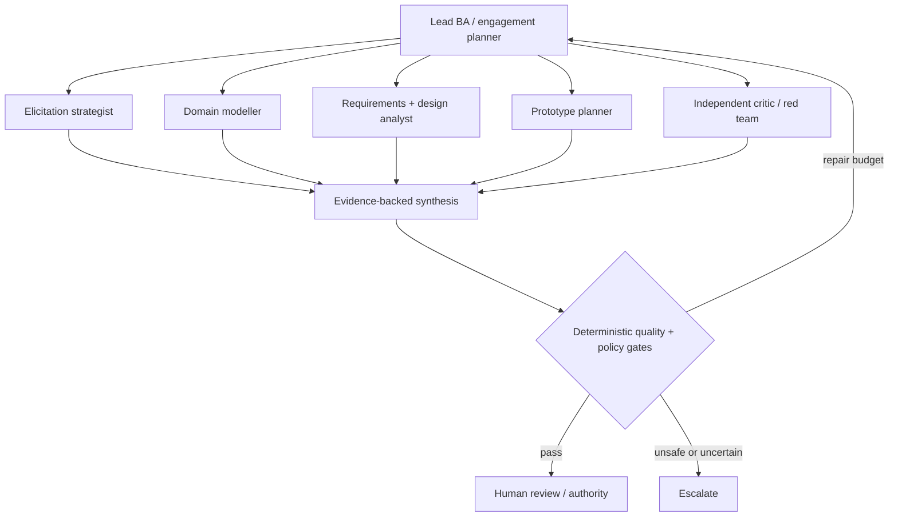
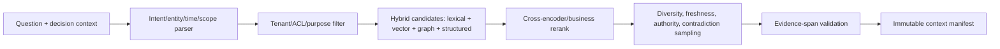

# Agent, memory, context, and retrieval design

Status: normative · Baseline: `design-v2` · Effective: 2026-08-11 · Owner: AI and architecture councils

## Agent topology

The default is a lead BA agent with deterministic services. It may spawn bounded specialists for independent expertise or adversarial review.

Specialists are capabilities with input/output schemas, tool policy, budgets, evaluation suite, and version—not anthropomorphic characters. Spawn when tasks are decomposable, context should be isolated, different tools/models are warranted, or independent critique reduces correlated error. Do not spawn for simple sequential transforms or to manufacture consensus.

## Cognitive run state

`goal; decision_needed; hypotheses; evidence_requests; context_manifest_id; plan; completed_steps; open_questions; conflicts; proposals; critic_findings; budgets; risk_class; required_approvals; terminal_reason`.

Loop:

1. Frame the decision and completion predicate.
2. Retrieve a policy-filtered context manifest.
3. Plan smallest useful actions and parallelise only independent work.
4. Execute typed tools through the gateway.
5. Validate schemas, citations, permissions and invariants.
6. Run critic/counterexample search for material outputs.
7. Repair within explicit iteration/cost/time limits.
8. Return proposals, unresolved uncertainty, and recommended next question.

Terminal reasons are success, needs-human, needs-evidence, policy-denied, budget-exhausted, cancelled, unsafe, or failed. “Keep thinking” is not a control strategy.

## Memory taxonomy

| Memory | Content | Lifetime | Write authority |
|---|---|---|---|
| Working | current cognitive run state | run | runtime |
| Episodic | session events, decisions, corrections | engagement | append-only event service |
| Semantic | reviewed domain concepts/rules/facts | effective-dated | steward/authority |
| Procedural | prompt, policy, tool and workflow versions | release | engineering/governance |
| Personal | consented preferences/accessibility | user-controlled | user/policy |
| Prospective | commitments, timers, unanswered questions | until resolved | durable workflow |
| Outcome | delivered results and measured value | governed retention | evaluation process |

Never promote a model-generated summary directly into semantic memory. Candidate memory passes novelty, support, sensitivity, scope, conflict, usefulness, retention and approval checks. Corrections create new versions and negative examples for evaluation.

## Context engineering

A context builder compiles an immutable manifest containing goal, actor/authority, applicable policy, selected evidence spans, relevant item versions, open conflicts, recent episode summary, tool definitions, output schema, budget and retrieval diagnostics. It records why each item was included and what was excluded by access policy.

Priority is roughly `decision relevance × authority × evidence strength × freshness × diversity / token cost`, followed by redundancy removal. Summarisation is hierarchical and source-linked. Context is separated into trusted instructions, governed facts, user input, retrieved untrusted content, and tool results to resist instruction confusion.

## Retrieval pipeline

Retrieval always includes possible counterevidence for material decisions. Evaluate Recall@k, nDCG, citation precision/recall, ACL leakage, temporal correctness, contradiction recall, latency and downstream task success. `pgvector` exact search is the initial truth benchmark; HNSW is enabled only after recall/latency testing because approximate indexing trades recall for speed ([pgvector](https://github.com/pgvector/pgvector)).

## Framework boundary

- LangGraph is the leading cognitive graph candidate because checkpointed state, subgraphs and interrupts match bounded analysis; hide it behind `CognitiveRuntime` interfaces.
- Temporal is the leading durable engagement candidate; do not ask an agent framework to guarantee month-long business workflows.
- Pydantic validates runtime Python contracts; JSON Schema 2020-12 is the language-neutral wire/storage contract ([specification](https://json-schema.org/draft/2020-12)).
- CrewAI and Semantic Kernel remain benchmark adapters, not baseline dependencies. CrewAI offers event-driven flows/state/persistence; Semantic Kernel offers several orchestration patterns but its agent orchestration documentation still labels features experimental ([CrewAI Flows](https://docs.crewai.com/en/concepts/flows), [Semantic Kernel](https://learn.microsoft.com/en-us/semantic-kernel/frameworks/agent/agent-orchestration/)).

## Tool protocol

Every tool declares name/version, purpose, schema, data classes, permissions, side effects, idempotency, timeout, rate/cost limits, confirmation policy, sandbox/network boundary and receipt schema. Tool calls are validated before and after execution. External writes require a preview diff and scoped human authorisation unless an explicitly approved low-risk automation policy exists.
