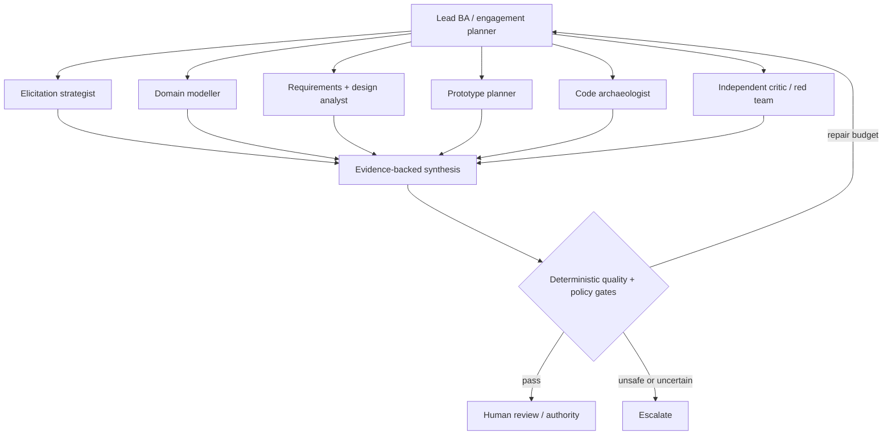
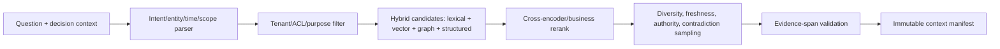

# Agent, memory, context, and retrieval design

Status: normative · Baseline: `design-v4` · Effective: 2026-08-19 · Owner: AI and architecture councils

This document governs BA cognitive runs. Business Design and Build Workspace generation use the same bounded-agent principles plus the stricter context, tool and patch contracts in [experience generation and governed coding agent](experience-generation-and-coding-agent.md) and [coding intelligence and review agent](coding-intelligence-and-review-agent.md).

## Agent topology

The default is a lead BA agent with deterministic services. It may spawn bounded specialists for independent expertise or adversarial review.

Specialists are capabilities with input/output schemas, tool policy, budgets, evaluation suite, and version—not anthropomorphic characters. Spawn when tasks are decomposable, context should be isolated, different tools/models are warranted, or independent critique reduces correlated error. Do not spawn for simple sequential transforms or to manufacture consensus.

### Coding and review specialists

When an engagement authorises repository or ERP/CRM/SAP evidence access, CollabX may run a parallel coding intelligence topology (see coding-intelligence doc):

| Role | Scope isolation | Default |
|---|---|---|
| Coding orchestrator | Cannot inherit BA lead’s full tool set; receives explicit repo/path/change-class | Per L5 / review run |
| Planner / Explorer / Implementer / Tester / Security | Worktree-bound; no widen of ACL | Ablation-gated except Explorer readonly |
| **Reviewer (AC-gated)** | Read-only diff + AC + standards; emits findings only | **Always-on** for material change sets |
| Archaeologist | Read-only sources; writes **claim proposals** only | Brownfield engagements |

BA↔code evidence promotion: Archaeologist and Reviewer outputs enter the work graph as proposals (`observed`/`inferred` assertions or review findings). Semantic memory and domain-pack promotion follow the same steward gates as other extractions (X08). Agents never write canonical domain state or merge/deploy/transport.

## Cognitive run state

`goal; decision_needed; hypotheses; evidence_requests; context_manifest_id; plan; completed_steps; open_questions; conflicts; proposals; critic_findings; budgets; risk_class; required_approvals; terminal_reason`.

Loop:

1. Frame the decision and completion predicate.
2. Retrieve a policy-filtered context manifest.
3. Plan smallest useful actions and parallelise only independent work.
4. Execute typed tools through the gateway.
5. Validate schemas, citations, permissions and invariants.
6. Run critic/counterexample search for material outputs.
7. Repair within explicit iteration/cost/time limits.
8. Return proposals, unresolved uncertainty, and recommended next question.

For experience-building tasks the lead agent may delegate research/intent, experience architecture, Build Workspace frontend/polyglot implementer, contract/data, security, accessibility and test/visual reviews only when their inputs/outputs and merge ownership are independent. Repository/file access is never inherited merely because a child task exists. Coding Reviewer findings with severity critical and type `ac_gap`, `trace_break`, `test_weakening` or `scope_escape` are escalated to the BA lead as gate-relevant signals.

Terminal reasons are success, needs-human, needs-evidence, policy-denied, budget-exhausted, cancelled, unsafe, or failed. “Keep thinking” is not a control strategy.

## Structured challenge (invoked, not resident)

Default remains lead BA + independent critic. Specialists stay capabilities with schemas (Principle 8; X03). Do **not** add a new Arbiter agent that decides. Do **not** default MAFP, Nash or Prisoner’s Dilemma personalities.

**Decision class** (class the *decision*, not the agent; map to control-framework A–D):

- Class A routine: lint, coverage, citations — lead BA only.
- Class B material (typical G2/G3/G5): lead + method engine + independent critic.
- Class C contested or irreversible: classed structured challenge under this controller. Requires named authority, budget, and a Decision Quality element that is not good enough.
- Class D prohibited: legal/HR eligibility, covert profiling, unreviewed external action — already banned.

The controller may escalate class; it may not approve. Classed challenge is enabled only if X13 passes; until then critic-only remains the default.

**Lenses** (invoked per run, not standing souls): Optimist / value; Constraint / risk / policy; Technical feasibility (sandbox-allowed); Counterexample / assumption. Six Hats is an optional *human-workshop* lens in facilitation, not a resident agent.

**Communication:** each turn is a typed IBIS *move*, not a chat. Show moves as Understand lists and Decide briefs (PERF-06). Do not build an IBIS canvas.

| Field | Values / meaning |
|---|---|
| `move_type` | `question` \| `position` \| `support` \| `challenge` \| `concession` \| `hidden_assumption` \| `evidence_request` \| `scope_split` |
| `target_item_id` | existing knowledge-item version |
| `evidence_span_ids[]` | required for material attacks |
| `new_evidence` | boolean — did this move introduce a new span? |
| `concession` | boolean |
| `attack_on` | criterion / assumption / authority / feasibility / scope / time |

**Controller halt / escalate** (existing cognitive-run loop):

- Halt if no `new_evidence` for two rounds, or semantic repetition (same item IDs, no concession), or budget exhausted, or a core constraint is violated.
- Escalate to human if consecutive rounds without concession ≥ 3 **and** a critical conflict remains.
- Never declare “zero contradictions = success.”
- Never write Approval or publish a baseline.

Technical feasibility may inspect code, propose a patch, run sandbox tests and attach stdout/stderr receipts as evidence spans (Capabilities 17/18). Sandbox cites without a receipt hash are an adversarial fail. MAFP / MCTS remain research-only after X03 and X13. If MCTS is ever tried, confine it to Capability 18 patch search with sandbox rewards, not PRD writing.

## Memory taxonomy

| Memory | Content | Lifetime | Write authority |
|---|---|---|---|
| Working | current cognitive run state | run | runtime |
| Episodic | session events, decisions, corrections | engagement | append-only event service |
| Semantic | reviewed domain concepts/rules/facts | effective-dated | steward/authority |
| Procedural | prompt, policy, tool and workflow versions | release | engineering/governance |
| Personal | consented preferences/accessibility | user-controlled | user/policy |
| Prospective | commitments, timers, unanswered questions | until resolved | durable workflow |
| Outcome | delivered results and measured value | governed retention | evaluation process |

Never promote a model-generated summary directly into semantic memory. Candidate memory passes novelty, support, sensitivity, scope, conflict, usefulness, retention and approval checks. Corrections create new versions and negative examples for evaluation.

## Context engineering

A context builder compiles an immutable manifest containing goal, actor/authority, applicable policy, selected evidence spans, relevant item versions, open conflicts, recent episode summary, tool definitions, output schema, budget and retrieval diagnostics. It records why each item was included and what was excluded by access policy.

Priority is roughly `decision relevance × authority × evidence strength × freshness × diversity / token cost`, followed by redundancy removal. Summarisation is hierarchical and source-linked. Context is separated into trusted instructions, governed facts, user input, retrieved untrusted content, and tool results to resist instruction confusion.

## Retrieval pipeline

Retrieval always includes possible counterevidence for material decisions. Evaluate Recall@k, nDCG, citation precision/recall, ACL leakage, temporal correctness, contradiction recall, latency and downstream task success. `pgvector` exact search is the initial truth benchmark; HNSW is enabled only after recall/latency testing because approximate indexing trades recall for speed ([pgvector](https://github.com/pgvector/pgvector)).

## Framework boundary

- LangGraph is the leading cognitive graph candidate because checkpointed state, subgraphs and interrupts match bounded analysis; hide it behind `CognitiveRuntime` interfaces.
- Temporal is the leading durable engagement candidate; do not ask an agent framework to guarantee month-long business workflows.
- Pydantic validates runtime Python contracts; JSON Schema 2020-12 is the language-neutral wire/storage contract ([specification](https://json-schema.org/draft/2020-12)).
- CrewAI and Semantic Kernel remain benchmark adapters, not baseline dependencies. CrewAI offers event-driven flows/state/persistence; Semantic Kernel offers several orchestration patterns but its agent orchestration documentation still labels features experimental ([CrewAI Flows](https://docs.crewai.com/en/concepts/flows), [Semantic Kernel](https://learn.microsoft.com/en-us/semantic-kernel/frameworks/agent/agent-orchestration/)).

## Tool protocol

Every tool declares name/version, purpose, schema, data classes, permissions, side effects, idempotency, timeout, rate/cost limits, confirmation policy, sandbox/network boundary and receipt schema. Tool calls are validated before and after execution. External writes require a preview diff and scoped human authorisation unless an explicitly approved low-risk automation policy exists.
