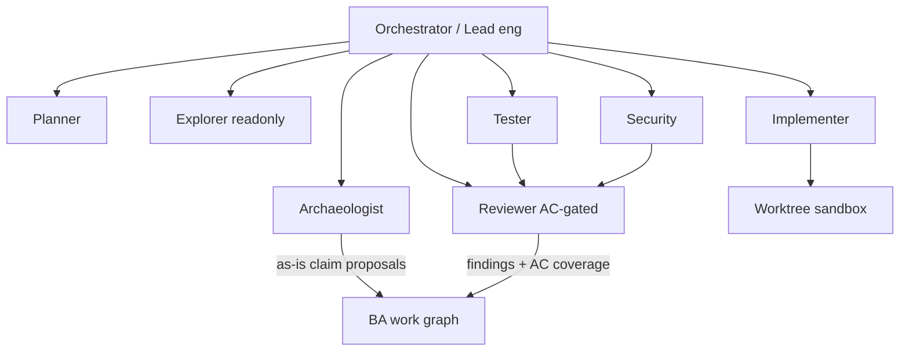

# Coding intelligence and review agent

Status: normative · Baseline: `design-v4` · Effective: 2026-08-12 · Owner: AI and architecture councils · Companion: [experience-generation-and-coding-agent.md](experience-generation-and-coding-agent.md)

This document governs brownfield code discovery, the versioned CodeKnowledgeGraph, hybrid index/reindex, multi-agent coding topology, and the **requirements coverage review** (also called AC-gated review in engineering contracts). Progressive experience fidelity L0–L5 and exact-base patch contracts remain in the companion experience/coding document; this document extends them for polyglot and ERP/CRM/SAP-class change.

User-facing surfaces live in the Build portal:

- **Delivery package (Home):** approved intent, expected behaviour, exceptions, done checks, open questions
- **Workspace:** code discovery, plan, patch, tests, clarification
- **Review:** requirements coverage, findings, approved exceptions, release readiness

Business users see plain-language status in Track. They do not navigate archaeology, AC-gap, or agent-run chrome.

## Product promise

Given governed access to an existing codebase and/or ERP/CRM/SAP configuration surfaces, CollabX will:

1. Index and maintain a tenant-ACL’d, versioned code knowledge graph.
2. Extract as-is process, rule, integration and permission evidence as **proposals** (never silent semantic promotion).
3. Bind requirements and acceptance criteria to symbols, tests and change sets.
4. Plan and propose bounded patches across authorised change classes.
5. Review diffs against acceptance criteria, standards, security and trace integrity before human authority.

It recommends; authorised humans decide. Commit, push, PR, deploy and ERP transport remain distinct side effects with distinct authority.

## Explicit non-goals

- Silent commit/push/PR/deploy/transport.
- Unreviewed production ERP writes.
- Claiming SAP/ERP vendor certification or replacing BASIS/functional consultants.
- Covert scanning beyond the authorised engagement scope.
- Training proprietary foundation models on customer ERP IP in the initial program.

## Capability checklist (required coverage)

### A. Knowledge / code graph

- Multi-language AST/LSP parse → definitions, references, calls, types, configs.
- Cross-artifact edges: code ↔ tests ↔ docs ↔ tickets ↔ ADRs ↔ API/schema ↔ CollabX requirements/scenarios/ACs.
- Enterprise nodes: SAP/ABAP/RFC/BAPI/IDoc-style objects (where adapters exist), CRM metadata, DB DDL, IaC, workflow/config-as-code.
- Versioned graph snapshots per commit/SHA; PR/change-set graph diffs.
- Tenant, path and purpose ACL on every node/edge.

### B. Retrieval

- Semantic embeddings + lexical (trigram/BM25/exact symbol) + structural (repo map / PageRank / call hierarchy).
- Hybrid rerank; ACL/path filters applied **before** candidate expansion.
- Stale-index vs live dirty-buffer fusion; ignore rules; secret redaction.

### C. Tool-calling catalog

| Class | Tools | Default authority |
|---|---|---|
| Inspect | read, ranged read, glob, grep, semantic search, graph query, blame | Allowed in scoped workspace |
| Structure | LSP defs/refs/diagnostics, repo-map build | Allowed |
| Transform | format, lint, pinned package install in sandbox | Sandbox only |
| Patch | exact-base hunk apply, three-way preview, revert | Preview; apply in authorised worktree |
| Validate | unit/integration/e2e, visual, a11y, security scan | Allowed under data/provider policy |
| Review | emit typed findings, AC coverage map, severity | Read-only always-on |
| VCS | status, branch, worktree | Allowed; commit/push/PR separate |
| External effect | commit, push, PR/MR, deploy, ERP transport | Explicit policy + human authority |
| Destructive | delete branch, force operations, mass rewrite | Exact-target preview + dual authority |

Every tool declares name/version, schema, side effects, idempotency, timeout, rate/cost, confirmation policy, sandbox/network boundary and receipt schema.

### D. Context persistence / reindex

- Rules hierarchy: org → engagement → repository → path (`AGENTS.md` / CollabX instruction packs).
- Memories with provenance and expiry (align [agents-memory-rag.md](agents-memory-rag.md)).
- Incremental reindex via Merkle/content-hash; embedding cache by chunk hash.
- Session resume/fork; compaction with recoverable history files.
- Dirty-buffer awareness: uncommitted user edits + agent edits never silently overwritten.

**Index freshness SLO (initial contract):** p95 queryable index lag ≤ 5 minutes after authorised SCM webhook for repositories ≤ 2M LOC; larger repos declare a measured lag in the engagement charter. Failures surface as `index_stale` warnings on review/patch runs.

### E. Multi-agent topology

| Role | Must do | Spawn rule |
|---|---|---|
| Orchestrator | Budgets, worktree isolation, merge ownership, terminal reasons | Always |
| Planner | Spec/AC → plan + success criteria; plan-only mode | Always for L5 |
| Explorer | Readonly broad search; return citations only | As needed |
| Archaeologist | As-is extraction → typed evidence proposals | Brownfield engagements |
| Implementer | Scoped exact-base patches; polyglot change classes | Ablation-gated beyond single-agent default |
| **Reviewer** | Diff vs ACs + standards + security + trace | **Always-on read-only** |
| Security | Threat, secrets, authz, dependency risk | Material risk classes |
| Tester | Generate/run tests; impact-set regression | L5 and review |

Specialists cannot widen repo/data/tool scope. Do not spawn to manufacture consensus. Independent critic findings are preserved.

### F. AC-gated review (differentiation)

Review inputs: authorised diff, base SHA, linked requirements/scenarios/ACs, open assumptions, coding standards pack, prior review comments, index generation ID.

Finding types: `bug`, `security`, `quality`, `ac_gap`, `trace_break`, `assumption_violation`, `test_weakening`, `scope_escape`, `secret_risk`.

Required behaviours:

- Map each linked AC → files/tests changed or **MISSING**.
- Incremental review when configured; respect existing comment threads.
- Never auto-approve baseline, merge, deploy or transport.
- Blocking CI/status when unresolved critical findings remain (engagement policy).

### G. Test generation and verification

- Unit/integration/e2e generation from AC where feasible.
- Fail-first then fix within budget.
- Deterministic sandbox repro; golden fixtures for ERP-like packs.
- Regression selection from code-graph impact set.

### H. Patch proposals and rollback

Inherit exact-base patch contract from [experience-generation-and-coding-agent.md](experience-generation-and-coding-agent.md). Additionally:

- Change-class declared on every proposal (see below).
- Atomic multi-file commits only when authorised; otherwise patch proposal only.
- One-click revert of applied worktree patches; remote revert requires authority.

### I. Repo hygiene

- Refuse silent overwrite of dirty state; explicit stash/worktree.
- Exact-base patches pinned to SHA + file hashes.
- Branch protection and CODEOWNERS routing respected.
- Monorepo path filters mandatory.

### J. Enterprise connectors

- SCM: GitHub, GitLab, Azure Repos, Bitbucket — index webhooks, PR review comments, CI statuses.
- Work: Jira / ADO Boards — bidirectional status with CollabX semantic authority.
- ERP/CRM/SAP **read** adapters: process/config/metadata/custom-object inventory as evidence sources (pilot-required stacks only).
- IdP, secrets vault, egress allowlists, audit logs, residency.

### K. Evaluation harnesses

- X10: progressive experience + patch integrity (expanded polyglot/brownfield).
- X11: AC-gated review vs human and quality-only bots.
- X12: archaeology → BA model precision/recall and citation integrity.
- Internal golden tasks for ERP-like customization and integration packs.
- Cost/latency SLOs per agent role.

## Change-class matrix

| Class | Examples | Default validation | Promotion path |
|---|---|---|---|
| UI / experience | routes, components, copy | browser/visual/a11y | git PR |
| API / contract | OpenAPI, events, DTOs | contract tests | git PR |
| Business rule | decision tables, validators | rule tests + scenario | git PR and/or ERP config |
| Workflow / process config | BPM, approval chains | conformance + UAT | ERP transport / CAB as applicable |
| Integration | adapters, mappings, IDoc/BAPI calls | contract + sandbox | dual control |
| Data migration | scripts, ETL | dry-run + reconciliation | dual control + freeze window |
| Role / security | authz, SoD | negative authz suite | dual control |

Configure vs customize vs integrate vs process-only optioning is produced with Capability 7 feasibility; archaeology evidence feeds technical feasibility.

## Brownfield archaeology

1. Bind authorised sources (repos, config exports, metadata APIs) and purpose.
2. Build/refresh CodeKnowledgeGraph and hybrid index.
3. Run Archaeologist: extract candidate processes, rules, integrations, permissions, technical-debt signals.
4. Emit assertions with lifecycle `observed` or `inferred`, full citations, and conflicts.
5. Steward/BA reviews; confirmed items enter domain pack or engagement knowledge via normal promotion (X08 rules).
6. Never promote model summaries directly to semantic memory.

## BuildContextManifest extensions

In addition to the experience companion fields, manifests include: `code_graph_snapshot_id`, `index_generation_id`, `dirty_buffer_digest`, `change_class`, `linked_ac_ids`, `review_policy_id`, `erp_adapter_scope` (if any), `promotion_path`.

## Success targets (initial contracts)

| Metric | Target |
|---|---|
| Patch precision | ≥95% changed lines attributable to scope |
| Unrelated loss / path escape / unauthorised effect | **0** |
| Material as-is claims cited or UNSUPPORTED | **100%** |
| AC-gap recall (seeded) | Feasibility in M1; confirmatory thresholds in M3/M4 |
| False approve with open critical AC-gap | **0** |
| Graph ACL leakage | **0** |
| Reviewer comprehension of bounded change | ≤5 minutes |
| Index freshness | per SLO above |

## Release and evidence

Prototype publication, repository patch acceptance, ERP transport/CAB approval and production release are **distinct** approvals. Every review-run and archaeology-run produces an immutable receipt naming model/provider profile, prompts, index generation, graph snapshot, datasets and terminal reason.
