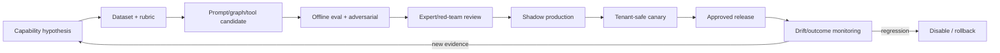

# Model, agent, prompt, and evaluation lifecycle

Status: normative · Baseline: `design-v3` · Effective: 2026-08-11 · Owner: AI risk and engineering councils

## Release unit

An agent capability release is an immutable manifest of: capability graph, node/tool versions, system/prompt components, output schemas, model routing/fallback, guardrail/policy versions, context/retrieval policy, domain-pack compatibility, design-system/repository adapter and sandbox image where applicable, budgets, evaluation dataset/result, threat assessment and rollback target. Changing any element creates a new candidate release.

## Lifecycle

No prompt is tested only by manual examples. No model alias floats to a new version in production. Model deprecation starts an explicit requalification.

## Model gateway decision

The gateway receives capability, risk, modalities, residency, context size, latency/cost budget, structured-output/tool requirement and tenant policy. It filters allowed deployments, then applies a versioned route. It records selected provider/model/deployment, parameters, usage, latency, safety decisions and hashed context manifest—not hidden reasoning or unrestricted content.

Fallback is capability-specific. A smaller/different model can change semantics; it must pass the same minimum gates. For high-risk outputs, outage may require queue/human rather than degraded inference. Cache keys include tenant, access set, model, prompt, context manifest, tool/schema/policy and relevant temperature; sensitive output caching is opt-in and encrypted.

## Structured generation

Prefer native structured output/tool calling, validate with strict schema and semantic invariants, reject unknown fields, normalise IDs/enums, and allow at most a bounded repair using validation errors. Invalid output never reaches tools or canonical state. Large collections are streamed/paginated with per-item evidence rather than one fragile response.

## Guardrail stack

1. Input boundary: size/type, malware, injection heuristics, PII/purpose and policy.
2. Context compiler: ACL, time, authority, trust-zone and token controls.
3. Provider guardrail: Bedrock content/denied topic/sensitive info as applicable.
4. Output schema and citation/claim verification.
5. Deterministic business/authority/tool policy.
6. Optional automated-reasoning policy for formalised rules.
7. Independent critic and human review by risk class.

Bedrock Guardrails can filter content and sensitive information and perform contextual grounding, but must be benchmarked per use case ([Guardrails](https://docs.aws.amazon.com/bedrock/latest/userguide/guardrails.html)). Automated Reasoning returns findings in detect mode and natural-language-to-logic translation quality depends on the reviewed policy ([Automated Reasoning](https://docs.aws.amazon.com/bedrock/latest/userguide/guardrails-automated-reasoning-checks.html)); CollabX decides block/rewrite/clarify/escalate.

## Prompt design grammar

Compose in this order: capability identity and non-goals; authority/safety constraints; epistemic vocabulary; task/decision and completion predicate; trusted domain policy; context sections each with trust label; available tools and confirmation rules; output schema; verification checklist; concise examples/counterexamples. User/retrieved text is quoted/tagged as data. Prompt injection instructions never gain tool authority.

## Agent budget and scheduling

Budget includes wall time, model calls/tokens/cost, tool calls, retrievals, parallel branches, repair cycles and output size. Parent reserves child budgets; child cannot exceed delegated authority or broaden data scope. Scheduler enforces global, tenant, engagement and run quotas; fair queueing prevents noisy neighbours. Cancellation stops descendants and invalidates pending external-action approvals.

## Evaluation layers

- Component: extraction, classification, retrieval, tool/schema and policy checks.
- Node/graph: deterministic fixtures and stochastic repeated runs.
- Capability: end-to-end BA rubric and strong baseline comparison.
- Safety: abuse, privacy, injection, authority and tenant isolation.
- Human factors: comprehension, trust calibration, fatigue, accessibility.
- Shadow/canary: real input distribution with no/limited effects.
- Outcome: rework, decision quality, cycle time, adoption and harm.

Bedrock evaluation jobs can support automatic, judge-model and human evaluation, including external RAG sources, but CollabX keeps the canonical dataset/result registry and calibrates graders ([Bedrock evaluations](https://docs.aws.amazon.com/bedrock/latest/userguide/evaluation.html)).

## Release decision record

Required: preregistered primary metrics; baseline and candidate distributions; domain/risk/language slices; confidence intervals; critical failure examples; human agreement; safety/red-team results; latency/cost/capacity; known limitations; rollback/kill switch; owner and expiry/re-evaluation date. Aggregate score cannot offset a critical tenant, authority or unsupported-claim failure.

## Production drift

Monitor input/source/domain shift, retrieval recall proxies, citation/unsupported rate, structured-output failure, human correction/rejection, escalation, outcome drift, latency/cost and safety findings. Sample under consent/privacy controls to a review queue. Drift triggers investigation, shadow re-evaluation, traffic reduction or disablement; never automatic prompt “self-improvement” in production.
