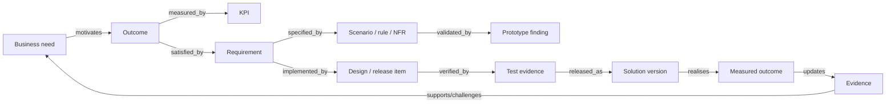
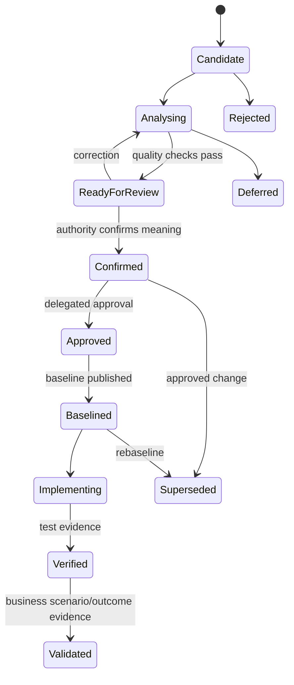

# Artefacts, traceability, and decision gates

Status: normative · Baseline: `design-v3` · Effective: 2026-08-11 · Owner: product and BA councils

## Canonical artefact families

Artefacts are projections of canonical versioned items, not independent documents.

| Family | Canonical contents | Required links |
|---|---|---|
| Charter | need, outcome, scope, constraints, authority, approach | sponsor, evidence, measures |
| Discovery | plan, stakeholder map, coverage, sessions, source requests | goals, risks, authorities |
| Domain | glossary, concept model, rules, process, data, systems | evidence, scope, effective time |
| Strategy | current/future state, cause, options, business case, change | outcomes, assumptions, decisions |
| Requirements | requirements, scenarios, acceptance, NFRs, architecture | sources, goals, designs, tests |
| Experience | journey, service blueprint, wireframe/prototype, findings | scenarios, elements, requirements |
| Experience build | intent graph, mock-data pack, route/component/state graph, code change set, visual/validation evidence | journeys, requirements, design system, repository revision, tests |
| Delivery | release slices, dependencies, RAID, implementation questions | baseline, work items, test evidence |
| Governance | reviews, approvals, waivers, baselines, change requests | authority, item versions, impact |
| Evaluation | measures, observations, limitations, recommendations | outcome, release, domain learning |

## Trace relation vocabulary

`supports`, `challenges`, `derives`, `satisfies`, `implements`, `verifies`, `validates`, `depends_on`, `conflicts_with`, `supersedes`, `allocated_to`, `measures`, `governed_by`, `observed_in`, `realised_by`.

Each relation has source/target version, direction, rationale, creator, evidence, confidence, valid interval and review state. “Linked” is too weak to express impact semantics.

## Gate model

| Gate | Absolute blockers | Authority | Output |
|---|---|---|---|
| G0 charter | no decision owner, outcome or permitted data purpose | sponsor + data owner | engagement charter |
| G1 discovery ready | key stakeholder class/source absent without waiver; unsafe elicitation | BA lead | discovery plan |
| G2 problem baseline | unresolved critical cause/scope/conflict; no outcome baseline | sponsor + SME authorities | approved problem model |
| G3 option decision | infeasible/unassessed critical risk; comparison hides assumptions | decision owner | selected option/ADR |
| G4 design validated | primary/exception/accessibility/security scenarios untested | product/design/risk owners | validated design |
| G5 delivery baseline | material item untraced/untestable; missing owner/operational readiness | delegated approvers | signed baseline bundle |
| G6 release ready | critical test/threat/data/DR/accessibility failure | release authority | release authorisation |
| G7 value review | measures unavailable or harm unresolved | sponsor/outcome owner | enhance/retire/close decision |

Gate calculation returns blockers, warnings, waivers and coverage dimensions—not a magic percentage. The authorised decision is a separate signed record. Waivers name the exact control, rationale, compensating control, owner, expiry and affected versions.

## Requirement state machine

State transitions enforce actor authority, expected source version, required evidence, quality gate and reason. Rejection/defer/supersession preserve history.

## Change impact algorithm

1. Identify changed item versions and semantic delta (not text diff only).
2. Traverse typed outgoing/incoming relations by impact rules.
3. Include applicable baselines, prototypes, tests, releases, prompts/rules and domain-pack consumers.
4. Score impact by relation strength, criticality, effective time, delivery state and uncertainty.
5. Assign owners to inspect; never auto-update approved descendants.
6. Re-run structural, retrieval, agent and domain regression suites.
7. Present unchanged, invalidated, suspect and added items with evidence.
8. Approve change and publish a new baseline, or reject/modify.

## Baseline bundle manifest

The immutable manifest contains tenant/engagement, baseline ID/version, purpose/audience, included item-version IDs and hashes, excluded/open items, decisions/waivers/approvals, source snapshot identifiers, schema/domain-pack/prompt/policy/model versions, render artefact hashes, evaluation snapshot, signature, creation/effective dates and supersession. A human-readable document is one rendering of this manifest.
