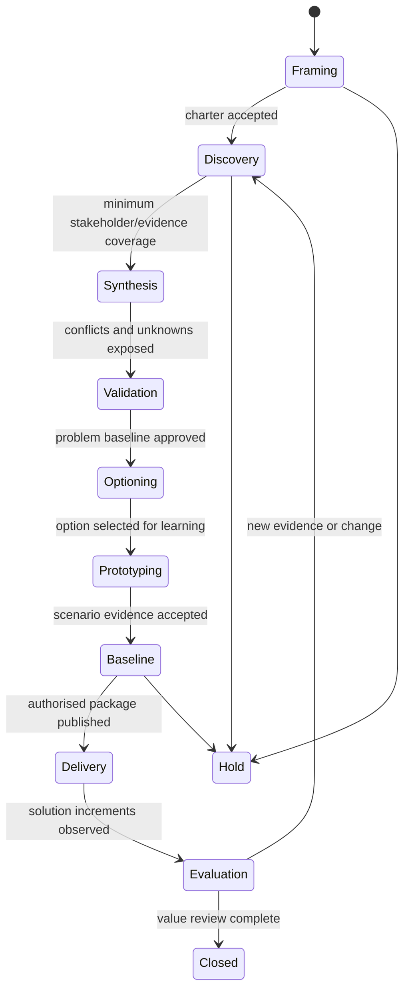

# Senior BA operating model

Status: normative · Baseline: `design-v2` · Effective: 2026-08-11 · Owner: BA practice council

## Engagement lifecycle

The lifecycle is iterative. Each gate names a business decision and its evidence threshold.

| Stage | CollabX work | Human gate | Durable outputs |
|---|---|---|---|
| Frame | clarify need, outcome, decision, boundary, risk, authority | sponsor accepts charter | goal tree, scope, hypotheses, governance |
| Discover | map stakeholders, sources, processes, vocabulary, exceptions | owner approves access/plan | coverage map, transcripts, observations, claims |
| Synthesise | model current state, causes, rules, capabilities, data, conflicts | SMEs review interpretations | domain slice, process/data models, issue set |
| Validate | run scenarios, counterexamples, playback, surveys | authorities confirm/contest | confirmation records, confidence updates |
| Option | generate and compare feasible change strategies | decision owner selects/rejects | options, trade-offs, risk/value model, ADRs |
| Prototype | render testable interaction/process representations | representative users test | executable UI spec, annotations, findings |
| Baseline | specify requirements/designs, NFRs, traceability and tests | delegated approvers sign | immutable baseline bundle |
| Deliver | answer implementation questions and assess deviations | change control authorises | decisions, impacts, revised baselines |
| Evaluate | measure performance and enterprise limitations | sponsor closes or loops | outcome measures, lessons, domain updates |

## Adaptive elicitation policy

For each candidate question `q`, estimate:

`priority(q) = information_gain × decision_impact × uncertainty × respondent_authority × freshness / (effort + fatigue + sensitivity + bias_risk)`

This is a policy feature, not an LLM prompt. Inputs and weights are logged and calibrated. The facilitator chooses among open exploration, critical-incident, laddering, scenario walkthrough, counterfactual, teach-back, ranking, survey, observation, document request, or prototype test.

Every turn follows:

1. Reflect the current interpretation in the participant’s language.
2. Identify the highest-impact unresolved assumption.
3. Ask one cognitively manageable, non-leading question.
4. Capture answer, source, scope, confidence, sentiment only where consented, and possible contradiction.
5. Offer correction or “I don’t know / ask someone else”.
6. Periodically play back the model, not merely a prose summary.

Stop questioning when marginal information gain is low, the participant is fatigued, an authority decision is required, evidence must be observed elsewhere, or the session purpose is met. Persistence is not professionalism.

## Intention model

An utterance never becomes a requirement directly. It creates candidates across:

| Lens | Questions |
|---|---|
| Outcome | What observable business result matters, to whom, by when? |
| Motivation | What symptom, cause, opportunity, obligation, or fear drives it? |
| Behaviour | Who must do what differently in which scenario? |
| Rule | What must always/never happen; what exceptions exist? |
| Data | What facts, quality, lineage, ownership, sensitivity, and timing are needed? |
| Experience | What is the user context, accessibility need, failure/recovery path? |
| System | Which boundary, integration, constraint, and quality attribute applies? |
| Authority | Who asserts, decides, approves, pays, operates, and bears risk? |
| Evidence | What observation supports this; what would disprove it? |

## Sufficiency, confidence, and approval

These must not collapse into one score.

- Confidence: strength of support for one claim.
- Coverage: proportion of required perspectives/scenarios addressed.
- Consistency: unresolved contradiction severity.
- Decision readiness: gate-specific evidence is present.
- Approval: authorised human act; never inferred from confidence.

A baseline is blocked by unresolved critical conflicts, missing accountable owner, untested primary scenario, unsupported regulatory claim, absent security/privacy assessment, or no measurable outcome. Lower risks may be explicitly waived with owner, rationale, expiry, and mitigation.

## Stakeholder topology

Model people and groups by role, authority, expertise, impact, influence, incentives, availability, accessibility, language, trust, and declared conflicts. Do not infer sensitive traits. Ensure frontline, dissenting, operational, security, support, and affected-but-low-power perspectives are sampled—not only sponsors.

## Human authority matrix

| Action | Agent | Professional reviewer | Business authority |
|---|---:|---:|---:|
| Explore/summarise/candidate model | execute | sample/review | informed |
| Propose question or requirement | execute | supervise | consult |
| Mark claim confirmed | propose | verify | source authority confirms |
| Resolve material conflict | facilitate | recommend | decide |
| Publish baseline | prepare | assure | approve |
| Send external message or change SaaS | draft | verify | explicit scoped authorisation |
| Change ontology/policy | propose impact | test | steward approves |
| Delete/retain regulated data | execute deterministic workflow | audit | data owner/legal authority |

## Quality rubric for BA artefacts

Each item is scored on necessity, atomicity, clarity, feasibility, testability, consistency, completeness, traceability, value alignment, exception handling, accessibility/security/privacy, and stakeholder confirmation. Automated linting can block obvious defects; semantic validity requires scenario evidence and human authority.
