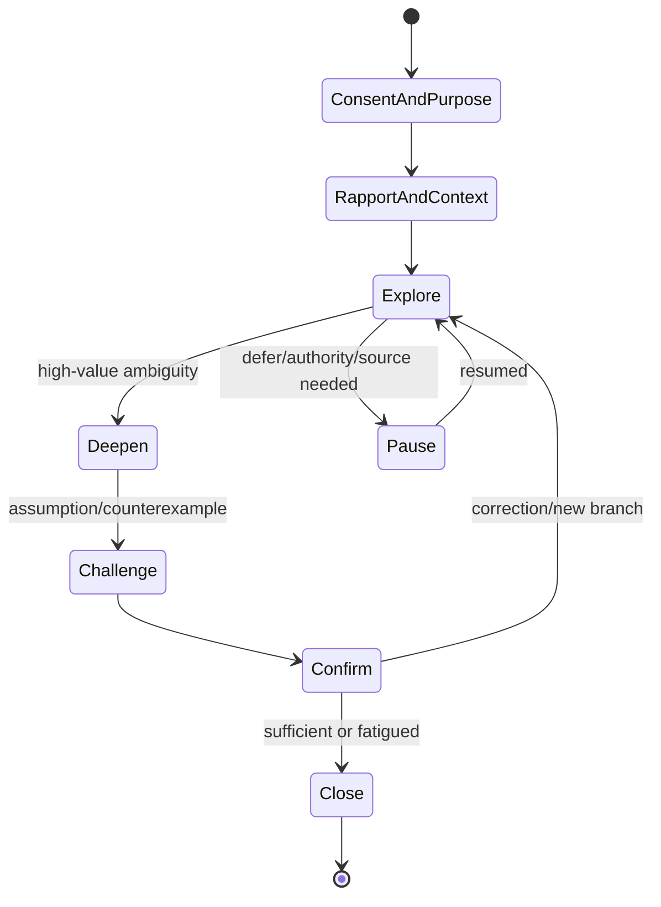

# Conversation, survey, and facilitation specification

Status: normative · Baseline: `design-v3` · Effective: 2026-08-11 · Owner: BA practice and design councils

## Conversation controller

The controller is a deterministic policy around model-generated language. It owns session purpose, phase, respondent, consent, coverage, question budget, sensitivity, open questions, recap interval and stop state. The model proposes; the controller selects or rejects.

## Question candidate contract

Each candidate includes stable ID; target unknown/claim; technique; neutral wording; expected answers/branch; information-gain estimate; decision impact; respondent fit/authority; sensitivity and burden; prerequisites; repetition similarity; rationale visible to user; stop/escalation outcome; and prompt/model version.

The response contract supports free-form, single-choice MCQ, multi-select, checklist, ranked/pairwise choice, labelled scale, matrix used sparingly, scenario task, evidence request and semantic-diff confirmation. Options include `unknown/not applicable/none` where meaningful, allow a participant to add a missing choice, and never imply exhaustive consensus. The controller selects the least burdensome format that preserves the information need and accessibility.

Hard reject: leading false premise; asks beyond consent/purpose; requests known information without explanation; solicits secrets; attempts diagnosis/emotion/personality inference; asks a respondent to decide outside authority; or cannot explain relevance.

## Facilitation behaviours

- Separate fact, interpretation, preference, decision and emotion expressed explicitly.
- Reflect without converting tentative language into certainty.
- Ask for concrete recent examples and observable exceptions.
- Test universals with “when does that not apply?” and scope/time.
- Detect circular discussion and propose a decision method/owner.
- Name conflict neutrally and show both evidence sets.
- Give quiet/asynchronous channels equal weight.
- Timebox; park out-of-purpose items with ownership.
- End with model playback, corrections, open questions, decisions/actions and data-retention reminder.

## Adaptive survey engine

Questionnaire definition is versioned and typed: sections, items, answer schemas, validation, branching expression, randomisation, quotas, audience/eligibility, anonymity, consent, expiry, scoring (if any), extraction mappings and accessibility/localisation. Published campaigns freeze the definition. In-progress responses retain their version; migration is explicit.

Avoid biased sampling, double-barrelled/leading questions, exhaustive mandatory forms, unlabelled AI-generated follow-ups and small-group deanonymisation. Report response/non-response, sample coverage and uncertainty; do not present counts as organisational consensus.

Collective clarification retains each response, role/authority, scope/time and confidence separately. The UI may show aligned, divergent and missing perspectives but never average them into approval. Material divergence routes evidence, experiment or named decision rather than another popularity poll.

## Live session protocol

WebSocket/SSE events include sequence, session/version, speaker, timestamp, type and idempotency key. Events: connected, consent_recorded, utterance_partial/final/corrected, question_proposed/asked/skipped, recap_proposed/confirmed/corrected, knowledge_candidate, conflict_detected, action/decision, pause/resume/end and error. Server is authoritative for ordering; clients resume from last acknowledged sequence.

Audio is optional. Prefer streaming transcription without retaining raw audio; if retention is authorised, isolate encrypted audio with shorter policy. Participant can correct transcript before extraction. Never treat speaker diarisation or transcript confidence as identity proof.

## Safety and UX recovery

Users can undo/correct, request source, ask why, skip, pause, switch to form, invite another authority, mark confidential, remove a response where policy permits, and report harm. When confidence is low, CollabX asks or labels uncertainty. When service/model fails, preserve typed input locally/server-side as governed, show exact state, and resume without repeating answered questions.

## Evaluation scenarios

Test dominant sponsor versus frontline dissent; contradictory authorities; respondent who does not know; sensitive HR/health content; non-native language; screen-reader/keyboard; fatigue; strategic silence; ambiguous acronym; policy-practice mismatch; fabricated answer; groupthink; hostile prompt injection; network interruption; transcript error; survey abandonment; and authority handoff.
