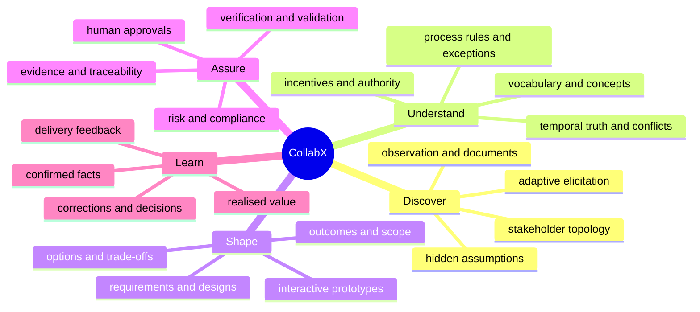

# Vision and success contract

Status: normative · Baseline: `design-v3` · Effective: 2026-08-11 · Owner: product council

## The job

Businesses do not usually arrive with complete requirements. They arrive with symptoms, desired outcomes, inherited language, political constraints, exceptions, partial processes, and incompatible beliefs. Software providers need a precise, feasible, testable account of change. CollabX maintains the living bridge between those worlds.

The product promise is:

> Place CollabX into a domain, give it governed access to people and evidence, and it will progressively build an inspectable model of that domain; conduct adaptive elicitation; expose uncertainty and disagreement; co-create designs and prototypes; and preserve traceability from intent through delivery and measured value.

It recommends; authorised humans decide. It learns through explicit proposals and validation, not silent self-modification.

## Users and value

| User | Current failure | CollabX outcome |
|---|---|---|
| Business sponsor | Solution drifts from outcome | Goal, value hypothesis, constraints, and measures stay linked |
| SME/frontline worker | Tacit exceptions are missed | Adaptive interviews and scenario walkthroughs capture them |
| Product/BA | Evidence is fragmented | One temporal, cited, conflict-aware work graph |
| Designer | Feedback arrives after build | Live, reversible prototypes tied to requirements |
| Engineer/vendor | Ambiguous handoff | Typed contracts, rules, NFRs, examples, and open questions |
| Client product/design team | Intent is trapped in documents and static mockups | Progressive mock experience and governed, test-backed code patches |
| Risk/compliance | AI outputs are opaque | Provenance, approvals, policy gates, and replayable runs |

## Capability model

The competency benchmark covers IIBA’s six knowledge areas: planning/monitoring, elicitation/collaboration, requirements life-cycle management, strategy analysis, requirements analysis/design definition, and solution evaluation. It also tests facilitation, systems thinking, negotiation, ethical judgement, and clear communication. The [IIBA Business Analysis Standard](https://www.iiba.org/knowledgehub/business-analysis-standard/4-tasks-and-knowledge-areas/introducing-business-analysis-tasks/) is a competency map, not a claim that CollabX is certified.

## North-star and guardrails

North-star: **validated decision readiness per stakeholder-hour**, reported with quality and harm guardrails.

| Dimension | Release-level target after pilot baseline exists |
|---|---|
| Coverage | ≥95% of gold critical needs and exception scenarios discovered |
| Quality | ≥90% requirements pass atomic, unambiguous, feasible, testable, traced checks |
| Grounding | 100% material factual claims cited or explicitly labelled unsupported |
| Conflict | ≥90% seeded high-impact contradictions surfaced before baseline |
| Elicitation | Non-leading question score and expert rubric non-inferior to senior BA benchmark |
| Efficiency | ≥30% lower stakeholder time for equal-or-better validated coverage |
| Safety | zero unauthorised external actions; zero cross-tenant retrieval in red-team suite |
| Value | pilot shows a measurable improvement in rework, cycle time, defects, or adoption |

Targets are hypotheses until benchmarked. A fluent demo, output volume, or token usage is not success.

## Product principles

1. Evidence before eloquence.
2. Questions are selected for information gain, risk, stakeholder cost, and bias—not conversational novelty.
3. The domain model is temporal, contested, and scoped; there is rarely one timeless “company truth”.
4. Conversation is a view over the work graph, not the database.
5. Deterministic policy gates surround probabilistic reasoning.
6. Every material change has author, rationale, provenance, effective interval, and impact set.
7. Show working representations early; make feedback addressable to a screen element and requirement.
8. Prefer one capable agent plus tools; introduce specialist agents only when evaluation proves value.
9. Progressive autonomy is earned per action class and reversible by default.
10. Uncertainty is structured data, never hidden in polished prose.
11. Generated experience and code remain inspectable change proposals: user need, rationale, trace, tests and rollback travel together.

## Explicit non-goals

- Replacing accountable sponsors, SMEs, architects, or professional BAs.
- Training a proprietary foundation model in the initial program.
- Treating document ingestion as domain understanding.
- Storing all knowledge in a vector database or knowledge graph.
- Letting agents publish baselines, contact stakeholders, or mutate source systems without authority.
- Building a general project-management suite before the BA intelligence loop is proven.
- Acting as an unrestricted autonomous software developer, silently rewriting customer repositories, or treating a generated prototype as production approval.

## Falsification conditions

Stop, narrow, or pivot if: expert-reviewed discovery does not outperform a strong RAG copilot; domain-pack upkeep costs exceed avoided rework; users cannot distinguish confirmed truth from inference; prototypes increase anchoring without improving understanding; multi-agent runs add cost/latency but no quality; or the evidence chain cannot survive real policy change and deletion demands.
