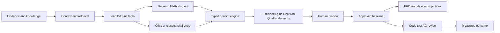

# Decision intelligence and structured deliberation

Status: research control · Baseline: `design-v4` · Effective: 2026-08-19 · Owner: product, BA practice and research councils · Companions: [ba-method-engines-and-sufficiency.md](../product/ba-method-engines-and-sufficiency.md), [agents-memory-rag.md](../intelligence/agents-memory-rag.md), [evaluation-and-experiments.md](evaluation-and-experiments.md)

This note records the 2026-08 decision on how CollabX extends optioning, prioritisation, assumption work, structured challenge and conflict facilitation. It is a **research-control decision candidate**. It does not override normative documents until product council accepts the bindings and those documents are updated. Stakeholder meeting notes are cited inputs, not authority.

**Product move:** deepen optioning, prioritisation, assumption work, structured challenge and conflict facilitation **on top of** evidence → claims → decisions → approved baseline → artefact projections. Do not build a second mathematically validated PRD runtime.

**Promise language:** replace “mathematically validated PRD” with **evidence-backed, contradiction-tested, and quantitatively prioritised projection of an approved baseline**.

## Verdict

The meeting architecture (Fusion Score, default MAFP, mandatory MCTS PRD generation, C#/Kafka/GraphRAG locks, `CR < 0.1` as a security firewall) is the wrong product. The revised stakeholder direction — a governed Decision Methods + structured-deliberation **layer on the existing BA spine** — is the right thesis.

CollabX already specifies five-way sufficiency, lead BA + critic, typed conflicts, bitemporal evidence, CodeKnowledgeGraph, Understand/Decide surfaces, and Python / TypeScript / PostgreSQL / SQS-EventBridge candidates. The real gap is that optioning, prioritisation and strategy remain the thinnest BA band.

This workstream is **documentation-only**. Experiments X13 and X14 are specified here; they run only in a later signed M1/M3 programme.

## Accepted claims

- Deterministic math is isolated from LLM prose (existing principle).
- Agents communicate in typed records with evidence IDs, not unrestricted chat.
- Live interviews stay responsive; transcription, contradiction candidates, weighting and deeper reasoning run asynchronously on the durable workflow.
- Technical feasibility may inspect code, propose patches, run sandbox tests and cite receipts as evidence spans (Capabilities 17/18).
- High-value decisions need challenge; the controller may halt or escalate; humans decide.
- Tree-sitter is a CodeKnowledgeGraph parser adapter, not a second code graph.
- Temporal freshness stays validity period, authority, supersession and evidence strength — not `last_modified` decay.
- PRDs remain projections of an approved baseline.

## Rejected meeting claims

| Claim | Disposition | Why |
|---|---|---|
| Fusion Score as truth, readiness or approval | Reject | Sufficiency is five-way; approval is a signed human record |
| AHP / `CR < 0.1` as truth or prompt-injection firewall | Reject | CR measures pairwise transitivity, not validity or security |
| Token log-probs as factual confidence | Reject | Next-token likelihood ≠ correctness; use calibrated confidence |
| Zero contradictions = successful stress test | Reject | Scope/time/referent differences are not contradictions; accepted divergence is allowed |
| Default MAFP / automatic Nash equilibrium | Reject | Principle 8 and X03; MAS often lose under matched compute |
| Mandatory MCTS PRD generation | Reject | MCTS needs a verifiable reward; that is patch tests, not PRD quality |
| C# AHP backend, Kafka/RabbitMQ, GraphRAG locks | Reject | Contradict TD-001, TD-011, TD-006 |
| `last_modified` decay | Reject | Inferior to the bitemporal model |
| Binary override as the only human act | Reject | Decide already uses item-level dispositions |
| Six Hats or Prisoner’s Dilemma as standing AI personalities | Reject | Lenses, not souls; Six Hats optional workshop assist only |
| IBIS/Dialogue Mapping as a product canvas | Retract | Typed IBIS *moves* on existing items; list/table UI (PERF-06) |
| BWM as a first-class v1 engine | Retract | X14 candidate only |
| Decision Quality as a branded seventh score | Retract | Six diagnostic questions mapped to G0–G7 |
| ISO 42001 / APP 10 / APRA as MVP architecture | Reject as architecture | Future mapping targets; documentation is not certification |
| Crypto-attestation of every AHP matrix as v1 differentiator | Reject | Existing provenance, baseline signatures and audit are the v1 bar |

## Technique kit

**Engine** = input schema, steps, stop, outputs, eval hook. **Assist** = structured draft; human owns judgment. **Skip v1** = OOS or method sprawl.

**Keep and thicken:** WSJF/CoD; MoSCoW; MCDA lite + sensitivity; event storming; process conformance; sufficiency / coverage / G0–G7; question priority; requirements lint.

**Add as v1 engines or field-complete contracts:** assumption mapping (importance × evidence; desirability / feasibility / viability / adaptability); MoSCoW to WSJF’s field bar; TCO / cost / reversibility *fields* (not NPV/Monte Carlo); decision-record schema already promised in Capability 7.

**Add as v1 assist:** issue / hypothesis tree (MECE lint, outline/table UI); even-swaps for small tables when people reject scores; CATWOE/SSM (already assist); SWOT/PESTLE as cited research templates; pre-mortem and steelman as critic patterns; Opportunity–solution outline (outcome → opportunity → option → assumption test) as a *view*; Six Hats as optional human-workshop lens.

**Optional behind the Decision Methods port:** bounded AHP or BWM when `n ≤ 7` **and** a named stakeholder asks for pairwise **and** X14 has not killed it.

**Skip v1:** portfolio AHP UI, ANP, TOPSIS, PROMETHEE, RICE/ICE, named dialectical-inquiry engine, IBIS canvas, Delphi, NGT, prediction markets, Cynefin/Wardley engines, NPV/real options/cost Monte Carlo/PERT, ATAM, QFD, autonomic Kotter/ADKAR, superforecasting, DMN executable runtime. IEEE 29148 / EARS / INVEST / GWT are lint profiles later, not decision methods.

**Human-owned:** live multi-party facilitation; negotiation; final charter/baseline/release approval; benefits-realisation *judgment*.

## Decision class

Class the *decision*, not the agent. Map to [enterprise-control-framework.md](../governance/enterprise-control-framework.md) classes A–D.

- **Routine (Class A):** lint, coverage, citations. Lead BA only.
- **Material (Class B, typical G2/G3/G5):** lead + method engine + independent critic. Default after X03 if critic wins.
- **Contested or irreversible (Class C):** classed structured challenge under the existing cognitive-run controller. Requires named authority, budget, and a Decision Quality element that is not good enough.
- **Prohibited (Class D):** legal/HR eligibility, covert profiling, unreviewed external action.

The controller may escalate class; it may not approve.

**Budgets:** Understand/Decide reads stay on PERF-02. Method/challenge runs are PERF-07 (ack, cancel/resume, progress). Live interview never waits on AHP/NLI/challenge. AVL-05: models down → evidence, editing and human Decide still work. Report **cost per validated decision** separately from cost per chat turn.

## Decision Quality elements (checklist, not a score)

| Element | Diagnostic | Existing blocker / rule |
|---|---|---|
| Frame | Named, scoped, owned? | `G0.NO_OWNER`, `G0.NO_OUTCOME`, `G0.NO_PURPOSE` |
| Alternatives | Null/manual/process/configure/buy/build/integrate present as applicable? | M3.12 |
| Information | Material claims cited or `UNSUPPORTED`? Coverage sufficient? | Grounding NFR + coverage graph |
| Values | Criteria, weights and *weight disagreement* visible? | MCDA lite dissent |
| Reasoning | Named method ran; critic searched hidden assumptions? | method-run tag + `G3.HIDDEN_ASSUMPTION` |
| Commitment | Signed human approval on exact versions? | Approval dimension; never inferred |

A decision is blocked by its weakest element. “Good enough” means further work on that element is no longer the best use of stakeholder time.

## Decision Methods port

Implementation is a tagged `/agent-runs` plus knowledge-item proposals. **Do not add `/method-runs`.** Full field contracts live in [ba-method-engines-and-sufficiency.md](../product/ba-method-engines-and-sufficiency.md) once accepted.

- **Input:** `decision_id`, `gate_id`, `option_item_ids[]`, `criterion_item_ids[]`, `method` enum, `judge_set`, `evidence_manifest_id`
- **Output:** `ranking[]` or `labels[]`, `sensitivity[]`, `dissent[]`, `unassessed[]`, `assumptions_open[]`, `stop_reason`, `recommendation` (`none` \| `prefer` \| `split_scope`)
- **Invariant:** `recommendation` never writes Approval. `decide` is a separate `/decisions` command by a named human.
- **Judges:** humans supply scores/weights/pairwise. LLM may propose a draft score with `UNSUPPORTED` or citation; it may not silently fill a missing critical dimension.
- **Engine tags:** `mcda_lite` \| `wsjf` \| `moscow` \| `assumption_map` \| `even_swaps` \| `ahp` \| `bwm` \| `catwoe_assist` \| `challenge`

Assumption mapping is the highest-value *new* engine: it attacks untested beliefs (`G3.HIDDEN_ASSUMPTION`), not ranking aesthetics.

Bounded AHP/BWM: deterministic backend; geometric-mean aggregation if multiple judges **and** dissent still shown; rank-reversal check; `CR ≥ 0.1` returns inconsistent pairs to the *human* judge — LLM may explain, not silently rewrite to pass CR. Never treat CR as security, validity, readiness or approval.

## Structured challenge (not MAFP)

Default remains lead BA + independent critic. Lenses are invoked, not resident: Optimist/value; Constraint/risk/policy; Technical feasibility (sandbox-allowed); Counterexample/assumption.

Each turn is a typed IBIS *move*, not a chat:

- `move_type`: `question` \| `position` \| `support` \| `challenge` \| `concession` \| `hidden_assumption` \| `evidence_request` \| `scope_split`
- `target_item_id`, `evidence_span_ids[]`, `new_evidence`, `concession`
- `attack_on`: criterion / assumption / authority / feasibility / scope / time

Controller (existing cognitive-run loop, **not** a new Arbiter agent): halt if no `new_evidence` for two rounds, semantic repetition, budget exhausted, or core constraint violated; escalate if consecutive rounds without concession ≥ 3 **and** a critical conflict remains. Never declare “zero contradictions = success.” Never decide.

MAFP / MCTS / Prisoner’s Dilemma remain research-only after X03 and X13. If MCTS is ever tried, confine it to Capability 18 patch search with sandbox rewards, not PRD writing.

## Conflict pipeline and NLI

1. Retrieval includes counterevidence (already required).
2. Optional NLI / span-entailment **candidate** (M3.08 thresholds).
3. Deterministic typed checks: scope, time, authority, policy-versus-practice, referent identity.
4. Emit `conflict.detected`; never auto-resolve.
5. Human disposition via `/decisions` or `/reviews`.

Conflict state extensions: `under_deliberation`, `dissent_recorded`, `deferred`, optional `scope_split_pending`. Do not add `workshop_active`. Escalation fires from enumerable sufficiency conditions — not a `0.85` Tension Index.

## API and UX (minimal extensions)

Reuse existing kinds. Options, criteria, assumption-map points, dissent and issue-tree nodes use current knowledge-item kinds and relations. No new kinds. No `/sufficiency` resource.

`/decisions`: `propose` (frame, owner, expiry/revisit, gate); `options` (method output refs); `decide` (named authority, exact versions, per-item `approve` \| `reject` \| `ask_evidence` \| `leave_out` \| `accept_divergence` \| `split_scope`); `revisit`.

Events: keep `decision.made`, `option.selected`, `conflict.detected`, `conflict.resolved`, `gate.evaluated`. Add only if needed: `decision.revisited`, `conflict.reopened`. Enrich `gate.evaluated` with the five sufficiency dimensions.

**Conflict Resolution Brief** is not a new product. Strengthen Understand Options / Disagreement / People and the Decide brief (method, scores, `unassessed`, tornado *table*, dissent, assumption map, both evidence sets, Decision Quality weak-link sentence, item-level dispositions). Pairwise matrix canvas remains OOS; pairwise as a survey response format already exists.

## Overnight-claims fixture (G2/G3)

The overnight-parking story in `prototype/05_business_understand.html` and `prototype/07_business_decision.html` is the required qualification fixture: policy-versus-practice after scope/time check; important+unknown volume; MCDA with divergent judges and one `UNSUPPORTED` score; critic/challenge producing an evidence request; Decide item-level sign-off; PRD as a rendering. If this fixture cannot be completed without Fusion Score, Kafka or C#, the meeting architecture is unnecessary.

## Experiments (specify now; run later)

See [evaluation-and-experiments.md](evaluation-and-experiments.md) for X13 and X14 rows. X03 remains the specialist gate. A 3-agent JSON demo that “converged” is not a pass. Adversarial additions: LLM-filled AHP with pretty `CR < 0.1` contradicting evidence; averaging-into-approval; scope-split presented as contradiction; obsolete policy as current constraint; challenge loop with no new evidence; sandbox test cited without receipt hash.

M1 interview probes (M1.02 / T0.01): pairwise vs MCDA vs even-swaps; how policy-versus-practice is resolved today; cost of a bad G3 decision vs extra stakeholder minutes; would they accept a system that *refuses* to recommend; existing WSJF/MoSCoW/AHP use.

## Milestone binding

Later implementation, if M1 invests, binds to existing tasks only. Full per-task specification inserts live in [milestone_1.md](../milestones/milestone_1.md) through [milestone_5.md](../milestones/milestone_5.md).

| Phase | Home | What is specified |
|---|---|---|
| M1 / R0 | M1.01–M1.20 | Promise wording, probes, gold fixture, X13/X14 metrics, rejected controls, invest/narrow criteria |
| M2 / R1 | M2.01, M2.08–M2.10, M2.15, M2.16, M2.18 | Schemas, events, workflow activity names, frontend vocabulary, CKG/Tree-sitter adapter |
| M3 / R2 | M3.07–M3.14, T6.08–T6.10 | Decision Methods port, assumption mapping, challenge, conflict pipeline, sufficiency |
| M4 / R3 | M4.01, M4.05–M4.09, M4.12–M4.16 | Understand/Decide/facilitation/PRD-projection contracts |
| M5 / R4–R5 | M5.01–M5.02, M5.07–M5.09, M5.13–M5.14, M5.16–M5.17 | Mapping targets, cost per validated decision, field metrics, autonomy limits |

Do not add a parallel MVP 1.0 infrastructure train. Do not change TD-001 / TD-006 / TD-011 without T0 evidence.

## Remaining hypotheses

- Whether buyers will sit through pairwise versus MCDA lite or even-swaps (M1).
- Whether classed challenge beats critic-only after cost (X13).
- NLI precision on CollabX claim language (measure on the M1 corpus before adopting a model).
- Domain-pack and steward TCO (existing falsifier).
- Whether assumption mapping’s 2×2 becomes dashboard theatre if importance is model-scored rather than human-owned.

Existing kill switch stands: if expert-reviewed discovery cannot beat a strong RAG copilot, or challenge adds cost without quality, narrow or stop.
