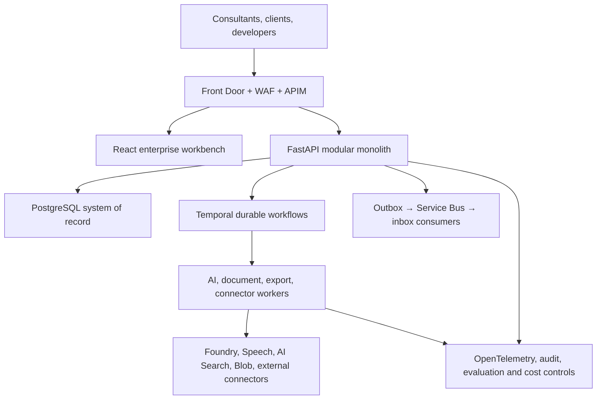

# Axion Stakeholder CRM — Master AI Coding Agent Execution Blueprint

> **Canonical source:** `master.docx`, architectural baseline dated 12 July 2026.  
> **Purpose:** an executable, sequential implementation contract for autonomous coding agents.  
> **Roadmap size:** 80 micro-tasks. Execute in numeric order unless the task's dependency statement explicitly allows parallel work.

## 0. Document Control and Non-Negotiable Rules

This blueprint translates the complete Stakeholder CRM specification into implementation work. The product is an AI-assisted consulting operating system that emulates disciplined Senior Business Analyst and Software Project Manager practices. It is not a chatbot, a one-shot document generator, or an autonomous authority. The application database and deterministic workflows own truth; models return proposals bounded by schemas, evidence, policy, review, and approval.

### 0.1 Locked implementation baseline

- **Repository:** `stakeholder-crm/` monorepo; Python managed with `uv`, JavaScript with `pnpm`; exact dependency versions locked and updated through reviewed automation.
- **Backend:** Python 3.13, FastAPI, Pydantic v2, SQLAlchemy 2 async, asyncpg, Alembic, PostgreSQL 17; modular monolith plus separately deployable workers.
- **Durable orchestration:** Temporal Python SDK. Workflow code is deterministic; database, network, model, search, storage, connector, clock, and random operations live only in activities.
- **Events:** transactional PostgreSQL outbox/inbox and Azure Service Bus Premium; at-least-once delivery with consumer idempotency.
- **AI:** application-owned Model Gateway over Microsoft Foundry `/openai/v1`; Azure identity authentication; LangChain adapters and bounded LangGraph subgraphs are internal implementation details, never authoritative state. Route hard tasks to `AZURE_OPENAI_LLM`, medium tasks to `AZURE_OPENAI_MLM`, and easy tasks to `AZURE_OPENAI_SLM`. LangSmith may receive redacted traces/evaluation metadata only where tenant policy allows; OpenTelemetry remains the system-wide trace standard.
- **Retrieval:** Azure AI Search hybrid full-text/vector retrieval merged with RRF and optional semantic reranking. PostgreSQL and Blob Storage remain authoritative; indexes are rebuildable projections.
- **Web:** React 19.2, TypeScript strict mode, Vite SPA, React Router, Tailwind CSS, Radix/Shadcn patterns, TanStack Query, React Hook Form, Zod, Zustand only for local UI state, React Flow for conceptual graphs, BPMN.io for formal BPMN.
- **Cloud:** Azure Front Door Premium/WAF, API Management, Container Apps/Jobs, PostgreSQL Flexible Server, Managed Redis, Blob Storage, AI Search, Service Bus, Key Vault, Foundry/Speech, App Insights/Monitor/Log Analytics; Bicep is the single IaC language.
- **Identity:** Microsoft Entra ID for Axion workforce; Entra External ID for clients; scoped expiring contribution links for limited survey participation.
- **Contracts:** OpenAPI 3.1, JSON Schema 2020-12, RFC 9457-style problem details, RFC 3339 UTC timestamps, UUID external identifiers, ETag/If-Match concurrency, `Idempotency-Key` for replayable commands.
- **Quality:** `ruff`, `mypy --strict`, `pytest`, Hypothesis, ESLint, Prettier, TypeScript strict checks, Vitest, Testing Library, Playwright, axe-core, Pact/schema compatibility checks, k6/Locust, and AI evaluation suites.

Version numbers other than the locked major/runtime baseline are resolved into lockfiles at TASK-002 from stable, supported releases and recorded in ADR-013. No downstream task may introduce an alternative framework, provider, or state store without an approved ADR.

### 0.2 Global autonomous-agent execution protocol

For every task, the executing agent shall:

1. Read this section, the current task, all stated dependencies, the referenced `master.docx` requirement IDs, and existing ADRs before editing.
2. Inspect the current repository and preserve unrelated changes. Never replace working code with placeholders, mocks in production paths, `TODO`, `pass`, disabled tests, or hard-coded secrets.
3. Create or update a task record at `docs/tasks/TASK-NNN.md` containing scope, decisions, changed files, migrations, commands run, test evidence, coverage, known residual risk, and rollback instructions.
4. Implement only the current task. When a prerequisite is absent, stop with `BLOCKED`, identify the exact missing contract/file/task, and do not invent it.
5. Enforce tenant, project, actor, classification, lifecycle, consent, and version context at server boundaries. Frontend hiding is never authorisation.
6. Use typed contracts end-to-end. All model output is untrusted until parsed, bounded-repaired, policy-checked, citation-validated, and committed by domain services.
7. Add unit, integration, contract, security, accessibility, performance, or AI regression tests in proportion to the change. Modified application code requires at least 90% line and 85% branch coverage; security/domain policy modules require 100% branch coverage. Generated code and migrations are excluded only through documented configuration.
8. Run the task-specific tests plus repository lint, type, schema-compatibility, migration, and secret scans. Record exact commands and outcomes.
9. Update OpenAPI, event schemas, diagrams, runbooks, threat models, seed data, and traceability when affected. Changes are incomplete if only code is updated.
10. Mark a task complete only when every DoD checkbox has objective evidence. Commit naming convention: `TASK-NNN: imperative summary`.

### 0.3 Standard repository structure

```text
stakeholder-crm/
  apps/
    api/                       # FastAPI composition root and HTTP/WebSocket adapters
    worker_ai/                 # Temporal AI and analysis activities
    worker_documents/          # Scan, parse, OCR, chunk, embed and index
    worker_exports/            # Isolated DOCX/PDF/XLSX rendering
    worker_integrations/       # Connector polling, webhook and reconciliation
    web/                       # React enterprise workbench
  packages/
    domain/                    # Pure entities, value objects, policies, domain events
    application/               # Commands, queries, DTOs, workflows and ports
    infrastructure/            # PostgreSQL, Azure, Temporal and provider adapters
    contracts/                 # OpenAPI, JSON Schema, generated clients and event schemas
    observability/             # OTel, redaction, audit and metrics helpers
    evaluation/                # Golden datasets, rubrics, judges and reports
    ui/                        # Design tokens and accessible shared components
  migrations/                 # Alembic revisions and verified data migrations
  infra/                      # Reusable Bicep modules and per-environment composition
  tests/{unit,integration,contract,e2e,security,performance,evals}/
  docs/{adr,architecture,runbooks,tasks,threat-models}/
  scripts/                    # Idempotent bootstrap, seed, recovery and validation CLIs
```

### 0.4 Architecture overview and ownership map



| Layer | Owns | Must never own |
|---|---|---|
| React workbench | presentation, validated drafts, optimistic low-risk interaction, live sequence reducer, human-readable errors | authorisation, authoritative domain state, raw internal IDs/JSON exposed to users |
| FastAPI application | identity context, commands/queries, policy checks, transaction boundaries, REST/WS contracts | long-running work, provider-specific business logic |
| Domain modules | invariants, state machines, gate rules, epistemic/lifecycle semantics, events | HTTP, SQL, Azure SDKs, mutable global state |
| PostgreSQL | tenants, projects, knowledge, evidence, requirements, approvals, baselines, audit/outbox/inbox | vector retrieval ranking or provider thread state |
| Temporal | durable coordination, timers, checkpoints, human waits, retry policy | network/DB/model calls inside workflows |
| Workers/adapters | model inference, parsing, OCR, rendering, connector calls, index updates | direct approval, baseline publication, bypass of application policy |
| AI Search/Redis | rebuildable search projection and disposable cache/rate state | project truth or irreplaceable workflow state |
| Model/agent layer | typed proposals, questions, analysis, summaries, validation recommendations | privileged commits, source fabrication, final commercial/legal/security authority |

### 0.5 Domain invariants applied to every task

- Every project-owned row, blob path, search document, cache key, event, trace, usage record, and export contains `tenant_id`; project-scoped resources also contain `project_id`.
- Knowledge state separates epistemic status (`CONFIRMED`, `INFERRED`, `ASSUMED`, `DISPUTED`, `UNKNOWN`) from lifecycle status (`PROPOSED`, `ACTIVE`, `SUPERSEDED`, `REJECTED`, `ARCHIVED`).
- Approved decisions, baselines, published artefacts, consent records, evidence source versions, and audit events are immutable; correction uses supersession/versioning.
- LLM-callable write tools create proposals only. `approve_baseline`, `publish_artefact`, `accept_change`, and equivalent privileged actions require authenticated human commands.
- A score cannot override an absolute blocker. “Insufficient information” is a valid successful outcome; fabrication is not.
- Source ACL and classification propagate to derived spans, chunks, knowledge, prompts, outputs, notifications, and exports using the strictest applicable policy.
- Provider threads, generated summaries, Redis, AI Search, and LangGraph checkpoints are non-authoritative and reconstructable.
- External writes are disabled by default, idempotent when enabled, reconciled, and governed by explicit field/object mappings.

## 1. Sequential Micro-Task Catalogue

### TASK-001 — Architecture Decision and Specification Traceability Baseline

**OBJECTIVE & SCOPE**

Create the governance artefacts that prevent implementation drift. Depends on no code. In scope: ADR backlog, requirement inventory (`FR-010`–`FR-160`, `NFR-001`–`NFR-018`, `AC-01`–`AC-14`), architecture diagrams, ownership, and decision status. Out of scope: resolving decisions that require procurement or client policy; those remain explicitly `PROPOSED` with recommended defaults.

**TECHNICAL SPECIFICATION & IMPLEMENTATION STEPS**

1. Create `docs/architecture/system-context.md`, `container.md`, `data-flow.md`, `trust-boundaries.md`, and `domain-dependencies.md`; reproduce the source architecture as Mermaid/C4-style views with exact service, data, trust, and human-approval boundaries.
2. Create `docs/adr/ADR-001.md` through `ADR-012.md` from the source backlog and `ADR-013-dependency-baseline.md`; use fields Status, Context, Decision, Alternatives, Consequences, Security/Privacy, Migration, Rollback, Owner, Approval.
3. Create `docs/traceability/specification-matrix.yaml` with one record per FR/NFR/AC including description, owning module, planned task IDs, API/event/schema/test evidence, and status.
4. Add `scripts/validate_traceability.py` that fails for duplicate/missing IDs, unknown task references, or mandatory requirements without implementation and test owners.
5. Add `CODEOWNERS`, `docs/governance/change-control.md`, and a pull-request template requiring requirement IDs, ADR impact, migrations, security, telemetry, rollback, and evidence.

**CORNER CASES & EDGE CASES TO HANDLE**

- One feature maps to multiple requirements; preserve many-to-many mappings rather than selecting one.
- Conflicting source recommendations remain visible with decision owner and due date.
- Renamed IDs cannot be silently reused; aliases retain history.

**VALIDATION & TESTING STRATEGY**

- Unit-test the validator with missing, duplicate, cyclic alias, malformed evidence, and unknown-task fixtures; 100% branch coverage.
- Validate every source FR, NFR, AC, gate G0–G7, and canonical state vocabulary appears exactly once as a primary record.

**DEFINITION OF DONE (DoD)**

- [ ] Twelve source ADRs plus dependency ADR exist and pass the template linter.
- [ ] Architecture, domain ownership, trust, and data-flow views are reviewable.
- [ ] Traceability validation passes and is wired into CI.
- [ ] No source requirement lacks planned implementation and test ownership.

### TASK-002 — Monorepo, Toolchains, Dependency Locks, and Developer Commands

**OBJECTIVE & SCOPE**

Create the buildable repository skeleton used by every later task. Depends on TASK-001. In scope: directories, Python/TypeScript workspaces, deterministic locks, lint/type/test commands, and minimal health applications. Out of scope: product features and cloud resources.

**TECHNICAL SPECIFICATION & IMPLEMENTATION STEPS**

1. Materialise the standard repository tree. Configure root `Makefile` (or `justfile`) commands: `bootstrap`, `lint`, `typecheck`, `test-unit`, `test-integration`, `test-web`, `contracts`, `migrate`, `dev`, and `verify`.
2. Configure `pyproject.toml` as a `uv` workspace for all Python packages/apps; set Python 3.13, ruff, mypy strict, pytest, coverage, Hypothesis, import-linter, and dependency groups. Create lockfile.
3. Configure `pnpm-workspace.yaml`, root `package.json`, TypeScript project references, ESLint, Prettier, Vitest, Testing Library, Playwright, and Vite React 19.2 app. Create lockfile.
4. Add FastAPI `/health/live` only, worker entry points that fail clearly without configuration, and a React shell showing build metadata. Add Dockerfiles with non-root runtime users, fixed base-image digests, health checks, and multi-stage builds.
5. Add `.editorconfig`, `.gitattributes`, `.gitignore`, `.dockerignore`, environment example files containing names but no values, and `docs/development/local-setup.md`.

**CORNER CASES & EDGE CASES TO HANDLE**

- Windows/macOS/Linux line endings and ARM64/x86_64 local builds.
- Missing optional Azure credentials must not prevent offline unit tests.
- Dependency install fails if lockfile and manifest disagree.

**VALIDATION & TESTING STRATEGY**

- Clean-room bootstrap in CI; build all containers and packages twice and compare dependency manifests.
- Smoke-test API and web; assert no network call at import/startup before readiness configuration.

**DEFINITION OF DONE (DoD)**

- [ ] One documented command bootstraps and verifies the repository.
- [ ] Python and TypeScript lint/type/test commands pass from a clean checkout.
- [ ] Containers run non-root and expose only declared ports.
- [ ] Dependency versions are locked and recorded in ADR-013.

### TASK-003 — Typed Configuration, Secrets, Environment Profiles, and Feature Flags

**OBJECTIVE & SCOPE**

Implement fail-fast, typed configuration shared by API and workers. Depends on TASK-002. In scope: environment profiles, Pydantic settings, Key Vault references, redaction, feature flags, and configuration validation. Out of scope: provisioning Key Vault and implementing product policy.

**TECHNICAL SPECIFICATION & IMPLEMENTATION STEPS**

1. Add `packages/infrastructure/config/` with immutable Pydantic Settings models for application, database, Redis, Temporal, Service Bus, Blob, Search, Foundry, Speech, OTel, identity, connector, and export configuration.
2. Define precedence: process environment → local `.env` only in `local` → Azure App Configuration/Key Vault adapter for deployed environments. Reject unknown variables under the application prefix and invalid cross-field combinations.
3. Model secrets as opaque `SecretRef`; prevent serialisation, repr, log, trace, exception, or FastAPI error exposure. Resolve secrets lazily through managed identity and cache only for bounded TTL.
4. Add `FeatureFlagPort` with deterministic tenant/project/environment evaluation, default-off for unfinished features, kill switch, evaluation reason, and audit hook for high-impact flags.
5. Provide `scripts/config_check.py --environment <name>` that validates presence and connectivity intent without printing values.

**CORNER CASES & EDGE CASES TO HANDLE**

- Empty strings, whitespace, malformed URLs, conflicting region/residency, expired secret version, Key Vault outage, and stale feature-flag cache.
- Production refuses local credentials, wildcard CORS, debug mode, or default cryptographic material.

**VALIDATION & TESTING STRATEGY**

- Property-test parsing/redaction; unit-test every invalid combination with 100% branch coverage.
- Integration-test secret resolution with fake and Azure sandbox adapters; snapshot logs to prove no secret leakage.

**DEFINITION OF DONE (DoD)**

- [ ] All apps consume the same validated configuration contracts.
- [ ] Production starts only with a complete safe configuration.
- [ ] Secret and flag decisions are redacted, attributable, and testable.
- [ ] Example configuration documents every variable and owner.

### TASK-004 — Canonical Contracts, State Vocabularies, Error Model, and Generated Clients

**OBJECTIVE & SCOPE**

Establish cross-language contracts before domain implementation. Depends on TASK-002. In scope: canonical enums, IDs, money/time/classification types, problem responses, pagination, event envelope, JSON schemas, and client generation. Out of scope: endpoints beyond health.

**TECHNICAL SPECIFICATION & IMPLEMENTATION STEPS**

1. Add Pydantic/domain value objects for UUID, `TenantId`, `ProjectId`, UTC timestamp, timezone, locale, classification, epistemic/lifecycle statuses, all Appendix A states, confidence, version, ETag, and correlation context.
2. Create `packages/contracts/schemas/` JSON Schemas for command metadata, `ProblemDetails`, cursor page, audit actor, evidence reference, `AgentResult<T>`, and domain event envelope with schema version.
3. Implement FastAPI exception mapping to `application/problem+json`; stable codes never expose SQL, stack traces, raw validation internals, snake_case field labels, or database IDs in user-facing `detail`.
4. Generate OpenAPI 3.1 and a TypeScript client into `packages/contracts/generated/ts`; generated output is checked for drift and never hand-edited.
5. Add schema compatibility rules: additive optional fields allowed within major version; required-field removal/type change fails; event consumers must ignore unknown additive fields.

**CORNER CASES & EDGE CASES TO HANDLE**

- Unknown future enum values are rejected for commands but preserved/handled safely for event reads where specified.
- Invalid cursor, naive datetime, unsupported locale, classification downgrade, and correlation-ID injection.

**VALIDATION & TESTING STRATEGY**

- Round-trip Python/JSON/TypeScript fixtures; property tests for timestamps and cursors.
- Contract tests prove representative breaking changes fail and additive changes pass; 100% branch coverage for error mapping.

**DEFINITION OF DONE (DoD)**

- [ ] Canonical states match Appendix A exactly.
- [ ] OpenAPI and JSON Schemas validate and generated clients compile.
- [ ] Error responses are stable, correlated, localisable, and sanitised.
- [ ] Contract drift is a CI failure.

### TASK-005 — Local Infrastructure Stack and Deterministic Test Harness

**OBJECTIVE & SCOPE**

Provide reproducible local dependencies and test fixtures. Depends on TASK-002–004. In scope: PostgreSQL, Redis, Temporal dev server, Azurite, Service Bus/Search/Foundry/Speech fakes, seed identities, and isolation. Out of scope: production cloud parity and real provider credentials.

**TECHNICAL SPECIFICATION & IMPLEMENTATION STEPS**

1. Add `compose.yaml` for PostgreSQL 17, Redis, Temporal dev server/UI, Azurite, and local mail capture; pin image digests and define health/dependency conditions.
2. Implement in-process ports/fakes for Service Bus, AI Search, Foundry, Speech, Key Vault, clock, UUID, and connectors. Fakes must reproduce pagination, retryable/non-retryable errors, throttling, duplicate events, and ACL filtering—not merely return success.
3. Add pytest fixtures for isolated database schemas/transactions, actor/tenant/project contexts, deterministic clock/IDs, blob containers, Temporal time-skipping environment, and synthetic source files.
4. Add web mock server generated from OpenAPI, with scenario fixtures for success, empty, loading, forbidden, conflict, partial, retrying, and failed states.
5. Add `scripts/seed_local.py` with two tenants containing identical names and cross-linked adversarial canaries; reruns are idempotent.

**CORNER CASES & EDGE CASES TO HANDLE**

- Parallel test workers cannot share schemas, ports, queues, or tenant data.
- Interrupted setup cleans temporary resources; stale seed version triggers migration rather than duplication.

**VALIDATION & TESTING STRATEGY**

- Run test suite twice in parallel and with random order; assert identical results.
- Contract-test fake behaviours against adapter expectations and selected Azure sandbox tests.

**DEFINITION OF DONE (DoD)**

- [ ] Local stack becomes healthy with one command and no cloud account.
- [ ] Tests are deterministic, parallel-safe, and tenant-isolated.
- [ ] Provider failure modes can be selected per test.
- [ ] Seed data includes positive and cross-tenant negative cases.

### TASK-006 — CI/CD, Supply-Chain Security, and Release Evidence Skeleton

**OBJECTIVE & SCOPE**

Create enforced pipelines for validation, build, scan, provenance, and promotion. Depends on TASK-001–005. In scope: pull-request CI, container build, SBOM/signing, artefact retention, staged deployment skeleton, and release manifest. Out of scope: deploying production resources before IaC exists.

**TECHNICAL SPECIFICATION & IMPLEMENTATION STEPS**

1. Add CI jobs for locks, formatting, lint, strict typing, unit/integration/contract tests, traceability, OpenAPI/event compatibility, migration upgrade/downgrade, web tests, accessibility smoke, secret/SAST/SCA/IaC/container scans.
2. Build immutable API/worker/web images once; attach SBOM, vulnerability report, source revision, dependency locks, and signed provenance. Promote the same digest between environments.
3. Add release manifest schema containing requirement/test evidence, image digests, migration set, prompt/model/domain-pack versions, feature flags, rollback, approvals, and known risks.
4. Configure environment gates: dev automatic after main; test/staging require passed suites; production requires named approval, backup check, migration plan, AI evaluation, and error-budget policy.
5. Add Renovate/Dependabot equivalent with grouped low-risk updates, mandatory tests, and no automatic major upgrades.

**CORNER CASES & EDGE CASES TO HANDLE**

- Forked/untrusted pull requests receive no secrets or deployment identity.
- Scanner outage, flaky test, partial matrix failure, revoked signing identity, and already-published tag.

**VALIDATION & TESTING STRATEGY**

- Intentionally introduce lint, secret, breaking schema, vulnerable package, failed test, and missing evidence changes; each must block.
- Verify artifact digest is unchanged across promotion and rollback can select the prior manifest.

**DEFINITION OF DONE (DoD)**

- [ ] Protected branch requires all mandatory checks and review.
- [ ] Builds are reproducible, scanned, signed, and traceable.
- [ ] Deployment uses workload identity federation, not stored cloud keys.
- [ ] Release manifest can reconstruct exactly what was promoted.

### TASK-007 — Azure Landing Zone, Network, Identity, and Core IaC Modules

**OBJECTIVE & SCOPE**

Provision repeatable environment foundations using Bicep. Depends on TASK-003 and TASK-006. In scope: resource groups, network/private DNS, managed identities, registries, Front Door/WAF, APIM, Container Apps environment, Key Vault, monitoring workspace, policy, tags, budgets. Out of scope: product database schemas and application deployment configuration.

**TECHNICAL SPECIFICATION & IMPLEMENTATION STEPS**

1. Create reusable modules under `infra/modules/` and compositions under `infra/environments/{dev,test,staging,prod,recovery}`; environment values contain no secrets.
2. Provision VNet/subnets, private DNS, NAT/firewall egress path, private Container Apps environment, ACR, user-assigned managed identities, Key Vault with RBAC/soft delete/purge protection, Log Analytics, App Insights, and diagnostic settings.
3. Configure Front Door Premium origin shielding and managed/custom WAF policy; APIM validates tokens, correlation headers, body limits, quotas, and versions. Direct public origins are denied.
4. Apply least-privilege role assignments per workload, resource locks for production critical services, Azure Policy, mandatory ownership/classification/cost/lifecycle tags, budgets, and anomaly alerts.
5. Add `what-if`, lint, Checkov/PSRule, deployment smoke, and drift-detection pipelines; document break-glass and private administration access.

**CORNER CASES & EDGE CASES TO HANDLE**

- Resource-name collisions, regional service unavailability, private DNS failure, role propagation delay, Front Door health probe failure, and recovery teardown safeguards.
- Production cannot share data, identities, secrets, or network with non-production.

**VALIDATION & TESTING STRATEGY**

- Deploy/destroy ephemeral dev; assert denied public DB/cache endpoints and only approved ingress/egress.
- Test WAF, TLS 1.2+, identity permissions, tag policy, budget, and drift alerts.

**DEFINITION OF DONE (DoD)**

- [ ] All environments are reproducible from reviewed Bicep.
- [ ] Production isolation and private-service posture are verified.
- [ ] No secret exists in source, output, or state.
- [ ] IaC tests and architecture documentation pass.

### TASK-008 — OpenTelemetry, Structured Logging, Correlation, and Redaction Foundation

**OBJECTIVE & SCOPE**

Make every later command and workflow observable without leaking sensitive payloads. Depends on TASK-003–004. In scope: trace propagation, metrics/log conventions, redaction, build metadata, health/readiness, and telemetry tests. Out of scope: feature-specific dashboards and AI evaluation.

**TECHNICAL SPECIFICATION & IMPLEMENTATION STEPS**

1. Implement `packages/observability/` with OTel initialisation for FastAPI, SQLAlchemy, HTTP clients, Temporal, Service Bus, Redis, and Azure SDKs; propagate W3C `traceparent`, `tracestate`, correlation and causation IDs.
2. Define structured event schema: timestamp, severity, stable event code, service/build, tenant/project hashed or access-controlled references, actor type, operation, outcome, duration, trace/correlation; payload fields are allowlisted.
3. Add recursive redaction for secrets, tokens, credentials, audio/text bodies, prompt/response, personal data patterns, and restricted fields. Redaction occurs before exporters and exception rendering.
4. Add `/health/live`, `/health/ready`, `/health/startup`; readiness checks critical dependency reachability with bounded timeout but never prints endpoints or credentials.
5. Create metric naming/cardinality policy and initial HTTP, DB pool, event loop, worker, and dependency metrics.

**CORNER CASES & EDGE CASES TO HANDLE**

- Malicious user strings containing line breaks/control characters, huge exception objects, recursive data, telemetry exporter outage, and high-cardinality identifiers.
- Telemetry failure never fails the business transaction.

**VALIDATION & TESTING STRATEGY**

- Snapshot redaction for nested Pydantic/dataclass/dict/exception structures; fuzz malicious strings; 100% branch coverage for redaction.
- Integration-test one trace across API → fake workflow/activity → HTTP/DB → event.

**DEFINITION OF DONE (DoD)**

- [ ] Cross-component trace reconstruction works.
- [ ] Sensitive raw content is absent from standard logs/traces.
- [ ] Health endpoints distinguish liveness/readiness safely.
- [ ] Telemetry conventions and cardinality budgets are documented.

### TASK-009 — PostgreSQL Foundation, Schemas, Common Columns, RLS, and Migration Policy

**OBJECTIVE & SCOPE**

Create the authoritative persistence base. Depends on TASK-003–005. In scope: database schemas, common metadata, actor transaction context, RLS, audit-safe migration conventions, and connectivity. Out of scope: feature tables added later.

**TECHNICAL SPECIFICATION & IMPLEMENTATION STEPS**

1. Create Alembic baseline schemas: `identity`, `project`, `stakeholder`, `discovery`, `source`, `evidence`, `knowledge`, `requirements`, `analysis`, `governance`, `artefact`, `delivery`, `platform`, `integration`, `operations`.
2. Implement reusable SQLAlchemy mixins for UUID, tenant/project, version, UTC timestamps, actors, classification, soft-delete marker, row ETag, and JSON metadata. Enforce timezone-aware values and optimistic update predicates.
3. Add transaction-local settings `app.tenant_id`, `app.project_ids`, `app.actor_id`, `app.permissions`, and `app.support_grant`; create deny-by-default RLS helpers/policies for project-owned tables.
4. Configure async engine, bounded pool, statement/lock/idle timeouts, application name, read-only transaction helper, and PgBouncer-compatible behaviour.
5. Document expand/contract migration rules; add migration checker for destructive DDL, missing tenant keys/indexes, unbounded locks, and absent downgrade/roll-forward notes.

**CORNER CASES & EDGE CASES TO HANDLE**

- Missing transaction context denies access; pooled connection cannot retain prior tenant context.
- Soft-deleted row uniqueness, concurrent ETag update, tenant mismatch FK, and long migration on populated table.

**VALIDATION & TESTING STRATEGY**

- Integration tests with two tenants and bypass attempts through joins, raw SQL, pooled connection reuse, and forged context; 100% branch coverage for context setup.
- Upgrade/downgrade clean and seeded databases; inspect constraints/indexes/RLS.

**DEFINITION OF DONE (DoD)**

- [ ] Baseline migration is deterministic and reversible or has documented roll-forward.
- [ ] RLS defaults to deny and survives pooled connection reuse.
- [ ] Common invariants are enforced in DB and domain layers.
- [ ] Migration safety is enforced in CI.

### TASK-010 — Identity, Browser Session, External Client, and Service Authentication

**OBJECTIVE & SCOPE**

Implement authentication and actor resolution. Depends on TASK-003–005, TASK-007, and TASK-009. In scope: Entra workforce/external identity, PKCE/BFF session choice, managed identity, token validation, account linking, MFA/step-up claims, and logout. Out of scope: authorisation decisions (TASK-011) and contribution links (TASK-013).

**TECHNICAL SPECIFICATION & IMPLEMENTATION STEPS**

1. Implement `identity_access` adapters for Entra ID and Entra External ID; validate issuer, audience, signature, expiry, nonce, authorised tenant, and token type. Cache signing keys with safe refresh on rotation.
2. Use a BFF-style encrypted, Secure, HttpOnly, SameSite cookie session; keep access/refresh tokens server-side encrypted. Implement PKCE login/callback, rotation, idle/absolute expiry, front/back-channel logout where supported, and CSRF token binding.
3. Add `identity.user_profile`, `external_identity`, and `service_principal_binding` tables; link by immutable issuer+subject, never email alone. Record verified email separately and handle explicit account merge workflow.
4. Build `ActorContext` containing user/service identity, active tenant, memberships, authentication time/method, step-up/MFA, locale/timezone, correlation, and impersonation grant.
5. Configure Azure workload managed identity/CI federation adapters; reject static service keys in deployed environments.

**CORNER CASES & EDGE CASES TO HANDLE**

- Key rotation, clock skew, revoked/disabled user, email change, duplicate email across directories, guest removal, token replay, concurrent refresh, stale cookie, wrong audience/issuer, and multi-tenant user without selected tenant.

**VALIDATION & TESTING STRATEGY**

- Unit-test claim validation and session state at 100% branch coverage; integration-test local OIDC and Entra sandbox.
- Security tests for fixation, CSRF, open redirect, replay, cookie theft mitigation, token substitution, and logout invalidation.

**DEFINITION OF DONE (DoD)**

- [ ] Workforce, external client, and service actors resolve to stable identities.
- [ ] Browser tokens never enter localStorage or client logs.
- [ ] Invalid/revoked/stale sessions fail closed with localisable messages.
- [ ] Authentication events are correlated, rate-limited, and audited without token leakage.

### TASK-011 — RBAC/ABAC Policy Engine and Sensitive-Action Audit

**OBJECTIVE & SCOPE**

Implement deny-by-default server authorisation. Depends on TASK-009–010. Covers permissions, role grants, resource attributes, policy explanations, segregation of duties, classification and support access checks. Excludes domain workflows and UI visibility.

**TECHNICAL SPECIFICATION & IMPLEMENTATION STEPS**

1. Add `packages/domain/identity_access/policy.py` with `PolicyDecision(ALLOW|DENY, code, matched_rules, obligations)` and permissions from the source (`project.*`, `session.*`, `evidence.review`, `requirement.approve`, `artefact.publish/export`, `ai.policy.manage`, `support.impersonate`).
2. Create tables for tenant/project membership, role, permission, authority grant, classification grant, and scoped delegation with effective/expiry dates.
3. Resolve RBAC first, then ABAC on tenant/project, resource classification, lifecycle, ownership, stakeholder authority, consent, environment, recent authentication, conflict of interest, and delegation.
4. Provide FastAPI dependency and application-service guard; repository calls require actor context and RLS. Emit allow audit only for configured sensitive operations; emit every deny using stable codes.
5. Add policy fixtures/matrix documentation and an admin simulation endpoint restricted to policy administrators; it cannot execute the action.

**CORNER CASES & EDGE CASES TO HANDLE**

- Multiple memberships, expired/revoked delegation, classification downgrade, self-approval, support grant outside ticket scope, and resource moved between projects.
- Missing attributes deny; no implicit platform-admin bypass.

**VALIDATION & TESTING STRATEGY**

- Table-driven and property tests for every persona/action/resource combination; 100% branch coverage.
- Integration-test API, repository, RLS, search/blob adapter guards, and forged identifiers across tenants.

**DEFINITION OF DONE (DoD)**

- [ ] Every command/query has an explicit permission and policy test.
- [ ] Sensitive allow/deny decisions are explainable and audited.
- [ ] Self-approval and cross-tenant/object bypasses fail closed.
- [ ] Policy matrix matches source authority boundaries.

### TASK-012 — Tenant, Client Account, Project, Policy, and Lifecycle Aggregate

**OBJECTIVE & SCOPE**

Implement FR-010 project administration and the governed lifecycle. Depends on TASK-004, TASK-009, TASK-011. Includes tenants, organisations/client accounts, projects, workstreams, policies, templates, G0–G7 transition preconditions, archive/hold/close. Excludes deletion execution and gate computation.

**TECHNICAL SPECIFICATION & IMPLEMENTATION STEPS**

1. Add entities/tables `tenant`, `client_account`, `project`, `workstream`, `project_policy`, `project_template_binding`, `lifecycle_transition`, `baseline`; include name/slug, consulting type, domain pack, outcomes, commercial boundary, classification, region, language, timezone, retention profile.
2. Implement pure project state machine for Appendix A states and permitted transitions. Require sponsor and engagement lead before `DISCOVERY_PLANNED`; store transition request, criteria snapshot, actor, reason, gate reference, old/new version.
3. Add command/query handlers and `/v1/projects`, `/{id}`, `/{id}/members`, `/{id}/transitions`, `/{id}/export`; enforce idempotency and If-Match.
4. Implement template clone by immutable version; copy reusable configuration only and record provenance/local modifications.
5. Classification/region/retention changes after evidence exists create policy-re-evaluation command and block until approved migration plan.

**CORNER CASES & EDGE CASES TO HANDLE**

- Same slug in different tenants, stale ETag, invalid transition, cancelled/closed mutation, template retired mid-clone, and lifecycle race.
- Reopening uses a new transition/version; history is never overwritten.

**VALIDATION & TESTING STRATEGY**

- State-machine property tests for every transition and invariant; 100% branch coverage.
- API/RLS tests with identical names across tenants; concurrency and idempotency tests.

**DEFINITION OF DONE (DoD)**

- [ ] FR-010 APIs and entities are complete and generated client compiles.
- [ ] Lifecycle rejects missing criteria and preserves immutable history.
- [ ] Template cloning contains no client data.
- [ ] Tenant-isolation acceptance evidence is recorded.

### TASK-013 — Contribution Links, Invitations, Break-Glass, and Support Grants

**OBJECTIVE & SCOPE**

Implement limited participant access and controlled support access. Depends on TASK-010–012. Covers stakeholder invitations, secure survey/session tokens, revocation, optional verification, break-glass grants, and support impersonation disclosure. Excludes campaign content.

**TECHNICAL SPECIFICATION & IMPLEMENTATION STEPS**

1. Create `invitation`, `contribution_grant`, `support_grant`, and token-use records; store only keyed token hashes, scope, purpose, tenant/project/stakeholder, allowed resources/actions, maximum uses, expiry, revocation, issuer.
2. Issue ≥256-bit random tokens through notification links; consume atomically and bind to intended route. Optional verification uses one-time code or external identity without changing stakeholder authority.
3. Implement invitation status and resend without reviving revoked tokens; accepted identities bind through explicit record.
4. Support grants require ticket, reason, approver, tenant consent when policy requires, expiry, classification ceiling, and step-up. UI/API must show impersonation banner and original/support actor.
5. Rate-limit token verification; redact query tokens from logs, referrers, analytics, and subsequent URLs.

**CORNER CASES & EDGE CASES TO HANDLE**

- Link forwarded, simultaneous use, expired during draft, revoked after page load, clock skew, email scanners prefetching links, and support grant expiring mid-request.

**VALIDATION & TESTING STRATEGY**

- Cryptographic/token lifecycle unit tests at 100% branch coverage; concurrency test atomic use.
- Security tests for enumeration, replay, privilege widening, referrer leakage, and support access outside scope.

**DEFINITION OF DONE (DoD)**

- [ ] Tokens are scoped, revocable, bounded, non-recoverable from storage.
- [ ] Prefetch does not consume a grant; explicit confirmation does.
- [ ] Break-glass use is time-limited, visible, and fully audited.
- [ ] No contribution grant conveys approval authority.

### TASK-014 — Unit of Work, Idempotency, Optimistic Concurrency, and Audit Ledger

**OBJECTIVE & SCOPE**

Create reusable transactional command infrastructure. Depends on TASK-008–012. Covers unit of work, repositories, command idempotency, ETags, append-only audit, before/after references, and RFC 9457 mapping. Excludes event publication.

**TECHNICAL SPECIFICATION & IMPLEMENTATION STEPS**

1. Implement async `UnitOfWork` that sets/clears actor transaction context, exposes repositories, commits once, rolls back on error, and collects domain events.
2. Add `idempotency_record` keyed by tenant+actor+route+key with canonical request hash, status, response reference, expiry. Same key/different body returns 409; in-progress duplicates wait boundedly or return retryable 409.
3. Implement aggregate ETags from row/version token; high-value PATCH/approve commands require If-Match and return 412 with current version metadata.
4. Add append-only, partition-ready `audit_event` with actor/delegation/support context, policy decision, target/version, action, reason, correlation, safe before/after references, classification. Deny UPDATE/DELETE to app role.
5. Provide audit query API with allowlisted filters, cursor pagination, restricted payload view, and export authorisation.

**CORNER CASES & EDGE CASES TO HANDLE**

- Client disconnect after commit, retry during first execution, hash canonicalisation, failed command retry, stale ETag, nested UoW, rollback, and audit write failure.

**VALIDATION & TESTING STRATEGY**

- Property/integration tests for exactly-one domain effect under parallel duplicates; 100% branch coverage for idempotency/concurrency.
- Verify audit immutability and no cross-tenant search.

**DEFINITION OF DONE (DoD)**

- [ ] Commands cannot duplicate effects or silently lose updates.
- [ ] Domain and audit changes share a transaction.
- [ ] Audit is immutable, searchable, redacted, and correlated.
- [ ] Reusable middleware/handlers are documented.

### TASK-015 — Transactional Outbox, Service Bus, Consumer Inbox, and DLQ

**OBJECTIVE & SCOPE**

Implement reliable domain/integration event delivery. Depends on TASK-004, TASK-014, TASK-007. Covers source event catalogue, outbox publisher, Service Bus topology, inbox idempotency, ordering, retries, and dead-letter operations. Excludes feature consumers.

**TECHNICAL SPECIFICATION & IMPLEMENTATION STEPS**

1. Add `outbox_event`, `consumer_inbox`, `publisher_lease`, `dead_letter_record`; commit domain change and event in the same UoW. Use immutable `event_id` as Service Bus `message_id`.
2. Implement publisher polling pending rows with `FOR UPDATE SKIP LOCKED`, bounded batches, lease heartbeat, exponential backoff, attempt/availability timestamps, and sent confirmation.
3. Provision topics/subscriptions/session keys through Bicep; configure duplicate detection as secondary defence and explicit DLQ thresholds.
4. Implement consumer wrapper that validates schema, tenant/project, classification, ordering expectation, and commits inbox+projection atomically.
5. Add restricted operations APIs to inspect, classify, repair payload/mapping via new corrective record, replay, and verify; never edit original event.

**CORNER CASES & EDGE CASES TO HANDLE**

- Publish succeeds but acknowledgement fails, duplicate/out-of-order event, poison schema, handler crash after side effect, expired event, lease loss, DLQ replay twice.

**VALIDATION & TESTING STRATEGY**

- Fault-injection integration tests across every commit/publish/consume boundary; prove no lost event and one consumer effect.
- Contract tests cover all initial event types and incompatible major rejection.

**DEFINITION OF DONE (DoD)**

- [ ] At-least-once delivery is safe through inbox idempotency.
- [ ] Publisher is horizontally scalable and recoverable.
- [ ] DLQ has audited inspect/repair/replay flow.
- [ ] Event schemas and compatibility checks pass.

### TASK-016 — Temporal Runtime, Worker Queues, Workflow Base Contracts, and Recovery

**OBJECTIVE & SCOPE**

Create durable orchestration foundation. Depends on TASK-003, TASK-005, TASK-008, TASK-015. Covers client/workers, namespaces/task queues, deterministic workflow conventions, activity policies, signals/queries, deployment versioning, and operations visibility. Excludes feature workflow logic.

**TECHNICAL SPECIFICATION & IMPLEMENTATION STEPS**

1. Configure local and environment Temporal connections, namespaces, retention, codecs/encryption policy, separate queues (`interactive`, `ai`, `documents`, `exports`, `connectors`, `maintenance`) and per-queue concurrency.
2. Implement base workflow input/status/result Pydantic contracts, correlation/search attributes, cancellation, pause/resume, progress queries, human-decision signals, and activity heartbeat helpers.
3. Centralise activity retry/timeout profiles matching source baselines; mark validation/policy/configuration errors non-retryable and respect provider `Retry-After`.
4. Enforce workflow sandbox/import rules: no DB/network/model/random/wall clock. Add replay tests and worker deployment versioning/patch policy for months-long workflows.
5. Add operations query APIs for workflow status/failure, safe retry, signal, cancel, reset proposal, and run linkage; high-impact reset requires approval and reason.

**CORNER CASES & EDGE CASES TO HANDLE**

- Worker crash, activity timeout after external success, signal before wait, duplicate signal, deployment during long wait, cancellation during heartbeat, and non-deterministic code change.

**VALIDATION & TESTING STRATEGY**

- Temporal time-skipping unit/integration tests, replay histories from fixtures, crash/restart fault injection; workflow core 100% branch coverage.
- Verify queue isolation and rate/concurrency limits.

**DEFINITION OF DONE (DoD)**

- [ ] Workflow code passes determinism/replay validation.
- [ ] Durable wait/restart/cancel/retry behaviour is demonstrated.
- [ ] Task queues isolate cost and workload classes.
- [ ] Recovery actions are safe, authorised, and audited.

### TASK-017 — Versioned Domain Packs, Topic Taxonomy, and Template Upgrade

**OBJECTIVE & SCOPE**

Implement FR-030 reusable discovery knowledge. Depends on TASK-012, TASK-014. Covers versioned packs, topics, dependencies, question seeds, evidence expectations, regulatory references, composition, project application, and upgrade diff. Excludes adaptive question generation.

**TECHNICAL SPECIFICATION & IMPLEMENTATION STEPS**

1. Create `domain_pack`, immutable `domain_pack_version`, `topic`, `topic_dependency`, `question_seed`, `evidence_expectation`, `risk_trigger`, `artefact_mapping`, `project_topic`, `template_upgrade`.
2. Implement deterministic composition order: core → industry → solution type → tenant; merge by stable topic key, detect incompatible definitions, preserve provenance, and require reviewer resolution.
3. Add admin APIs for draft/version/test/approve/publish/retire and project APIs for list/apply/preview-upgrade/accept-upgrade/waive topic.
4. Compute semantic diff of added/changed/removed/reordered/mandatory/dependency/evidence items. Active projects never change until explicit upgrade.
5. Promotion of a project addition requires client-data scan/anonymisation, provenance, expert review, and new version.

**CORNER CASES & EDGE CASES TO HANDLE**

- Circular topic dependency, same stable key different meaning, retired source, project-local edits, downgrade attempt, mandatory-to-optional change, and regulatory source expiry.

**VALIDATION & TESTING STRATEGY**

- Property-test deterministic composition and DAG; integration-test ERP+healthcare merge and upgrade diff.
- Security test that cloned/global packs contain no project/client data.

**DEFINITION OF DONE (DoD)**

- [ ] Pack versions are immutable, attributable, and reproducible.
- [ ] Active project upgrades are explicit and diffed.
- [ ] Mandatory waivers remain visible and feed residual risk.
- [ ] FR-030 acceptance scenario passes.

### TASK-018 — Stakeholder, Authority, RACI, Participation, and Consent Model

**OBJECTIVE & SCOPE**

Implement FR-020 stakeholder intelligence. Depends on TASK-011–013, TASK-017. Covers individuals/groups, identity binding, roles, knowledge/ownership, decision authority, influence/impact, participation, consent, RACI recommendations, coverage warnings, import. Excludes surveys/sessions.

**TECHNICAL SPECIFICATION & IMPLEMENTATION STEPS**

1. Add stakeholder tables from FR-020 plus `consent_record` immutable version, `engagement_action`, `waiver`; distinguish business person/group from login identity.
2. Implement CRUD/import with row-level validation and duplicate-candidate report. AI/source-inferred fields start `PROPOSED` with evidence; no silent merge.
3. Model authority by domain, scope, limit, delegation, effective dates; `information_provider` is distinct from `approver`.
4. Implement stakeholder coverage query for mandatory decision/process/data/security/acceptance roles, representation confidence, proxy/waiver, and route suitability.
5. Generate RACI/RASCI and engagement recommendations as reviewable proposals; prohibit sensitive-trait inference/psychometric ranking.

**CORNER CASES & EDGE CASES TO HANDLE**

- One person holds conflicting roles, delegated authority expires, group later resolves to individuals, stakeholder declines, proxy is unrepresentative, consent versions differ by purpose.

**VALIDATION & TESTING STRATEGY**

- Unit-test authority/coverage at 100% branch coverage; import malformed/duplicate spreadsheets.
- E2E test missing process owner/security approver and end-user budget approval denial.

**DEFINITION OF DONE (DoD)**

- [ ] Stakeholder map captures source fields and separates identity/role/authority.
- [ ] Coverage exposes absent owners and formal waivers.
- [ ] Inferred data remains proposed until confirmed.
- [ ] Consent history is immutable and enforceable.

### TASK-019 — Discovery Plan, Coverage Projection, Document Requests, and Topic Waivers

**OBJECTIVE & SCOPE**

Build FR-030/FR-120 discovery planning over packs and stakeholders. Depends on TASK-017–018. Covers plan versions, topic-to-evidence/participant/session mapping, coverage calculation inputs, document requests, scheduling dependencies, waiver validation, and G1 readiness. Excludes campaigns and final sufficiency gate.

**TECHNICAL SPECIFICATION & IMPLEMENTATION STEPS**

1. Add `discovery_plan`, immutable version, plan topic/participant/session/document-request mappings, dependency, completion criterion, and approval.
2. Generate a deterministic draft from project configuration, composed topics, stakeholder suitability/authority, expected evidence, risk triggers, availability, and accessibility/locale.
3. Calculate coverage by expected evidence state (`MISSING`, `REQUESTED`, `RECEIVED_UNREVIEWED`, `PARTIAL`, `SUFFICIENT`, `WAIVED`) and weighted topic—not question count.
4. Support consultant add/reorder/suppress/mandatory/assign/waive with reason; validate authority, scope, expiry, residual risk, and affected gates.
5. Implement publish and G1-readiness endpoint; published version is immutable and lifecycle transition references it.

**CORNER CASES & EDGE CASES TO HANDLE**

- No suitable stakeholder, unavailable mandatory approver, evidence satisfies multiple topics, invalid waiver expiry, dependency cycle, pack upgrade after publication.

**VALIDATION & TESTING STRATEGY**

- Property-test coverage bounds and deterministic plan; 100% branch coverage for readiness/blockers.
- Integration-test publish rejection for missing sponsor/consent/owner and residual risk from waiver.

**DEFINITION OF DONE (DoD)**

- [ ] Plan explains every topic, source, participant, dependency, and expected evidence.
- [ ] Coverage is reproducible and cannot be inflated by question count.
- [ ] G1 returns exact blockers and remediation.
- [ ] Published plans are immutable/versioned.

### TASK-020 — Tasks, Comments, Mentions, Notifications, Digests, and Escalations

**OBJECTIVE & SCOPE**

Implement FR-150 collaboration infrastructure. Depends on TASK-011, TASK-014–015, TASK-018. Covers tasks/dependencies, comments/mentions, preferences, in-app/email channels, redaction, quiet hours, digests, delivery tracking, escalation. Excludes Teams/Slack connectors.

**TECHNICAL SPECIFICATION & IMPLEMENTATION STEPS**

1. Add `task`, dependency DAG, `comment`, `mention`, `notification`, `notification_delivery`, `preference`, `escalation_policy`, `digest`; typed targets reference project entities without polymorphic FK ambiguity.
2. Implement task CRUD/complete with owner, due date, evidence requirements, dependency state, priority; completion records actor/time/evidence and rejects unmet prerequisites.
3. Implement threaded comments, resolution, mentions, deep links, edit history, classification inheritance, and authorisation per target.
4. Consume domain events into notification proposals; render channel/localised templates with classification-aware redaction, quiet hours, deduplication key, retry/bounce status, and one escalation per policy window.
5. Add reviewer/session preparation digests sorted by criticality/deadline; authoritative approval/task state remains in domain tables.

**CORNER CASES & EDGE CASES TO HANDLE**

- Circular task dependency, deleted target, mentioned user loses access, quiet-hours timezone/DST, bounced email, duplicate event, escalation chain loop, restricted content in subject line.

**VALIDATION & TESTING STRATEGY**

- Unit/property tests for dependency DAG, scheduling, redaction and dedupe; 100% branch coverage for policy/redaction.
- Integration-test restricted comment email, overdue escalation once, bounce/retry, and access-revoked deep link.

**DEFINITION OF DONE (DoD)**

- [ ] Task and collaboration state is structured, traceable, and authorised.
- [ ] Notifications expose no disallowed sensitive content.
- [ ] Quiet hours, locale, delivery, digest, and escalation operate deterministically.
- [ ] FR-150 acceptance evidence passes.

### TASK-021 — Adaptive Survey Campaign Domain and Form Contracts

**OBJECTIVE & SCOPE**

Implement FR-040 campaign authoring and structured question/response contracts. Depends on TASK-017–020. Covers campaign versions, question types, branching, limits, answer quality, publication, and localisation. Excludes public token flow and AI question ranking.

**TECHNICAL SPECIFICATION & IMPLEMENTATION STEPS**

1. Add `campaign`, immutable `campaign_version`, `survey_instance`, `survey_question`, `survey_response`, `branching_rule`, `response_quality`, `campaign_checkpoint`; support choice, matrix, scale, date, numeric, file, rich text.
2. Define each question with stable ID, purpose, topic, generator/prompt version, answer JSON Schema, target reason, sensitivity, authority required, required/optional, neutral participant wording, and estimated seconds.
3. Compile branching rules into deterministic DAG; validate references, reachability, maximum depth/question count/time, accessibility label, locale fallback, and sensitive-channel routing.
4. Implement create/preview/publish APIs. Publishing freezes content/checksum; instances bind to version and participant/stakeholder scope.
5. Implement deterministic completeness/ambiguity validators and one bounded clarification slot; AI enhancement remains a proposal.

**CORNER CASES & EDGE CASES TO HANDLE**

- Circular/unreachable branch, answer changed after dependent response, locale missing, matrix too large, numeric/date locale ambiguity, sensitive file answer, and campaign retired during completion.

**VALIDATION & TESTING STRATEGY**

- Property-test branch graph and schema validation; 100% branch coverage for publication rules.
- Contract-test every answer type and neutral wording/security review fixtures.

**DEFINITION OF DONE (DoD)**

- [ ] Campaign versions are immutable and explain question selection.
- [ ] All question types validate server-side.
- [ ] Limits prevent endless/overlong campaigns.
- [ ] FR-040 campaign acceptance fixtures pass.

### TASK-022 — Public Survey Participation, Autosave, Resume, Completion, and Extraction Trigger

**OBJECTIVE & SCOPE**

Deliver secure participant survey runtime. Depends on TASK-013, TASK-021. Covers token entry, consent/notice, autosave, cross-device resume, branch recalculation, completion, accessibility/localisation, and one extraction event. Excludes internal authoring UI.

**TECHNICAL SPECIFICATION & IMPLEMENTATION STEPS**

1. Implement `/public/surveys/{token}` exchange into a short-lived scoped session; remove token from URL and prohibit project navigation beyond the instance.
2. Add response commands with client response ID, question version, typed answer, branch state, sequence and If-Match. Persist each valid answer/checkpoint transactionally.
3. Implement progress and resume; restore server branch truth, warn on invalidated dependent answers, retain them in history, and request confirmation.
4. Complete atomically only when reachable required questions pass; freeze responses, emit `survey.completed.v1`, enqueue extraction once, and show participant-readable receipt/next steps.
5. Enforce consent/notice, language, screen-reader status, keyboard order, safe timeout, secure upload handoff, and no internal risk/model labels.

**CORNER CASES & EDGE CASES TO HANDLE**

- Offline duplicate autosave, two-device race, link expiry mid-survey, consent withdrawal, campaign corrected after start, skipped unknown answer, file upload unfinished, and completion retry.

**VALIDATION & TESTING STRATEGY**

- API concurrency/idempotency tests; Playwright keyboard/mobile/resume/offline tests; axe-core.
- Verify completion produces exactly one extraction event and no authority escalation.

**DEFINITION OF DONE (DoD)**

- [ ] Partial responses survive securely across sessions/devices.
- [ ] Branching and completion remain server-authoritative.
- [ ] Public UX exposes no raw IDs, JSON, or internal errors.
- [ ] FR-040 partial/resume acceptance passes.

### TASK-023 — Policy-Constrained Question Planner and Candidate Scoring

**OBJECTIVE & SCOPE**

Implement Section 8 question candidate generation/filtering/scoring. Depends on TASK-017–019 and consumes evidence/knowledge through provider-neutral ports whose production adapters are supplied by later knowledge tasks. Covers `QuestionCandidate`, scoring formula, suitability, burden/repetition, coherent sequence and override audit. Excludes natural-language facilitation.

**TECHNICAL SPECIFICATION & IMPLEMENTATION STEPS**

1. Implement Pydantic/domain contract exactly for candidate fields in source plus score-component manifest and selection version.
2. Generate candidates from mandatory topics, dependencies, evidence gaps, conflicts, risk triggers, artefact gaps and feedback through typed generator ports.
3. Apply hard filters for lifecycle, permission, consent, classification, sensitivity, authority, duplicate semantic key, prerequisites, and session budget. Unavailable authority becomes routed action.
4. Implement configurable normalised formula: `.28 information + .22 risk + .18 coverage + .12 dependency + .08 fit + .07 urgency + .05 novelty - .12 burden - .15 repetition - policy penalty`; persist components before presentation.
5. Select a short coherent topic sequence with diversity/continuity rules; facilitator override requires reason and evaluation label.

**CORNER CASES & EDGE CASES TO HANDLE**

- All candidates denied, equal scores, missing normalisation range, negative/NaN input, wrong authority, repeated paraphrase, tiny remaining time, sensitive topic without approved channel.

**VALIDATION & TESTING STRATEGY**

- Golden ranking fixtures, property tests for bounds/monotonicity/determinism; 100% branch coverage.
- Bias/suitability tests across personas; denied candidates never reach participant output.

**DEFINITION OF DONE (DoD)**

- [ ] Every asked question has persisted rationale and score manifest.
- [ ] Policy denial is absolute and authority mismatch routes correctly.
- [ ] Planner avoids repetition and conversational whiplash.
- [ ] Expert-labelled ranking baseline is recorded.

### TASK-024 — Text Interview Session Workflow, WebSocket Protocol, and Checkpoints

**OBJECTIVE & SCOPE**

Implement FR-050 text sessions and durable state machine. Depends on TASK-016, TASK-018–020, TASK-023. Covers PREPARE–CLOSE states, WS sequencing, message idempotency, checkpoints, pause/resume/disconnect, facilitator controls, and session summary request. Excludes speech.

**TECHNICAL SPECIFICATION & IMPLEMENTATION STEPS**

1. Add session/participant/turn/facilitator-note/checkpoint/summary tables and `InterviewSessionWorkflow`; persist authoritative session lifecycle outside socket process.
2. Implement REST create/start/pause/resume/complete and WS `/v1/sessions/{id}/stream` messages from source. Every client message has UUID; every server message has monotonic sequence and checkpoint reference.
3. On join, authorise participant, confirm notice/consent, load missed events after `last_sequence`, or send bounded snapshot when retention window exceeded.
4. Execute PREPARE, RECAP, ASK, CLARIFY, PROBE, CONFIRM, CHECKPOINT, CLOSE; time/token limits roll to structured checkpoint, never truncate authoritative transcript.
5. Facilitator may override/reorder/suppress/question/pause/handover/add private note/off-record marker; every action has reason and visibility policy.

**CORNER CASES & EDGE CASES TO HANDLE**

- Reconnect with stale/ahead sequence, duplicate/out-of-order message, two facilitator conflict, participant leaves, workflow/activity crash, timeout during checkpoint, off-record boundary, project placed on hold.

**VALIDATION & TESTING STRATEGY**

- Temporal time-skipping/replay and WS contract tests; property-test sequence reducer; 100% branch workflow coverage.
- E2E disconnect/reconnect and duplicate-send without duplicated turns/extraction.

**DEFINITION OF DONE (DoD)**

- [ ] Multi-session text resumes from durable checkpoint.
- [ ] WS protocol is generated/versioned and gap-recoverable.
- [ ] Private/off-record content is excluded from participant/model/export contexts.
- [ ] FR-050 text acceptance passes.

### TASK-025 — Conversation Facilitator, Recap, Clarification, Confirmation, and Session Closure

**OBJECTIVE & SCOPE**

Define and implement the bounded facilitation contract and deterministic session policies. Depends on TASK-024. It uses an `AgentExecutionPort`; the production agent registration is completed by TASK-041 after context/model infrastructure exists. Covers participant-facing turn, recap confirmation, clarification/probe limits, structured interpretation, summary/actions and AI disclosure. Excludes privileged commits.

**TECHNICAL SPECIFICATION & IMPLEMENTATION STEPS**

1. Define facilitator input/output schemas containing current planned question, permitted recap, transcript window, participant role/authority, accessibility/language, time/burden, policy and allowed actions.
2. Implement deterministic pre/post policy: disclose AI, one clear question, optional purpose, neutral/non-leading wording, no unsupported fact, no asking for decisions outside authority, no hidden personnel inference.
3. Bound clarification/probe count and detect loops; allow `unknown`, skip, route-to-owner, pause, or human escalation as valid exits.
4. CONFIRM shows typed candidate interpretation and source turn references; correction creates new turn/candidate version rather than rewriting history.
5. CLOSE produces confirmed/proposed/disputed/assumed items, actions/owners/dates, unanswered topics, next-session recommendations; participant acknowledgement is not formal baseline approval.

**CORNER CASES & EDGE CASES TO HANDLE**

- Model unavailable/malformed, participant disputes recap, prompt injection in answer, contradictory answer, harassment/unsafe content, wrong language, burden threshold, and zero evidence.

**VALIDATION & TESTING STRATEGY**

- Golden conversation/state cases and adversarial injection/authority tests; schema-valid rate target 100% after bounded handling.
- Human rubric for neutrality, relevance, challenge quality and accessibility; regression fixtures for every override.

**DEFINITION OF DONE (DoD)**

- [ ] Conversation cannot loop indefinitely or fabricate completion.
- [ ] Every structured interpretation is reviewable against turns.
- [ ] AI identity and uncertainty are clear to participants.
- [ ] Closure outputs actionable, typed, evidence-linked state.

### TASK-026 — Speech Gateway, Streaming Transcription, Consent, Audio Retention, and Text Fallback

**OBJECTIVE & SCOPE**

Implement FR-050 voice requirements through Azure Speech adapter. Depends on TASK-024–025 and the project retention/consent policies established in TASK-012/TASK-018; TASK-074 later extends verified deletion across all data planes. Covers streaming STT, optional TTS, diarisation confidence, final segments, recording control, correction, retention and provider failover to text. Excludes emotion/accent/personality inference.

**TECHNICAL SPECIFICATION & IMPLEMENTATION STEPS**

1. Define `SpeechGateway` port and Azure adapter with start/stream/finalise/pause/close; negotiate supported codec/sample rate and enforce size/rate/backpressure.
2. Stream partial text for display only; create `transcript_segment` evidence candidate solely from final segments with timestamps, speaker/confidence, provider/model/version and audio span if retained.
3. Gate recording on immutable consent version. Implement transcript-only default, visible recording state, pause/redaction markers, and policy-driven encrypted Blob lifecycle.
4. Correct speaker/text via new correction record with author/reason; preserve original and invalidate/re-evaluate dependent evidence.
5. On provider loss, checkpoint audio cursor/turn state, notify users in plain language, stop unsafe recording, offer text fallback, and resume without duplicate final turns.

**CORNER CASES & EDGE CASES TO HANDLE**

- Consent revoked mid-stream, missing final event, duplicated chunk, packet loss, wrong codec, diarisation uncertainty, overlapping speakers, reconnect, very long silence, provider throttling.

**VALIDATION & TESTING STRATEGY**

- Adapter contract tests with synthetic audio and failures; E2E consent/pause/correction/fallback.
- Performance test partial p95 ≤1.5s and final p95 ≤3s under supported conditions; privacy tests verify deletion/ACL.

**DEFINITION OF DONE (DoD)**

- [ ] No audio records before valid consent.
- [ ] Only final segments become evidence; corrections preserve history.
- [ ] Provider failure yields safe text continuation.
- [ ] Prohibited vocal inference is absent by design/test.

### TASK-027 — Secure Upload Sessions, Blob Manifests, File Policy, and Malware Quarantine

**OBJECTIVE & SCOPE**

Implement first stage of FR-060 ingestion. Depends on TASK-007, TASK-011–016. Covers upload registration, signed target, content policy, checksum, immutable source version, quarantine/malware scan, ACL, progress. Excludes parsing.

**TECHNICAL SPECIFICATION & IMPLEMENTATION STEPS**

1. Add source/file/source-version/upload/malware/source-ACL tables; blob path includes tenant/project/document/version random IDs and never trusts filename.
2. `POST /v1/projects/{id}/documents` validates permission, classification, extension/MIME allowlist, declared size (default max 250 MB), quota and retention, then issues short-lived write-only upload target.
3. Completion verifies size, content type by sniffing, SHA-256, block manifest, and one-time session; create immutable version and `document.uploaded.v1` transactionally.
4. Quarantine all uploads; run Defender/approved scanner before any parser. Malware or scan uncertainty blocks processing/download and creates operations event.
5. Implement safe filename normalisation, duplicate content family detection, progress/status, cancellation, and orphan multipart cleanup.

**CORNER CASES & EDGE CASES TO HANDLE**

- Polyglot/spoofed MIME, zip bomb, encrypted file, zero-byte, checksum mismatch, upload timeout, duplicate completion, filename traversal/control chars, tenant quota race, scanner unavailable.

**VALIDATION & TESTING STRATEGY**

- Security fixture suite (benign EICAR-style test marker per scanner process, archive bombs simulated safely, malformed formats); 100% branch policy coverage.
- Cross-tenant blob/path/ACL tests and exactly-once completion.

**DEFINITION OF DONE (DoD)**

- [ ] Unscanned/unapproved files cannot be parsed or downloaded.
- [ ] Source versions and checksums are immutable/reproducible.
- [ ] Upload status is durable and human-readable.
- [ ] FR-060 upload security evidence passes.

### TASK-028 — Format Parsers, OCR, Structural Anchors, and Extraction Quality

**OBJECTIVE & SCOPE**

Implement document extraction for PDF, DOCX, XLSX/CSV, PPTX, images, email exports, and transcripts. Depends on TASK-027, TASK-016. Covers sandboxed parsers, OCR fallback, tables, page/sheet/row/slide anchors, confidence and partial status. Excludes chunking/indexing.

**TECHNICAL SPECIFICATION & IMPLEMENTATION STEPS**

1. Define `DocumentParser` port returning canonical blocks (`heading`, `paragraph`, `table`, `cell`, `figure_caption`, `image_text`) with exact source anchors, order, language, confidence, warnings and parser version.
2. Implement isolated worker/container adapters with CPU/memory/time/page limits and no network. Preserve original; never execute macros, links, formulas, embedded code or external references.
3. For PDFs/images use text extraction then OCR only where quality threshold fails; retain page coordinates. For spreadsheets resolve used ranges, merged cells, displayed/formula values and row/column coordinates.
4. Persist `extraction_job`, `document_page/block`, warnings and content hash; status `PARTIAL` whenever any supported region fails and enumerate omissions.
5. Provide reprocess with new parser configuration/version; compare results and keep previous run.

**CORNER CASES & EDGE CASES TO HANDLE**

- Scanned/mixed PDF, rotated pages, corrupted OOXML, huge merged range, hidden sheet, formula error, password protection, RTL/multilingual text, duplicate headers, embedded objects, cancellation.

**VALIDATION & TESTING STRATEGY**

- Golden corpus with exact anchors/tables and malformed/adversarial files; parser property/fuzz tests.
- Resource-exhaustion tests; no-network sandbox proof; supported standard files meet accuracy thresholds.

**DEFINITION OF DONE (DoD)**

- [ ] Extracted content resolves to exact human-verifiable locations.
- [ ] Partial/failed processing is never shown as complete.
- [ ] Parsers are versioned, sandboxed, bounded, and reprocessable.
- [ ] Common office/PDF acceptance corpus passes.

### TASK-029 — Document Classification, Sensitive-Data Flags, Redaction Markers, and Injection Detection

**OBJECTIVE & SCOPE**

Classify extracted content before retrieval. Depends on TASK-028. Implement deterministic rules and a provider-neutral `DocumentClassifierPort`; production model routing is attached in TASK-038–040 without changing this domain contract. Covers document type/language, classification candidates, personal/sensitive flags, source trust/review status, prompt-injection indicators and human review. Excludes destructive redaction.

**TECHNICAL SPECIFICATION & IMPLEMENTATION STEPS**

1. Define deterministic rules plus bounded classifier output schema for document type, language, classification suggestion, sensitive spans/categories, injection signals, trust level and reasons.
2. Apply strictest policy between project default, source ACL, detected candidate and reviewer decision; no automatic downgrade.
3. Store redaction markers separately from original text with scope/purpose; context/export adapters request permitted view and record applied policy.
4. Detect instruction-like content, obfuscated directives, tool/API requests, credential patterns and anomalous high-risk blocks; label as untrusted data, never execute.
5. Route uncertain/high-sensitivity classifications to review and block embedding/model processing where policy requires.

**CORNER CASES & EDGE CASES TO HANDLE**

- False-positive business instructions, multilingual/encoded injection, overlapping sensitive spans, conflicting classifications, legal privileged content, credential-like test data, reviewer downgrade without authority.

**VALIDATION & TESTING STRATEGY**

- Golden multilingual classification/redaction/injection corpus; adversarial obfuscation tests; false-positive/negative report.
- Policy tests at 100% branch coverage; verify source text cannot alter tool/system instructions.

**DEFINITION OF DONE (DoD)**

- [ ] Classification and flags are versioned, explainable, and reviewable.
- [ ] Derived content inherits strictest source policy.
- [ ] Injection content is isolated as quoted data.
- [ ] Restricted processing blocks safely and creates remediation.

### TASK-030 — Structure-Aware Chunking, Embeddings, and Azure AI Search Index Projection

**OBJECTIVE & SCOPE**

Implement FR-060 chunk/embed/index pipeline. Depends on TASK-028–029. Define and test the `EmbeddingPort`; use a deterministic local adapter for pipeline tests, while TASK-038 binds the production Foundry gateway to this port. Covers semantic chunks, parent context, content hashes, embedding batches, index schema/ACL, tombstones and progress. Excludes query/reranking.

**TECHNICAL SPECIFICATION & IMPLEMENTATION STEPS**

1. Define deterministic chunker preserving headings, paragraphs, table units, rules/requirements and anchors; configurable token bounds/overlap with no split inside atomic business rule where possible.
2. Persist chunk manifest with immutable ID, tenant/project/document/version, text hash, parent/anchor, classification, ACL principals, topics/entities, authority/evidence/extraction scores, parser/chunker version.
3. Batch embeddings through approved Model Gateway route with dimension/model recorded; reuse only exact content+policy+model hash and heartbeat progress.
4. Provision Azure AI Search index fields from source, vector profile, filterable tenant/project/version/classification/ACL/current fields, semantic configuration and aliases for zero-downtime rebuild.
5. Index current projection idempotently; tombstone superseded/deleted chunks, verify counts/hashes, emit indexed/failed event and support full project/tenant rebuild.

**CORNER CASES & EDGE CASES TO HANDLE**

- Oversized table/paragraph, empty chunk, dimension mismatch, embedding throttle/partial batch, ACL too large, source updated mid-run, alias switch failure, duplicate hash under different ACL.

**VALIDATION & TESTING STRATEGY**

- Golden boundary/anchor tests; idempotent batch/restart; cross-tenant/ACL canary queries.
- Load test 10M-chunk design assumptions at scaled pilot; index count/hash reconciliation.

**DEFINITION OF DONE (DoD)**

- [ ] Chunks retain exact citations and inherited access policy.
- [ ] Embeddings/index are reproducible and rebuildable.
- [ ] Partial failures resume without duplicates.
- [ ] Old/deleted versions cannot appear as current results.

### TASK-031 — Secure Hybrid Retrieval, Semantic/Business Reranking, and Citation Validation

**OBJECTIVE & SCOPE**

Implement Section 12 retrieval. Depends on TASK-011, TASK-029–030. Covers query planning, mandatory security filters, BM25+vector RRF, optional semantic reranker, business ranking, diversity, citations and context caps. Excludes generation.

**TECHNICAL SPECIFICATION & IMPLEMENTATION STEPS**

1. Define `SearchEvidenceQuery/Result` ports with tenant/project/current-version/ACL/classification fixed by server, never caller-supplied raw filters.
2. Build lexical/vector query plan, typed topic/entity/evidence filters, top-k and latency/cost budget. Execute hybrid query; retain lexical, vector, RRF and semantic scores separately.
3. Apply bounded business reranking for authority, recency, evidence quality, applicable scope and diversity; publish exact weights/version and prevent relevance from being overridden unboundedly.
4. Verify every returned ID against PostgreSQL/source ACL/version; reject mismatch. Create opaque citation IDs mapped server-side to exact anchor/span.
5. Pack context with fixed/direct items first, per-source caps, surrounding text limits, diversity and token budget; persist retrieval manifest.

**CORNER CASES & EDGE CASES TO HANDLE**

- Empty query/result, semantic service unavailable, filter injection, stale index, ACL changed after query, deleted source, one long source dominating, conflicting evidence, score NaN.

**VALIDATION & TESTING STRATEGY**

- Relevance golden set with recall/nDCG and citation precision; cross-tenant canaries must yield zero leakage.
- Fuzz filters and stale-index races; p95 ≤2s supported load.

**DEFINITION OF DONE (DoD)**

- [ ] Security filters are server-enforced and result-verified.
- [ ] Every citation resolves to exact authorised current source.
- [ ] Ranking is reproducible/explainable and diversity-bounded.
- [ ] Injection/poisoning fixtures do not control tools or policy.

### TASK-032 — End-to-End Document Ingestion Workflow, Reprocess, Deletion, and Reconciliation

**OBJECTIVE & SCOPE**

Compose TASK-027–031 into `DocumentIngestionWorkflow`. Depends on those tasks and TASK-016. Covers stage state, retries, progress, reprocessing, supersession, delete/tombstone, affected-item events, and reconciliation.

**TECHNICAL SPECIFICATION & IMPLEMENTATION STEPS**

1. Implement scan → parse/OCR → classify → chunk → embed → index → extract-proposal stages with durable status and per-stage run/version/checksum.
2. Activities are idempotent using document version+stage+configuration hash; workflow resumes from verified completed stage and heartbeats large work.
3. Reprocess creates new run, optionally new source version only when bytes change; compare output before atomic current-projection switch.
4. Deletion workflow evaluates retention/legal hold, restricts access immediately, tombstones index/cache, deletes eligible blobs, flags dependent evidence/knowledge/artefacts, verifies absence and records exceptions.
5. Add scheduled DB/blob/index/job manifest reconciliation and repair-plan preview; repairs require permission and emit events.

**CORNER CASES & EDGE CASES TO HANDLE**

- Project/classification changes mid-run, cancellation, old run completes late, delete races reprocess, scan later revoked, index partially updated, legal hold, restore from backup reintroduces projection.

**VALIDATION & TESTING STRATEGY**

- Temporal crash/replay at each stage; deletion/reprocess races; duplicate event tests.
- Reconciliation injects missing/orphan/mismatched records and proves repair is previewed/audited.

**DEFINITION OF DONE (DoD)**

- [ ] Status/progress accurately reports partial/failure/recovery.
- [ ] Workflow is replay-safe and stage-idempotent.
- [ ] Deletion/supersession propagates to every derived plane.
- [ ] FR-060 end-to-end acceptance passes.

### TASK-033 — Evidence Spans, Links, Provenance, Confidence, and Source Viewer Contract

**OBJECTIVE & SCOPE**

Implement the evidence ledger foundation of FR-070. Depends on TASK-024, TASK-028, TASK-032. Covers exact spans from documents/transcripts/surveys/notes/external references, links, provenance, evidence quality, access inheritance, and source retrieval. Excludes knowledge versioning.

**TECHNICAL SPECIFICATION & IMPLEMENTATION STEPS**

1. Add `evidence_span`, `evidence_link`, `provenance_record`, `confidence_assessment`; spans reference immutable source version and page/cell/time/turn coordinates plus exact content hash.
2. Define source types and directness; provenance records extraction method/version, actor/agent, model/prompt/tool versions, timestamp, scope and input lineage.
3. Implement evidence quality dimensions: provenance, authority, directness, specificity, recency, corroboration, completeness, review; store components and calculation policy.
4. Provide APIs to resolve citation, show permitted surrounding context, compare original/correction, and report inaccessible/restricted/deleted status without leaking content.
5. On source ACL/classification/deletion change, recalculate link usability and emit affected-item event; never leave an unlabelled orphan claim.

**CORNER CASES & EDGE CASES TO HANDLE**

- Span hash no longer matches, correction/supersession, overlapping spans, source restricted after baseline, participant identity uncertain, external URL changes, one link supports and another contradicts.

**VALIDATION & TESTING STRATEGY**

- Property-test anchor round trips and strictest classification; 100% branch policy coverage.
- E2E source viewer for PDF/XLSX/transcript/survey and inaccessible/deleted sources.

**DEFINITION OF DONE (DoD)**

- [ ] Every evidence reference is reproducible or explicitly invalid.
- [ ] Provenance and evidence quality are componentised and versioned.
- [ ] Source ACL is enforced at resolution time.
- [ ] Exact citation acceptance scenarios pass.

### TASK-034 — Canonical Knowledge Items, Immutable Versions, Relations, and As-Of View

**OBJECTIVE & SCOPE**

Implement FR-070 project truth storage. Depends on TASK-009, TASK-033. Covers typed items, immutable versions, separate epistemic/lifecycle state, relationships, supersession, as-of baseline/date/scope, graph APIs and DAG constraints. Excludes review UX and AI extraction.

**TECHNICAL SPECIFICATION & IMPLEMENTATION STEPS**

1. Create `knowledge_item`/`knowledge_item_version` schema pattern from source with stable key, typed payload schema registry, scope, valid dates, current version, provenance and evidence links.
2. Support types: facts, goals/outcomes, capabilities, processes/rules/pain points, requirements/constraints, assumptions/decisions/risks/dependencies, systems/integrations/data/metrics/actions/glossary.
3. Create typed `relation` with supports, motivates, refines, depends_on, conflicts_with, decides, implements, verifies, delivered_in, supersedes. Enforce tenant/project/type/cardinality and acyclicity where directed.
4. Implement propose/new-version/supersede/reject/history/graph/as-of APIs. Current resolver applies temporal validity and scope, not newest-text wins.
5. Approved baseline stores exact item-version manifest/checksum; later edits cannot mutate it.

**CORNER CASES & EDGE CASES TO HANDLE**

- Simultaneous new versions, stable-key collision, temporal overlap, scope ambiguity, relation cycle, target superseded, backdated fact, cross-project relation, source invalidation.

**VALIDATION & TESTING STRATEGY**

- Property tests for version monotonicity, graph DAG and as-of reproducibility; 100% branch domain coverage.
- DB constraints/concurrency and baseline reconstruction tests.

**DEFINITION OF DONE (DoD)**

- [ ] Project truth is typed, versioned, scoped, temporal and evidence-linked.
- [ ] Baseline/as-of views reproduce exact historical state.
- [ ] Graph invariants block invalid/cross-tenant relations.
- [ ] FR-070 core acceptance passes.

### TASK-035 — Knowledge Review Queue Actions, Bulk Review, Merge, Split, and Deduplication

**OBJECTIVE & SCOPE**

Implement human governance over proposed knowledge. Depends on TASK-018, TASK-020, TASK-034. Covers confirm/edit/reject/dispute/request evidence/delegate/abstain, bulk action, merge/split/dedup, reviewer authority, and dependent impact. Excludes general gate engine.

**TECHNICAL SPECIFICATION & IMPLEMENTATION STEPS**

1. Add review state/decision records with item version, reviewer role/authority, decision, edits, reason, evidence request, timestamp and policy snapshot.
2. Implement review-task routing by item type, risk, confidence, classification, authority and conflict; critical proposals cannot be silently dismissed.
3. Confirm/edit creates ACTIVE version with explicit epistemic status; reject/dispute preserves proposal. Delegate validates authority; abstain records reason.
4. Merge creates canonical item and supersession/duplicate relations; split creates children with redistributed evidence; preview downstream trace/artefact/gate impact before commit.
5. Bulk decisions require homogeneous permission/policy and per-item result; all-or-none for baseline-critical set, otherwise explicit partial result.

**CORNER CASES & EDGE CASES TO HANDLE**

- Reviewer reviews own proposal where segregation applies, stale version, item changes during bulk review, conflicting reviewers, merge circularity, split loses evidence, authority revoked mid-action.

**VALIDATION & TESTING STRATEGY**

- Unit policy/state tests at 100% branch coverage; concurrent reviewer integration tests.
- E2E merge/split history and affected artefact/gate invalidation.

**DEFINITION OF DONE (DoD)**

- [ ] Every review outcome is attributable, authorised and immutable.
- [ ] Complex transformations preserve evidence and history.
- [ ] Stale/conflicting review cannot overwrite newer state.
- [ ] Unsupported claims cannot become confirmed through bulk shortcuts.

### TASK-036 — Conflict Detection, Glossary, Scope/Temporal Resolution, and Contradiction Workflow

**OBJECTIVE & SCOPE**

Implement material contradiction and terminology governance. Depends on TASK-034–035. Covers deterministic/model-assisted detection, glossary ambiguity, scope/temporal explanations, conflict severity/status/owner/question/decision. Excludes broad BA analysis.

**TECHNICAL SPECIFICATION & IMPLEMENTATION STEPS**

1. Add `conflict` and `glossary_term/version` with subjects, item versions, disagreement dimensions, scope/time hypotheses, materiality, owner, resolution question, status and decision.
2. Run deterministic checks for exclusive values, incompatible states/dates/rules and glossary collisions; model returns candidates only with exact item IDs/evidence.
3. Deduplicate conflict pairs symmetrically; classify true contradiction versus region/product/process/time variant or perception.
4. Route to accountable owner/approver; resolution may scope, supersede, coexist, accept risk, request evidence or remain disputed. Preserve dissent.
5. Re-evaluate downstream current view, questions, requirements, gates and artefacts after resolution; emit conflict events.

**CORNER CASES & EDGE CASES TO HANDLE**

- Three-way conflicts, cycles, semantically equivalent wording, same term different domain, stale evidence, conflict self-resolves after source invalidation, owner unavailable.

**VALIDATION & TESTING STRATEGY**

- Expert-labelled detection precision/recall and scope/temporal fixtures; property-test pair dedupe.
- Regression tests for false alarms/misses and downstream invalidation.

**DEFINITION OF DONE (DoD)**

- [ ] Disagreement is retained, scoped and explainable—not averaged away.
- [ ] Material conflicts have owners and resolution paths.
- [ ] Glossary ambiguity drives clarification.
- [ ] Resolutions update current view without rewriting history.

### TASK-037 — Multi-Layer Memory, Context Builder, and Immutable Context Manifests

**OBJECTIVE & SCOPE**

Implement Section 11 context architecture. Depends on TASK-011, TASK-031, TASK-033–036. Covers L0–L6 authority layers, fixed/direct/unresolved/retrieved selection, token budgets, summary invalidation, participant exclusions, and manifest. Excludes model invocation.

**TECHNICAL SPECIFICATION & IMPLEMENTATION STEPS**

1. Define `ContextEnvelope` and `context_manifest` recording task, actor/policy, exact item/source/summary versions, retrieval query/result scores, redactions, token counts and checksum.
2. Implement order: fixed agent/task policy+charter+decisions → explicit subjects → conflicts/assumptions/questions → authorised retrieval; then rerank and pack by budget/per-source cap/diversity.
3. Enforce participant view exclusions for private facilitator notes and other restricted contributions; verify each selected item again at build time.
4. Implement generated summaries as non-authoritative materialisations keyed by input-version hash, context policy/version and expiry; invalidate on source change.
5. Provide manifest replay/debug view restricted to authorised operators; store concise rationale, never chain-of-thought.

**CORNER CASES & EDGE CASES TO HANDLE**

- Fixed content exceeds budget, source access revoked between retrieve/build, summary stale, conflicting versions, baseline versus current context, empty evidence, token estimator drift.

**VALIDATION & TESTING STRATEGY**

- Deterministic golden manifests; property tests for budget and strict ACL; cross-tenant/private-note adversarial tests.
- Rebuild same task/snapshot yields same manifest checksum absent declared nondeterminism.

**DEFINITION OF DONE (DoD)**

- [ ] Context is minimal, authorised, task-specific and reproducible.
- [ ] Summary/model memory never silently becomes truth.
- [ ] Revoked/restricted content is excluded before inference.
- [ ] Manifest supports audit and AI regression replay.

### TASK-038 — Microsoft Foundry Model Gateway, Routing, Quotas, Fallback, and Cost Recording

**OBJECTIVE & SCOPE**

Implement Section 10.3/FR-160 application-owned inference gateway. Depends on TASK-003, TASK-008, TASK-014, TASK-037. Covers Foundry `/openai/v1`, managed identity, capability routes, structured requests, budgets, health, fallback, caching and usage. Excludes prompts and agents.

**TECHNICAL SPECIFICATION & IMPLEMENTATION STEPS**

1. Define provider-neutral `ModelGateway` for structured response, embedding and optional streaming; adapter uses Foundry stable v1 endpoint with Azure token credential, timeout/cancellation and no static key in deployed environments.
2. Add immutable `model_deployment`, `model_route`, price/version, tenant override and health records. Route by capability, environment, region/residency, classification, context, latency/cost tier, experiment and health.
3. Enforce token/output/tool ceilings, safety/data-retention flags, concurrency/rate limits and tenant/project/capability soft/hard budgets before call.
4. Fallback only to compatible approved route; record reason/capability difference and never bypass residency/safety. If none, return `BLOCKED/INSUFFICIENT` safely.
5. Record usage/latency/retry/status/fallback/cost against task/project. Cache only deterministic low-risk transforms with exact input+policy+prompt+model hash and classification policy.
6. Bind the production embedding and document-classifier ports defined in TASK-029–030; run their Azure sandbox contract tests before enabling those routes.

**CORNER CASES & EDGE CASES TO HANDLE**

- 429 Retry-After, quota exhaustion, partial stream, unknown model version, region outage, route unhealthy, price change effective date, budget race, cancelled request, cached ACL change.

**VALIDATION & TESTING STRATEGY**

- Adapter contract/fault tests; routing matrix at 100% branch coverage; budget concurrency tests.
- Shadow sandbox call verifies auth/schema/telemetry; no raw sensitive payload in general traces.

**DEFINITION OF DONE (DoD)**

- [ ] All inference/embedding calls use the gateway.
- [ ] Routing/fallback is policy-safe, visible and reproducible.
- [ ] Per-task/project/capability costs are exact enough for governance.
- [ ] Budget limits prevent uncontrolled spend without safety downgrade.

### TASK-039 — Prompt, Agent Policy, Tool Policy, and Evaluation Registry

**OBJECTIVE & SCOPE**

Implement immutable promotion governance for prompts/policies. Depends on TASK-004, TASK-038. Covers source-controlled prompt bundles, schemas, tool grants, safety/context policy, statuses, approvals, canary/rollback references. Excludes execution/evaluation engine.

**TECHNICAL SPECIFICATION & IMPLEMENTATION STEPS**

1. Create prompt bundle directories with `prompt.yaml`, system template, input/output schemas, context/tool/safety policy references, compatible routes, change reason and golden tests.
2. Add tables matching `PromptVersion` contract; statuses DRAFT→TESTING→CANARY→ACTIVE→RETIRED with immutable content/checksum and authorised transition rules.
3. System instructions define role/bounds, fact-versus-assumption rules, unknown/conflict behaviour, citation constraints, output schema and forbidden commitments; client content is delimited untrusted data.
4. Tool policy specifies capability, read/proposal class, permission, allowed data/classification, arguments/result limits, timeout and audit. LLM cannot receive privileged commit tools.
5. CI packages signed release; database imports exact released checksum. Production console cannot edit content; rollback activates prior compatible version.

**CORNER CASES & EDGE CASES TO HANDLE**

- Schema/prompt mismatch, deleted route/tool, active version retired, concurrent activation, unsafe template interpolation, hidden prompt leakage, canary without evaluation suite.

**VALIDATION & TESTING STRATEGY**

- Template/schema/render tests, injection fixtures and state-machine tests at 100% branch coverage.
- CI proves database checksum equals repository release and blocks direct mutation.

**DEFINITION OF DONE (DoD)**

- [ ] Every AI output identifies immutable prompt/policy/model versions.
- [ ] Production changes require test evidence and approval.
- [ ] Privileged tools are structurally absent from model grants.
- [ ] Rollback restores a tested compatible bundle.

### TASK-040 — Typed Agent Runner, Bounded Repair, Tool Executor, LangChain/LangGraph/LangSmith Adapters

**OBJECTIVE & SCOPE**

Implement deterministic control around specialist model calls. Depends on TASK-037–039. Covers immutable AI tasks, `AgentResult<T>`, Pydantic/JSON Schema parse, bounded repair, tool authorisation, dedupe, optional LangChain/LangGraph execution and redacted LangSmith observability. Excludes specialist prompts.

**TECHNICAL SPECIFICATION & IMPLEMENTATION STEPS**

1. Add `ai_task`, `model_call`, `tool_call`, validation and attempt records; implement states from Appendix A and exact `AgentResult<T>` envelope.
2. Runner loads released bundle, builds context manifest, invokes gateway, parses Pydantic output, allows at most configured repair attempts using validation errors only, then returns PARTIAL/INSUFFICIENT/FAILED without corrupting state.
3. Tool executor re-authorises actor/task/tenant/project per call, validates args/results, enforces timeout/limits/idempotency and records concise summary. Proposal tools use application commands.
4. LangChain adapters may provide provider/tool/structured-output wiring; bounded LangGraph subgraphs may orchestrate within one activity. Persist durable state in Temporal/PostgreSQL, not LangGraph/provider threads.
5. LangSmith export is optional by environment/tenant: redact content, use pseudonymous IDs, send trace/eval metadata only, tolerate outage. OTel trace ID links all records.

**CORNER CASES & EDGE CASES TO HANDLE**

- Malformed/truncated JSON, invented IDs/citations, schema-valid domain-invalid output, repeated tool loop, tool timeout after proposal, context revoked mid-run, repair increases unsupported claims, LangSmith outage.

**VALIDATION & TESTING STRATEGY**

- Golden malformed/timeout/injection/tool-abuse cases; 100% branch coverage for validation/tool policy.
- Assert bounded attempts/calls, no privileged tool, no direct project-truth mutation, and replayable task record.

**DEFINITION OF DONE (DoD)**

- [ ] Model output is untrusted until all deterministic validators pass.
- [ ] Failures produce safe typed outcomes and review/recovery paths.
- [ ] Optional AI frameworks do not own authoritative/durable state.
- [ ] Task/model/tool/context lineage is complete and redacted.

### TASK-041 — Specialist Agent Bundle Catalogue and Engagement Planning Agent

**OBJECTIVE & SCOPE**

Register all Section 10 specialist capabilities and implement Engagement Planner first. Depends on TASK-019, TASK-037–040. Covers typed bundle metadata, ownership, inputs/outputs, escalation, evaluation linkage, and discovery-plan proposals. Excludes direct plan publication.

**TECHNICAL SPECIFICATION & IMPLEMENTATION STEPS**

1. Create bundle manifests for Engagement Planner, Question Planner, Conversation Facilitator, Document Classifier, Knowledge Extractor, Contradiction Analyst, Business Analyst, Requirements Analyst, Solution Architect, Risk Analyst, PM Planner, Quality Gate Evaluator, Artefact Composer and Evaluation Judge.
2. Each manifest declares responsibility, lifecycle applicability, input/output schema, context policy, prompt, route, tools, validators, evaluation suite, risk level, review and escalation.
3. Implement Engagement Planner output: plan topics, stakeholder/session priorities, document requests, dependencies, coverage warnings, rationale and evidence/assumptions.
4. Validate all proposed IDs against current snapshot; deduplicate against existing plan; label inferred domain-pack advice versus client fact.
5. Register the TASK-023 Question Planner and TASK-025 Conversation Facilitator contracts with the production Agent Runner, then commit Engagement Planner output via `propose_discovery_plan_change`; route review and never auto-publish.

**CORNER CASES & EDGE CASES TO HANDLE**

- Missing stakeholder, contradictory pack, empty project, stale snapshot, invented participant, sensitive topic, overlong plan, model returns commitments.

**VALIDATION & TESTING STRATEGY**

- Manifest/schema/policy tests for every agent; golden engagement cases and adversarial missing-authority cases.
- Expert rubric measures coverage, practicality, burden and evidence discipline.

**DEFINITION OF DONE (DoD)**

- [ ] Catalogue is complete, versioned and linked to evaluation suites.
- [ ] Engagement plan proposals are typed, evidence-aware and review-only.
- [ ] Missing information creates warnings/actions, not invented facts.
- [ ] All agent boundaries match source catalogue.

### TASK-042 — Knowledge Extraction and Contradiction Specialist Agents

**OBJECTIVE & SCOPE**

Implement extraction from approved spans and conflict proposals. Depends on TASK-033–040. Covers typed candidates, exact citations, dedup keys, epistemic state, relation proposals, contradiction candidates and review routing. Excludes confirmation.

**TECHNICAL SPECIFICATION & IMPLEMENTATION STEPS**

1. Define extraction schema per knowledge subtype with field values, scope, source span IDs, direct quote hash/reference, confidence reasons, status, dedup stable key and proposed relations.
2. Partition source blocks within context budget; require every material field to map to one or more provided spans. Unknown fields remain null/unknown.
3. Run citation validator, ID resolver, classification/ACL check, type/domain invariant and near-duplicate matcher before proposal commit.
4. Contradiction agent compares new candidates to applicable current items/glossary; output conflict pair, dimension, severity, scope/time explanation and resolution question.
5. Commit candidate/conflict in one UoW with full AI lineage; high impact/low confidence enters review.

**CORNER CASES & EDGE CASES TO HANDLE**

- Table header context loss, speaker uncertainty, negation, conditional rule, multiple scopes, duplicate source, citation outside context, extraction partially valid, malicious instruction.

**VALIDATION & TESTING STRATEGY**

- Golden exact-span extraction precision/recall/F1 by type/field; citation precision target 100% for accepted fixtures.
- Adversarial negation/scope/injection and malformed-output regression.

**DEFINITION OF DONE (DoD)**

- [ ] Candidates never bypass review/domain service.
- [ ] Material fields resolve to exact authorised spans.
- [ ] Partial results preserve valid candidates and label omissions.
- [ ] Reviewer corrections create learning labels.

### TASK-043 — Business Analysis Workbench Domain and Senior-BA Analysis Agents

**OBJECTIVE & SCOPE**

Implement FR-080 structured business analysis. Depends on TASK-034–042. Covers objectives/KPIs/value streams/capabilities/process/data/systems, five-whys, SIPOC, SWOT/PESTLE, gaps/options/recommendations and challenge protocol. Excludes process editor UI.

**TECHNICAL SPECIFICATION & IMPLEMENTATION STEPS**

1. Add typed entities for business objective, outcome metric, capability, value stream, pain point, cause, gap, option, recommendation and analysis run/framework/version.
2. Implement framework inputs/outputs; every element is evidence, inference or assumption—not framework-created fact. Stop causal probing when evidence becomes speculative.
3. Implement challenge protocol: classify request; request observable evidence/volume/cost/failure; find owner/missing perspectives; test exceptions/NFR/downstream; generate materially different alternative; compare criteria; record decision/dissent/risk/revisit trigger.
4. Recommendations include benefit, cost, risk, dependency, reversibility, assumption and do-nothing/process-only/configure/buy/integrate/build alternatives.
5. Add analysis run/review APIs and impact links to requirements, risks, decisions and artefacts.

**CORNER CASES & EDGE CASES TO HANDLE**

- Solution-first framing, single-stakeholder bias, no baseline KPI, circular causal chain, mutually exclusive process variants, unsupported SWOT, dominant sponsor view.

**VALIDATION & TESTING STRATEGY**

- Expert-labelled CRM/ERP scenarios; rubric for root cause, alternatives, evidence, counter-evidence and usefulness.
- Domain/traceability tests at 90%/85%; forbidden commitment and unsupported conclusion tests.

**DEFINITION OF DONE (DoD)**

- [ ] Outputs distinguish symptom/cause/constraint/requirement/solution/task.
- [ ] Counter-evidence and assumptions remain visible.
- [ ] Recommendations compare alternatives and operational ownership.
- [ ] FR-080 acceptance scenario passes expert review.

### TASK-044 — Process, Capability, Business Rule, Data Flow, React Flow, and BPMN Model Contracts

**OBJECTIVE & SCOPE**

Implement structured current/future-state modelling. Depends on TASK-043. Covers process/steps/gateways/events/messages/exceptions/controls, SIPOC/value-stream, capability maturity, business rules and BPMN import/export validation. Excludes final frontend view (TASK-068).

**TECHNICAL SPECIFICATION & IMPLEMENTATION STEPS**

1. Add `process`, immutable version, actor/lane, process step, gateway, event, message flow, input/output, rule, exception, control, metric, pain link and capability/maturity entities.
2. Define conceptual graph JSON Schema for React Flow and standards-compliant BPMN 2.0 XML adapter for formal models; persist canonical domain model, not canvas coordinates alone.
3. Validate unique start/end semantics, reachable nodes, gateway paths, actor ownership, normal/alternate/failure/recovery paths and evidence per material rule.
4. Generate current/future model proposals from reviewed knowledge; require human review for inferred order/decision rules.
5. Compare versions and compute impact on requirements, data, integration, role, control and training.

**CORNER CASES & EDGE CASES TO HANDLE**

- Cycles intentionally valid, dead-end path, parallel join mismatch, external black-box pool, manual workaround, asynchronous event, regional variant, invalid BPMN XML, huge model.

**VALIDATION & TESTING STRATEGY**

- Graph property tests, BPMN schema round-trip and golden process cases; malformed XML security tests.
- Expert review normal/difficult/exception scenarios.

**DEFINITION OF DONE (DoD)**

- [ ] Models are evidence-linked, versioned and machine-validatable.
- [ ] Current and future state remain separate.
- [ ] Exceptions/recovery/controls are first-class.
- [ ] Diagram and textual representations round-trip without semantic loss.

### TASK-045 — Requirements, Use Cases, User Stories, Acceptance Criteria, and Prioritisation Domain

**OBJECTIVE & SCOPE**

Implement FR-090 persistence and APIs. Depends on TASK-034, TASK-043–044. Covers all requirement types, stable identifiers, versions, stories/use cases, criteria, relations, priority methods and approval state. Excludes AI generation/lint logic.

**TECHNICAL SPECIFICATION & IMPLEMENTATION STEPS**

1. Add requirement/version, use case, user story, acceptance criterion, priority assessment, relation and approval tables; allocate non-recycled human-readable project sequence plus UUID.
2. Support business/stakeholder/solution/functional/NFR/transition/interface/data/reporting/compliance types; include statement, rationale, actor/owner, conditions, outcome, scope, evidence/objective/risk, dependencies, status.
3. Model use cases with actor, precondition, trigger, main/alternate/exception flow, postcondition and rules. Criteria support Given/When/Then and decision tables including negative/permission/concurrency/recovery.
4. Implement MoSCoW, WSJF, RICE and value-risk-effort with explicit inputs, scale/version, confidence and decision owner; retain sensitivity data.
5. Add CRUD/history/trace/approve APIs with ETag; baseline prerequisites require objective/risk plus evidence/decision and acceptance criterion.

**CORNER CASES & EDGE CASES TO HANDLE**

- Identifier gap after rejection, conflicting criteria, parent superseded, priority missing input, decimal divide-by-zero, cyclic dependencies, approval after source invalidation.

**VALIDATION & TESTING STRATEGY**

- Domain/state/priority formula property tests at 100% branch for approval policy.
- API concurrency, traceability and identifier non-reuse tests.

**DEFINITION OF DONE (DoD)**

- [ ] All requirement classes and states match specification.
- [ ] IDs are stable/non-recycled and history immutable.
- [ ] Baseline prerequisites are DB/domain enforced.
- [ ] Priority calculations are transparent and reproducible.

### TASK-046 — Requirements Analyst, Quality Linter, and Acceptance-Criteria Generator

**OBJECTIVE & SCOPE**

Implement FR-090 AI/deterministic quality. Depends on TASK-040, TASK-045. Covers propose/refine/split, atomicity, clarity, actor, trigger, observable/quantified outcome, feasibility, consistency, traceability, priority, exceptions, security/privacy and acceptance. Excludes approval.

**TECHNICAL SPECIFICATION & IMPLEMENTATION STEPS**

1. Implement deterministic lint rules with stable code, severity, exact field/span, explanation and remediation. Undefined “real-time/secure/fast/intuitive” fails quantification.
2. Requirements agent consumes reviewed knowledge/constraints/templates and returns typed proposals with citations, assumptions, conflicts and lint preview.
3. Split compound requirements into children preserving original intent/evidence/relations; never delete original—supersede after approved review.
4. Generate Given/When/Then and decision-table criteria covering normal, invalid, unavailable, permission, concurrency and recovery paths appropriate to type.
5. Feasibility/consistency validators query approved decisions/architecture/requirements; uncertainty creates verification task rather than invented capability.

**CORNER CASES & EDGE CASES TO HANDLE**

- “And” not actually compound, UI visual criterion legitimately required, conflicting negative criteria, unquantifiable exploratory goal, external standard unavailable, malformed rule table.

**VALIDATION & TESTING STRATEGY**

- Golden lint corpus with precision/recall per rule; property tests; expert-quality rubric.
- FR-090 compound/conflict/export acceptance and adversarial vendor-claim cases.

**DEFINITION OF DONE (DoD)**

- [ ] Lint is deterministic/explainable and AI suggestions remain proposals.
- [ ] Split/refinement preserves traceability.
- [ ] Criteria include material negative/recovery paths.
- [ ] ≥95% reviewed requirement-quality target is measurable.

### TASK-047 — Systems, Integrations, Solution Options, Feasibility, Technical Spikes, and ADRs

**OBJECTIVE & SCOPE**

Implement FR-100 solution architecture analysis. Depends on TASK-034, TASK-043, TASK-045–046. Covers current systems/interfaces/data/identity/environments, configure-buy-integrate-build options, criteria/trade-offs, C4 recommendations, technical spikes and project ADRs. Excludes connector runtime.

**TECHNICAL SPECIFICATION & IMPLEMENTATION STEPS**

1. Add system, interface, integration, architecture option, feasibility assessment, technical constraint/spike, project ADR and deployment assumption entities.
2. Capture interface contract: producer/consumer, data, schema/version, protocol, auth, frequency/volume/order, SLA, idempotency, failure/retry/reconciliation/manual fallback, evidence and owner.
3. Solution Architect agent generates no-change/process/configure/buy/integrate/build/staged options and assesses functional/architecture/data/security/privacy/performance/support/vendor/cost/delivery criteria.
4. Vendor/API claims require current approved documentation or client evidence; otherwise create verification spike with owner/due/evidence criteria.
5. High-impact irreversible selection requires ADR approval; decision propagates constraints/risks/requirements/artefacts.

**CORNER CASES & EDGE CASES TO HANDLE**

- Legacy API unknown/unavailable, unsupported version, conflicting standards, vendor doc stale, data residency, manual fallback, irreversible migration, option incomparable due missing evidence.

**VALIDATION & TESTING STRATEGY**

- Golden unavailable-legacy-API scenario must propose verification and alternatives.
- Domain/approval/propagation tests; expert architect rubric for completeness/trade-offs.

**DEFINITION OF DONE (DoD)**

- [ ] Technical uncertainty is explicit and assigned to spikes.
- [ ] Options include no-change/manual/staged alternatives.
- [ ] ADRs are immutable after approval and supersedable.
- [ ] FR-100 acceptance passes.

### TASK-048 — RAID, Decisions, Actions, Risk Signals, and Escalations

**OBJECTIVE & SCOPE**

Implement FR-110. Depends on TASK-020, TASK-034–047. Covers risks cause-event-impact, configurable matrices, treatments/residuals, assumptions, issues, dependencies, decisions/options, actions, automated signals and overdue escalation. Excludes PM schedule.

**TECHNICAL SPECIFICATION & IMPLEMENTATION STEPS**

1. Add risk/assessment/treatment, assumption, issue, dependency, decision/option, action/escalation records and Appendix A states.
2. Risk stores likelihood and multiple impact dimensions/raw scales, exposure label via versioned tenant matrix, trigger, owner, treatment and residual assessment.
3. Assumption stores validation method/owner/due/consequence and conversion to fact/risk/issue. Approved decision locks content; supersession selects effective replacement and preserves rejected alternatives/dissent.
4. Risk Agent proposes from conflicts, missing owners, waivers, poor evidence, tight dependency and feasibility uncertainty; critical proposals are visible immediately but unconfirmed.
5. Schedule reminders/escalation with TASK-020; close records outcome/treatment effectiveness.

**CORNER CASES & EDGE CASES TO HANDLE**

- Matrix changes after assessment, materialised risk, due date timezone, owner leaves, decision conflicts, dependency cycle, accepted risk expires, duplicate signal.

**VALIDATION & TESTING STRATEGY**

- Formula/state/property tests; 100% branch decision lock/approval.
- E2E waived security topic→residual risk; assumption overdue→one escalation; decision lock/supersede.

**DEFINITION OF DONE (DoD)**

- [ ] RAID data is typed, linked, owned and time-bound.
- [ ] Raw assessment values remain after policy changes.
- [ ] Approved decisions cannot be edited.
- [ ] FR-110 acceptance passes.

### TASK-049 — PM Planner, WBS, Milestones, Dependencies, Estimates, and Release Readiness

**OBJECTIVE & SCOPE**

Implement Senior Software PM reasoning. Depends on TASK-045, TASK-047–048. Covers deliverables/work packages, dependencies, milestones, three-point estimates, assumptions/exclusions, critical-path signals, communication/readiness. Excludes commercial commitment and external work-item sync.

**TECHNICAL SPECIFICATION & IMPLEMENTATION STEPS**

1. Add plan/version, deliverable, work package, milestone, dependency, estimate, resource assumption, readiness check and communication-plan entities.
2. Generate WBS only from sufficiently stable approved/baseline candidates; link each package to requirement/deliverable and acceptance evidence.
3. Support optimistic/most-likely/pessimistic or confidence range with method, basis, exclusions, owner, date; explicitly separate estimate, budget, commitment and actual.
4. Detect schedule risk from overdue decisions, assumptions, external dependencies, review age and requirement volatility; create proposed risk/action.
5. Release readiness covers functional/NFR, migration, operations/support, security, training, data, rollback and residual risk; missing evidence blocks readiness.

**CORNER CASES & EDGE CASES TO HANDLE**

- Circular dependency, zero/negative estimate, unstable scope, shared resource, milestone without acceptance, overdue decision, partial release, timezone/calendar assumptions.

**VALIDATION & TESTING STRATEGY**

- Property-test dependency graph/estimate calculations; schedule risk golden scenarios.
- Expert PM rubric and readiness false-pass tests.

**DEFINITION OF DONE (DoD)**

- [ ] Plan items trace to scope, dependencies and acceptance.
- [ ] Estimate uncertainty/basis/exclusions are explicit.
- [ ] No AI output is represented as commercial commitment.
- [ ] Readiness cannot pass without required evidence.

### TASK-050 — Sufficiency Metrics, Absolute Blockers, Gate Definitions, and Evaluation Snapshots

**OBJECTIVE & SCOPE**

Implement FR-120/G0–G7 deterministic gate engine. Depends on TASK-018–019, TASK-033–049. Covers coverage/evidence/representation/consistency/review formula, gate definitions/checks/blockers/thresholds/approvers/waivers, explainable snapshots and diffs. Excludes review UI.

**TECHNICAL SPECIFICATION & IMPLEMENTATION STEPS**

1. Add gate definition/version, evaluation, check, score component, blocker, required approval, waiver reference, remediation and snapshot manifest.
2. Implement source formula: `.30 coverage + .20 evidence + .15 representation + .15 consistency + .20 review`; inputs [0,1], weighted components persisted. Configure per gate/version.
3. PASS only when threshold met, absolute blockers zero, approvals satisfied and waivers valid for exact project/gate/version. Scores never override missing consent/security/critical approval.
4. Implement deterministic G0–G7 checks from source; model-assisted semantic evaluator can only add evidence/warnings/proposed checks and uses typed outputs.
5. `GateEvaluationWorkflow` runs checks, creates remediation/review tasks, waits for signals/timers, re-evaluates and preserves immutable prior snapshot/diff.

**CORNER CASES & EDGE CASES TO HANDLE**

- Zero-weight set, NaN, score rounding, concurrent data change, waiver expiry, approval of old snapshot, one critical missing item with high average, evaluator failure.

**VALIDATION & TESTING STRATEGY**

- Formula/property and absolute-blocker tests at 100% branch coverage.
- Expert-labelled pass/fail/insufficient cases; false pass weighted as critical; snapshot reproducibility.

**DEFINITION OF DONE (DoD)**

- [ ] Gate decision is reproducible from stored components/rules.
- [ ] Exact blockers, owners and remediation are returned.
- [ ] `INSUFFICIENT` is supported without fabrication.
- [ ] High-score/missing-security false-pass scenario fails.

### TASK-051 — Unified Review Queues, Approvals, Waivers, Delegation, and Electronic Sign-Off

**OBJECTIVE & SCOPE**

Implement FR-120 human decision services across knowledge, requirements, gates, decisions and artefacts. Depends on TASK-011, TASK-020, TASK-035, TASK-050. Covers queue routing, decision actions, authority, delegation, approval sets, waivers and stale-snapshot prevention. Excludes frontend.

**TECHNICAL SPECIFICATION & IMPLEMENTATION STEPS**

1. Generalise `review_queue`, `review_task`, `review_decision`, `approval`, `waiver`, delegation and remediation with typed target/version and Appendix A states.
2. Route by risk, confidence, classification, domain authority, workload, due policy and segregation; require confirm/edit/reject/dispute/request evidence/delegate/abstain reason rules.
3. Electronic approval records actor identity, authentication strength/time, authority grant, exact target/checksum/baseline, decision, reason and timestamp; immutable after commit.
4. Waiver requires scope, unmet check, rationale, residual risk, approver, effective/expiry, conditions and gate/project/version. Expired/changed target invalidates it.
5. APIs use ETag and idempotency; multi-approver policy defines all/threshold/ordered approvals and revocation before finalisation.

**CORNER CASES & EDGE CASES TO HANDLE**

- Approver loses authority, target changes after review, self-approval, conflicting decisions, expired delegation, duplicate signature, waiver reused across baseline.

**VALIDATION & TESTING STRATEGY**

- Policy/state tests at 100% branch coverage; concurrency/stale snapshot tests.
- E2E multi-approval, waiver expiry and authority removal.

**DEFINITION OF DONE (DoD)**

- [ ] Decisions bind exact immutable versions and valid authority.
- [ ] Waivers are scoped, expiring and risk-linked.
- [ ] Stale or self-conflicted approvals fail closed.
- [ ] Queue state is explainable and auditable.

### TASK-052 — Artefact Domain, Template DSL, Section Anchors, and Bundle Definitions

**OBJECTIVE & SCOPE**

Implement FR-130 artefact foundation. Depends on TASK-034, TASK-045–051. Covers artefact/template/version/section/render/publication/export entities, controlled template DSL and Appendix C bundle definitions. Excludes composition/rendering.

**TECHNICAL SPECIFICATION & IMPLEMENTATION STEPS**

1. Add artefact, immutable template/version, artefact version/section, render job, editorial override, publication, export job/manifest and approval tables.
2. Define safe declarative DSL for sections, queries, ordering, conditional visibility, tables, diagrams, citations, labels and classification—not arbitrary Python/Jinja execution.
3. Seed Project Charter, Discovery Plan, BRD, SRS, Story/Use Case, Process, Architecture, Data Dictionary, RAID, Roadmap/WBS, Traceability, Change Impact and Handover templates with Appendix C required contents.
4. Section anchors have stable key, source query/manifest, generated block boundaries and editorial override slots.
5. Validate template schema, allowed query fields, audience/classification/export policy, page/render limits and required sections before activation.

**CORNER CASES & EDGE CASES TO HANDLE**

- Recursive section, unknown field, unsafe markup, missing required section, template upgraded mid-draft, restricted section in public audience, very large table.

**VALIDATION & TESTING STRATEGY**

- DSL parser/schema/security tests at 100% branch coverage; snapshot seeded templates.
- Verify no template can execute code/read arbitrary fields.

**DEFINITION OF DONE (DoD)**

- [ ] All Appendix C artefact types have valid versioned templates.
- [ ] DSL is deterministic, safe and audience-aware.
- [ ] Section anchors support regeneration and overrides.
- [ ] Template activation is governed and auditable.

### TASK-053 — Artefact Composer, Evidence Citations, Unsupported-Claim Validator, and Impact Selection

**OBJECTIVE & SCOPE**

Compose controlled artefact sections from a baseline. Depends on TASK-037–040, TASK-050–052. Covers baseline resolution, source query, AI composer, citations, epistemic wording, unsupported claims, impacted-section regeneration and pre-render QA. Excludes binary rendering.

**TECHNICAL SPECIFICATION & IMPLEMENTATION STEPS**

1. `ArtefactRenderWorkflow` resolves exact baseline/template/audience/policy and creates source manifest before composition.
2. Composer outputs structured blocks only; confirmed/inferred/assumed/disputed/unknown states map to explicit wording/badges. No free citation strings; only provided opaque IDs.
3. Validate each material claim against evidence/decision/assumption, resolve citation span, prevent restricted/internal prompt notes and list unresolved assumptions/conflicts.
4. Build dependency map item version→section blocks; on change regenerate only impacted blocks and preserve unaffected approved content.
5. Produce QA report for missing required content, unsupported critical claim, broken trace, contradictory sections, classification, figure/table captions and render constraints.

**CORNER CASES & EDGE CASES TO HANDLE**

- Citation inaccessible to audience, source invalidated, baseline contains dispute, same fact repeated, section exceeds limits, composer partial failure, changed template.

**VALIDATION & TESTING STRATEGY**

- Golden composition/citation/wording cases and injection tests; unsupported claim rate measurement.
- Change one requirement and assert only mapped sections change.

**DEFINITION OF DONE (DoD)**

- [ ] Every material claim is supported or explicitly labelled.
- [ ] Output is reproducible from baseline/template/prompt versions.
- [ ] Impact regeneration is minimal and deterministic.
- [ ] Critical unsupported claims block publication.

### TASK-054 — Isolated DOCX, PDF, XLSX/CSV, JSON, Diagram, and Visual QA Rendering

**OBJECTIVE & SCOPE**

Implement binary renderers for FR-130. Depends on TASK-052–053, TASK-016. Covers tenant branding, DOCX, PDF conversion, spreadsheets, JSON, diagrams, checksums, sandbox/resource limits and visual QA. Excludes publish permissions.

**TECHNICAL SPECIFICATION & IMPLEMENTATION STEPS**

1. Build `worker_exports` isolated non-root image with Python renderer, controlled DOCX template tooling, LibreOffice/PDF conversion, spreadsheet library and diagram renderer; no network and read-only base FS.
2. Render semantic blocks with tenant typography/header/footer/watermark, repeat table headers, captions, page breaks, TOC, accessibility alt text and source footnotes/endnotes as policy specifies.
3. XLSX/CSV preserves typed values, headings, filters/freeze panes and human labels; JSON follows approved external schema and omits internal fields.
4. Render diagrams from validated model (not arbitrary script); cap nodes/size and include textual alternative.
5. Generate file SHA-256, MIME/size/pages, renderer/template/source manifest, warnings. Render DOCX/PDF to page images for automated overflow/clipping checks and review sample.

**CORNER CASES & EDGE CASES TO HANDLE**

- 500-page pack, table split, Unicode/RTL, missing font, oversized diagram/image, formula injection in CSV, malformed override, renderer timeout/crash.

**VALIDATION & TESTING STRATEGY**

- Golden binary/content and page-image visual regression across all artefacts; office round-trip.
- Sandbox/resource/formula-injection tests; async render performance.

**DEFINITION OF DONE (DoD)**

- [ ] All required formats render deterministically and safely.
- [ ] Documents have no clipped/overlapping/restricted content.
- [ ] Checksums/manifests reproduce every export.
- [ ] Extreme output splits safely with linked bundle manifest.

### TASK-055 — Editorial Overrides, Version Comparison, Publication, Export Policy, and Immutable Baseline Bundle

**OBJECTIVE & SCOPE**

Complete FR-130 publication governance. Depends on TASK-051–054. Covers anchored overrides, item/section diff, approvals, immutable publication, classification/redaction, export delivery and handover manifest. Excludes change-request logic.

**TECHNICAL SPECIFICATION & IMPLEMENTATION STEPS**

1. Store editorial overrides separately with anchor, author/reason, applicability and source version. Regeneration reapplies only when anchor/context compatibility passes; otherwise raises conflict.
2. Compare artefact versions at baseline item, semantic section/block and rendered file metadata levels; classify added/removed/changed/superseded/restricted.
3. Publish only exact approved render/gate snapshot with approvers, model/prompt/tool/template versions, baseline, checksums and classification; mark immutable.
4. Export policy recalculates audience access, redacts internal notes/prompt details/restricted evidence, adds watermark/expiry where required, and records recipient/purpose/download.
5. Build handover bundle and manifest; require G5, developer acknowledgement workflow and secure expiring delivery.

**CORNER CASES & EDGE CASES TO HANDLE**

- Override anchor deleted, approval stale after rerender, access revoked before download, published source later restricted, duplicate publish, export generation succeeds but delivery fails.

**VALIDATION & TESTING STRATEGY**

- Concurrency/stale approval and override conflict tests; immutable storage tests.
- E2E regenerate/preserve override, publish, restricted export redaction and checksum verification.

**DEFINITION OF DONE (DoD)**

- [ ] Overrides survive safe regeneration without overwriting source truth.
- [ ] Publication binds approved immutable inputs/output.
- [ ] Export enforces current audience policy and is auditable.
- [ ] FR-130 acceptance passes.

### TASK-056 — Controlled Change Request, Impact Analysis, Decision, and Re-Baselining Workflow

**OBJECTIVE & SCOPE**

Implement G6 and controlled change lifecycle. Depends on TASK-034–055. Covers change intake/classification, cross-domain impact, estimates/options, decision, knowledge updates, gate invalidation, regeneration, notification and new baseline. Excludes connector intake.

**TECHNICAL SPECIFICATION & IMPLEMENTATION STEPS**

1. Add change request/version and Appendix A states; capture source, rationale, requested outcome, affected items, urgency, requester authority and evidence.
2. `ChangeRequestWorkflow`: TRIAGE → IMPACT_ANALYSIS → ESTIMATING → DECISION_PENDING → decision → IMPLEMENTING/CLOSED. Durable timers and human signals.
3. Analyse value, scope, stakeholder/process, requirements, architecture/integration/data, security/privacy, RAID, schedule/cost, testing, training, operations and artefacts; show impacted trace paths.
4. Present do/change/defer/reject options, assumptions and residual risks. Approval binds exact analysis version and authority.
5. Approved change creates new item versions, re-evaluates gates, regenerates affected artefacts, publishes only after required approvals, and retains prior baseline.

**CORNER CASES & EDGE CASES TO HANDLE**

- Duplicate requests, emergency change, request withdrawn, conflicting pending changes, base item already superseded, partial approval, budget unknown, approval expires.

**VALIDATION & TESTING STRATEGY**

- Temporal replay/failure tests and graph impact completeness fixtures.
- E2E developer latency concern→options→decision→new baseline without mutating old.

**DEFINITION OF DONE (DoD)**

- [ ] No feedback silently changes approved scope.
- [ ] Impact spans every source-required dimension.
- [ ] Decisions and baselines are immutable/versioned.
- [ ] G6/change acceptance scenario passes.

### TASK-057 — Developer Questions, Implementation Feedback, Deviations, Test Evidence, and Delivery Readiness

**OBJECTIVE & SCOPE**

Implement FR-140 internal delivery collaboration. Depends on TASK-045–056. Covers questions against traced items, feedback classification, feasibility routing, deviations, work-item links model, test evidence, release/readiness and acknowledgement. Excludes connector adapters.

**TECHNICAL SPECIFICATION & IMPLEMENTATION STEPS**

1. Add delivery question, implementation feedback, work-item link, deviation, test evidence, clarification and release entities.
2. Classify feedback as clarification, feasibility concern, specification defect, implementation decision, dependency, estimate impact or change request; actor may select/correct classification.
3. Link to exact requirement/process/interface/data/criterion version; route owner and start TASK-056 when baseline impact exists.
4. Test evidence records criterion, environment/build, result, source URI/checksum, executor/time and approval; deviation records rationale/risk/expiry/authority.
5. Delivery readiness aggregates questions, changes, implementation/test coverage, deviations, RAID and G5/G7; developer acknowledgement is explicit and version-bound.

**CORNER CASES & EDGE CASES TO HANDLE**

- Orphan external item, duplicate feedback, evidence link inaccessible, failed/flaky test, requirement superseded during implementation, accepted deviation expires.

**VALIDATION & TESTING STRATEGY**

- Domain/traceability/readiness tests; duplicate feedback idempotency.
- E2E impossible latency feedback and gated rebaseline.

**DEFINITION OF DONE (DoD)**

- [ ] Build reality remains linked to approved project truth.
- [ ] Feedback routes through clarification/change rather than mutation.
- [ ] Test/deviation evidence is versioned and authorised.
- [ ] FR-140 acceptance passes.

### TASK-058 — Connector Framework, Credential References, Webhook Inbox, Polling, Mapping, and Reconciliation

**OBJECTIVE & SCOPE**

Implement Section 18 generic connector contract. Depends on TASK-003, TASK-011, TASK-015–016, TASK-057. Covers configuration, OAuth/Key Vault refs, direction/field policy, pull/push/webhook, canonical proposals, mappings, rate limits, health and reconciliation. Excludes vendor implementations.

**TECHNICAL SPECIFICATION & IMPLEMENTATION STEPS**

1. Define `ConnectorAdapter` methods exactly from source and records for connector, connection, credential ref, subscription, cursor, webhook inbox, external mapping, sync run/conflict/health.
2. Default read-only; writable object/field/direction requires explicit approved mapping and idempotent command. External data enters canonical proposal/domain service.
3. Verify webhook before durable inbox, acknowledge promptly, dedupe provider event ID, process async. Poll delta cursor commits only after canonical transaction succeeds.
4. Map identity using connector-scoped immutable IDs, never email alone. Configure field source-of-truth and surface conflict; no default last-write-wins.
5. Central throttle respects Retry-After/tenant quota; health and reconciliation compare external/internal state with previewed repair plan.

**CORNER CASES & EDGE CASES TO HANDLE**

- Credential revoked, replayed/forged webhook, cursor expiration, partial page, rate-limit storm, external ID reuse, deletion conflict, push succeeds/ack fails.

**VALIDATION & TESTING STRATEGY**

- Connector conformance kit with contract, idempotency, signature, throttle, cursor and reconciliation fault tests.
- Security tests prove config/logs contain no credentials.

**DEFINITION OF DONE (DoD)**

- [ ] New adapters cannot bypass tenant/domain/approval rules.
- [ ] Webhook/poll/push are durable and idempotent.
- [ ] Conflicts/deletions are policy-controlled.
- [ ] Connector health/reconciliation is operable.

### TASK-059 — Microsoft Teams/Outlook and SharePoint/OneDrive Connectors

**OBJECTIVE & SCOPE**

Implement priority Microsoft 365 integrations. Depends on TASK-058. Covers approved meeting invitations/calendar metadata/transcript-file import, selected SharePoint/OneDrive content with ACL awareness, and optional published export. Excludes autonomous mailbox actions.

**TECHNICAL SPECIFICATION & IMPLEMENTATION STEPS**

1. Implement delegated/application Graph auth per tenant with minimum scopes and admin-consent status; store token/secret references only.
2. Teams/Outlook: create/update approved project meeting, participants, timezone, deep link and notification; import only approved meeting transcript/files with consent/source provenance.
3. SharePoint/OneDrive: select allowlisted sites/libraries/folders, use delta queries, map file versions and ACL principals, and pass bytes through standard upload/scan pipeline.
4. Optional export writes only PUBLISHED artefacts to configured folder with checksum/metadata and collision policy.
5. Add subscription renewal, webhook verification, cursor recovery, throttling and full reconciliation.

**CORNER CASES & EDGE CASES TO HANDLE**

- Recurring meeting changes, participant outside tenant, transcript unavailable/consent absent, moved/renamed file, inherited/broken ACL, delta reset, tenant revokes consent.

**VALIDATION & TESTING STRATEGY**

- Microsoft sandbox contract tests plus fakes; ACL and consent adversarial cases.
- Duplicate webhook/delta replay and export idempotency.

**DEFINITION OF DONE (DoD)**

- [ ] Imports retain exact external version/provenance/ACL.
- [ ] Meeting/transcript actions require explicit policy/consent.
- [ ] Published export is checksum-idempotent.
- [ ] Credential expiry and reconciliation are recoverable.

### TASK-060 — Jira, Azure DevOps, and GitHub Work-Item Connectors

**OBJECTIVE & SCOPE**

Implement FR-140 delivery-tool adapters. Depends on TASK-057–058. Covers link/read status/comments/test refs and approved create/update mappings. Excludes repository code generation and CI control.

**TECHNICAL SPECIFICATION & IMPLEMENTATION STEPS**

1. Implement adapter per provider with OAuth/app identity, sandbox, pagination/delta/webhook, health and connector-scoped project mapping.
2. Normalise issue/work-item fields into canonical external record while retaining raw payload encrypted/short-retention only if policy needs diagnostics.
3. Read links/status/comments/test references; create/update only from approved templates/field maps and authorised command. Store unique `(connector, project, external_id)`.
4. Verify webhook signatures/tokens, dedupe, map actor, and classify external comments into feedback proposals; never modify requirement directly.
5. Reconcile status/links and surface conflicting source-of-truth fields; write a comment/link back only when configured.

**CORNER CASES & EDGE CASES TO HANDLE**

- Issue moved/project renamed, deleted item, duplicate IDs across instances, user unmapped, webhook reorder, unsupported custom field, rate limit, write permission removed.

**VALIDATION & TESTING STRATEGY**

- Provider sandbox contract/conformance tests; duplicate webhook exactly-one feedback.
- Mapping/property and permission negative tests.

**DEFINITION OF DONE (DoD)**

- [ ] External work remains linked by immutable connector mapping.
- [ ] Writes are explicit, mapped, approved and idempotent.
- [ ] Feedback enters controlled domain/change flow.
- [ ] Jira/ADO/GitHub adapter suites pass.

### TASK-061 — CRM, Email Ingestion, and Approved Documentation Research Connectors

**OBJECTIVE & SCOPE**

Complete initial connector scope. Depends on TASK-058. Covers read-only client/project/stakeholder metadata from HubSpot/CRM, explicitly forwarded/labelled email ingestion, and allowlisted vendor/standards research with citations/retrieval date. Excludes autonomous mailbox or public-web actions.

**TECHNICAL SPECIFICATION & IMPLEMENTATION STEPS**

1. CRM adapter reads configured objects/fields with mapping and contract permission; data remains source evidence/proposal, never project truth. Optional write-back limited to published status/link.
2. Email adapter ingests only explicitly forwarded or labelled messages/attachments from configured address/folder; preserve headers/message ID/thread/source and route attachments through scan.
3. Research adapter accepts approved domain/source allowlist and query purpose; retrieves current documentation, stores URL/title/publisher/date/retrieval timestamp/content hash/licence note and exact cited span.
4. Apply egress, robots/licensing and size/rate policy; no credentials/forms/external writes; content is untrusted retrieval data.
5. Implement cursor, dedupe, deletion/retention and reconciliation through framework.

**CORNER CASES & EDGE CASES TO HANDLE**

- CRM duplicate contact/email ambiguity, forwarded chain/attachments, spoofed sender, research redirect/domain change, stale source, paywall/blocked page, write-back conflict.

**VALIDATION & TESTING STRATEGY**

- Provider sandbox/fake contract tests and email MIME adversarial corpus.
- Research allowlist/redirect/injection/citation tests.

**DEFINITION OF DONE (DoD)**

- [ ] Connector data is provenance-linked and reviewable.
- [ ] No autonomous mailbox/research write is possible.
- [ ] Vendor claims include current source/retrieval date or verification task.
- [ ] Sync/reconciliation and retention are governed.

### TASK-062 — Frontend Foundation, Design System, Humanisation Layer, Localisation, and Error Boundaries

**OBJECTIVE & SCOPE**

Create enterprise UI architecture required by Section 16 and the user’s presentation rules. Depends on TASK-002, TASK-004, TASK-010–011. Covers app shell, tokens, accessible components, routing, API/query/form foundations, human-readable mapping, loading/error/empty states and localisation. Excludes feature views.

**TECHNICAL SPECIFICATION & IMPLEMENTATION STEPS**

1. Configure React 19.2/Vite/TypeScript strict, route-level code splitting, generated API client, TanStack Query defaults, React Hook Form+Zod, limited Zustand preferences, error boundaries and test harness.
2. Build `packages/ui` Axion tokens for typography, spacing, colour, elevation, density, motion and semantic statuses; Radix primitives; Framer Motion spring `stiffness:300,damping:30` with reduced-motion fallback.
3. Implement `HumanLabel`, `EntityReference`, `StatusBadge`, `ProblemMessage`, date/number/locale formatters and error-code dictionary. Never render raw JSON, snake_case, UUID/database ID, stack trace or technical provider error to ordinary users.
4. Create skeleton, empty, partial, offline, access-denied, conflict, retrying and durable-job states. Multi-minute operations show stage/progress/last update/retry-support action, not indefinite spinner.
5. Configure i18n namespace/language fallback, locale/timezone, WCAG focus/contrast, keyboard navigation, announcements and no colour-only status.

**CORNER CASES & EDGE CASES TO HANDLE**

- Unknown future error/status, long translated label, RTL, timezone/DST, reduced motion, high zoom, slow/offline network, stale generated client.

**VALIDATION & TESTING STRATEGY**

- Component tests/Storybook states, axe-core, keyboard/focus, visual regression at breakpoints/themes/locales.
- Static test forbids raw ID/JSON/error rendering outside developer-authorised components.

**DEFINITION OF DONE (DoD)**

- [ ] Shared UI is accessible, localisable and consistent.
- [ ] Technical internals are intercepted and humanised.
- [ ] Every async state has deliberate enterprise presentation.
- [ ] Design tokens/components are documented and tested.

### TASK-063 — Authenticated App Shell, Portfolio, Project Overview, Lifecycle, and Global Context Header

**OBJECTIVE & SCOPE**

Implement `/portfolio` and project overview. Depends on TASK-012, TASK-020, TASK-062. Covers session/tenant switch, portfolio health, project charter, lifecycle, gates/actions, global header and route authorisation. Excludes project detail modules.

**TECHNICAL SPECIFICATION & IMPLEMENTATION STEPS**

1. Build authenticated shell with skip links, primary/project navigation, tenant selector, breadcrumbs, command entry, notifications and user/support context.
2. Portfolio cards/table show human project name, lifecycle, coverage, critical risks, pending approvals, recent activity and last changed; permission-aware server query and cursor pagination.
3. Project header persists project, lifecycle, baseline version, classification, coverage, gate blockers and last changed; classification and support/impersonation are prominent.
4. Overview displays charter/outcomes/scope/exclusions, G0–G7 timeline, actions, decision latency and delivery summary; edit uses RHF/Zod/ETag and impact preview.
5. Lifecycle transition modal shows criteria/blockers/remediation and requires reason; durable evaluation progress updates by event/poll fallback.

**CORNER CASES & EDGE CASES TO HANDLE**

- User in many tenants, no projects, project permission revoked mid-view, stale ETag, closed/on-hold project, support grant expiry, partial dashboard data.

**VALIDATION & TESTING STRATEGY**

- Playwright persona/tenant/navigation/concurrency tests; axe and responsive desktop/tablet.
- Verify URLs/DOM/analytics expose no restricted raw data.

**DEFINITION OF DONE (DoD)**

- [ ] Users orient to tenant/project/status/blockers immediately.
- [ ] Project transitions expose exact human-readable criteria.
- [ ] Stale/forbidden states recover safely.
- [ ] `/portfolio` and `/overview` satisfy accessibility/usability baseline.

### TASK-064 — Stakeholder, Authority, Coverage, Discovery Plan, and Domain-Pack Workspaces

**OBJECTIVE & SCOPE**

Implement `/stakeholders` and `/discovery`. Depends on TASK-017–019, TASK-062–063. Covers list/map, authority/coverage, invitation/consent, RACI, topic coverage, plan, document requests, pack upgrade and waivers.

**TECHNICAL SPECIFICATION & IMPLEMENTATION STEPS**

1. Stakeholder workspace provides accessible table and optional map; filters by role/domain/participation/authority, with details, evidence/proposal status, consent and invite history.
2. Separate “can inform” and “can approve” visually/textually. Coverage panel lists missing decision/process/data/security roles, representation confidence and remediation.
3. Discovery workspace groups topics by lens with weighted coverage/evidence state, dependencies, responsible people, requested sources and risk; not a raw score-only dashboard.
4. Pack apply/upgrade uses semantic diff; plan editing supports add/reorder/assign/suppress/waive with rationale and impact preview. Publish shows G1 checklist.
5. Spreadsheet import provides row preview, errors, duplicate candidates and atomic/partial choice before commit.

**CORNER CASES & EDGE CASES TO HANDLE**

- 500 stakeholders, group/proxy, revoked consent, unknown identity, no approver, pack conflict, waiver expired, concurrent plan update, chart inaccessible.

**VALIDATION & TESTING STRATEGY**

- Playwright missing-owner, invite, import, pack-diff, waiver and publish scenarios.
- axe/keyboard/screen-reader; performance with maximum planning sizes.

**DEFINITION OF DONE (DoD)**

- [ ] Authority and coverage gaps cannot be mistaken for contact data.
- [ ] Plan/pack changes are diffed and impact-aware.
- [ ] Waivers show residual risk and expiry.
- [ ] FR-020/030 journeys are production-usable.

### TASK-065 — Survey Authoring, Preview, Publication, and Participant Experience UI

**OBJECTIVE & SCOPE**

Implement internal campaign builder and public survey UI. Depends on TASK-021–022, TASK-062. Covers supported controls, conditional preview, role/sensitivity rationale for consultants, accessible mobile completion, save/resume and receipt. Excludes chat sessions.

**TECHNICAL SPECIFICATION & IMPLEMENTATION STEPS**

1. Authoring view lists questions with human type names, purpose/topic/target, neutral wording, estimated time and branch summary; technical schema hidden behind authorised developer details.
2. Provide drag reorder with keyboard alternative, validation summary, language variants, preview-as-role and max burden/length indicators. Publish dialog shows immutable version/checksum.
3. Public survey uses one-question/section flow chosen by accessibility/usability, clear progress/time, autosave status, conditional transitions, safe validation and file upload.
4. Clarification appears once with reason; allow unknown/skip/escalate where policy permits. Sensitive questions explain approved handling without exposing internal labels.
5. Resume/conflict/expiry/consent states use human guidance and preserve entered work when policy allows.

**CORNER CASES & EDGE CASES TO HANDLE**

- Mobile keyboard, screen reader matrix, long choice list, offline autosave, two devices, expired link, branch invalidation, file failure, localisation expansion.

**VALIDATION & TESTING STRATEGY**

- Playwright full question-type/branch/resume/mobile journeys; axe, keyboard and screen-reader manual script.
- Visual regression for skeleton/error/empty/completed/locales.

**DEFINITION OF DONE (DoD)**

- [ ] Consultants can author/preview/publish without raw schemas.
- [ ] Stakeholders complete standard survey without training.
- [ ] Progress/resume/failures are clear and non-destructive.
- [ ] FR-040 UI acceptance passes.

### TASK-066 — Live/Replay Session, Transcript, Question Rationale, Facilitator, Voice, and Extraction UI

**OBJECTIVE & SCOPE**

Implement `/sessions/:sid`. Depends on TASK-024–026, TASK-062. Covers live sequence reducer, text/voice, transcript, consent/recording, facilitator controls, notes, question purpose, reconnect, extraction review and replay.

**TECHNICAL SPECIFICATION & IMPLEMENTATION STEPS**

1. Use three-panel responsive layout: session/participants/topics, main conversation/transcript, evidence/extraction. Collapse without losing focus/state.
2. Implement sequence-numbered WS reducer, optimistic local pending message only, reconnect/missed-event recovery, snapshot reset and durable checkpoint indicator.
3. Show current question in participant language; authorised facilitator sees purpose/topic/time/probes/score rationale. Override/reorder/suppress/handover requires reason.
4. Voice shows explicit consent/recording state, partial versus final transcript, speaker confidence/correction, pause/off-record/redaction, network/provider text fallback.
5. Proposed extraction cards show type, interpretation, source turns, confidence separate from review status and confirm/edit/dispute/defer actions. Replay retains original/corrections.

**CORNER CASES & EDGE CASES TO HANDLE**

- Reconnect storm, out-of-order delta, duplicate local message, two facilitators, consent revoked, partial transcript mistaken as final, private note exposure, four-hour transcript performance.

**VALIDATION & TESTING STRATEGY**

- Playwright with mocked WS disconnect/reorder/duplicate and voice states; reducer property tests.
- Accessibility live-region/noise, keyboard, captions and reduced-motion testing.

**DEFINITION OF DONE (DoD)**

- [ ] Session survives connection/provider loss without duplicate state.
- [ ] Consent/off-record/private boundaries are unmistakable/enforced.
- [ ] AI rationale/evidence/review are visible but not overwhelming.
- [ ] FR-050 UI acceptance passes.

### TASK-067 — Evidence Library, Source Viewer, Search, Knowledge Graph/Table, Conflict, and Bulk Review UI

**OBJECTIVE & SCOPE**

Implement `/evidence` and `/knowledge`. Depends on TASK-031–036, TASK-062. Covers upload/job progress, source anchoring, authorised search, project-truth views, history/as-of, conflicts and bulk review. Excludes process/requirements.

**TECHNICAL SPECIFICATION & IMPLEMENTATION STEPS**

1. Evidence library shows source name/type/version/classification/ACL, processing stages/warnings, current/superseded/deleted, reprocess and policy-aware delete.
2. Source viewer supports page/sheet/row/time anchors, highlight, permitted context, original/correction and copyable citation label; unavailable source shows reason, not leaked content.
3. Search exposes human filters and result rationale/source/status; no raw Azure scores by default. Empty/stale/partial/indexing states are explicit.
4. Knowledge offers virtualised table and React Flow graph with textual alternative, type/status/confidence/evidence filters, item detail, history/as-of/baseline and trace relations.
5. Review/conflict UI supports side-by-side evidence, scope/time explanation, merge/split preview, bulk per-item results and impact before commit.

**CORNER CASES & EDGE CASES TO HANDLE**

- Restricted citation, deleted source, 50k items, graph overload, stale review, mixed-permission bulk set, conflict with three items, search index lag.

**VALIDATION & TESTING STRATEGY**

- Playwright upload→anchor→review→history/conflict; large-list performance.
- Axe/table alternative/keyboard graph navigation and cross-tenant tests.

**DEFINITION OF DONE (DoD)**

- [ ] Users can verify any claim in ≤3 interactions target.
- [ ] Evidence, epistemic status and review status remain distinct.
- [ ] Technical search/index details are humanised.
- [ ] FR-060/070 UI acceptance passes.

### TASK-068 — Process, Business Analysis, Requirements, Stories, Criteria, Lint, and Trace UI

**OBJECTIVE & SCOPE**

Implement `/processes` and `/requirements`. Depends on TASK-043–046, TASK-062. Covers analysis framework runs/review, React Flow/BPMN editors, catalogue, stories/use cases, criteria, prioritisation, lint and trace. Excludes solution workspace.

**TECHNICAL SPECIFICATION & IMPLEMENTATION STEPS**

1. Analysis workbench selects framework with purpose/inputs and shows hypotheses, evidence/counter-evidence, assumptions, alternatives and reviewer action—not opaque prose.
2. Process workspace provides current/future tabs, accessible conceptual canvas/textual list, BPMN editor for formal flow, evidence side panel and impact/version comparison.
3. Requirements catalogue uses virtualised rows, human types/statuses/owners/priorities/quality, saved filters and bulk review restricted by permission.
4. Editor sections statement/rationale/actor/conditions/outcome/evidence/objectives/risks/dependencies; stories/use cases and GWT/decision-table criteria have structured forms.
5. Lint panel groups blocking/warning rules with exact field/remediation; split/refine preview preserves IDs/trace. Trace drawer shows why/what implements/verifies/delivers.

**CORNER CASES & EDGE CASES TO HANDLE**

- Huge BPMN, cyclic process valid versus requirement dependency invalid, stale edit, conflicting criteria, unknown priority input, inaccessible evidence, AI proposal rejected.

**VALIDATION & TESTING STRATEGY**

- Playwright current/future/BPMN, compound split, lint, priority, approve/trace.
- Accessibility/keyboard diagram alternatives and performance at 10k requirements.

**DEFINITION OF DONE (DoD)**

- [ ] Analysis is structured/evidence-visible and challenge-oriented.
- [ ] Process models are editable without hiding textual semantics.
- [ ] Requirement quality/trace is understandable and actionable.
- [ ] FR-080/090 UI acceptance passes.

### TASK-069 — Solution Architecture, Integrations, ADR, RAID, Gate, Review, and Approval UI

**OBJECTIVE & SCOPE**

Implement `/solution`, `/raid`, `/gates` and unified review queue. Depends on TASK-047–051, TASK-062. Covers systems/interfaces/options/trade-offs/spikes, RAID, decisions, gate score components/blockers/waivers/snapshots and approvals.

**TECHNICAL SPECIFICATION & IMPLEMENTATION STEPS**

1. Solution view separates current landscape, options comparison, feasibility, integration contracts/data flows, constraints/spikes and ADR timeline; unknown vendor capability shows verification task.
2. RAID view provides typed tabs with owner/due/exposure/status, risk matrix/raw dimensions, assumption validation, decision options/rationale/dissent and action links.
3. Gate view prioritises absolute blockers before composite score; show five components, rule/evidence, owner/remediation, required approvals, valid/expired waivers and snapshot diff.
4. Unified review queue supports assignment, due/critical filters and side-by-side source/impact; decisions display authority and exact target version.
5. Approval/waiver dialogs require rationale and show legal effect in plain language; step-up/stale/version conflict handled.

**CORNER CASES & EDGE CASES TO HANDLE**

- Score high but blocker exists, waiver expires while open, approval target changes, self-approval denied, matrix policy changes, large option matrix, authority removed.

**VALIDATION & TESTING STRATEGY**

- Playwright false-pass, waiver, multi-approval, ADR and RAID escalation journeys.
- Axe/keyboard/table alternatives; visual test status never colour-only.

**DEFINITION OF DONE (DoD)**

- [ ] Users understand why a gate passes/fails and how to remediate.
- [ ] Approvals cannot target stale/unauthorised versions.
- [ ] Options/risks/decisions retain evidence and uncertainty.
- [ ] FR-100/110/120 UI acceptance passes.

### TASK-070 — Artefact Studio, Version Diff, Publication, Delivery Feedback, Change, and Readiness UI

**OBJECTIVE & SCOPE**

Implement `/artefacts` and `/delivery`. Depends on TASK-052–057, TASK-062. Covers template selection, section/source editor, override, preview/QA, compare/publish/export, developer questions, work links, changes, evidence and readiness.

**TECHNICAL SPECIFICATION & IMPLEMENTATION STEPS**

1. Artefact studio shows template/baseline/audience, section tree, structured preview, source/trace panel, unresolved labels and durable render stages.
2. Editing creates anchored override with reason; impacted-source change shows three-way conflict. Version compare aligns section/item/render changes and classification.
3. Print/export preview surfaces page/table/figure/overflow/restriction warnings; publish/export dialog shows gate/approvals/checksum/watermark/audience and immutable consequence.
4. Delivery view lists developer questions/feedback/work items/test evidence/deviations/releases; each traces to exact item. Feedback classification and routing preview.
5. Change timeline presents impact by dimension, options/estimate/decision, regeneration and baseline diff. Readiness checklist exposes missing evidence and acknowledgement.

**CORNER CASES & EDGE CASES TO HANDLE**

- Render lasts minutes/fails, override conflict, approval stale after rerender, restricted source in export, duplicate feedback, connector unavailable, concurrent changes.

**VALIDATION & TESTING STRATEGY**

- Playwright render→override→diff→publish/export and feedback→change→rebaseline.
- Visual/accessibility tests for long documents, durable progress and error recovery.

**DEFINITION OF DONE (DoD)**

- [ ] Users never confuse draft/rendered/approved/published state.
- [ ] Sources/assumptions/impact stay visible during editing.
- [ ] Delivery feedback cannot silently alter baseline.
- [ ] FR-130/140 UI acceptance passes.

### TASK-071 — Administration, Operations Console, Model/Prompt/Pack Governance, Usage, Audit, and Failure Recovery UI

**OBJECTIVE & SCOPE**

Implement `/admin` for FR-160 and operations. Depends on TASK-011, TASK-016–020, TASK-038–040, TASK-058–061, TASK-062. Covers tenant/users/policies, packs/templates/connectors, model/prompt routes/evaluations, usage/cost, audit, workflow/DLQ/index failures and support. Excludes changing immutable content in production.

**TECHNICAL SPECIFICATION & IMPLEMENTATION STEPS**

1. Create permission-segmented admin navigation; tenant admin cannot access platform model policy, and support access requires grant.
2. Build governed version/promote/retire/rollback flows for prompts, model routes, tools, packs, templates and evaluation suites; production screens reference released checksums, never raw direct editor.
3. Connector admin shows scopes/direction/field maps/health/cursor/reconcile and secret reference status without secret value.
4. Usage dashboard allocates tokens/speech/search/storage/render/connector cost by tenant/project/capability, forecast and budget response; audit search uses human labels with restricted technical detail drawer.
5. Operations console lists Temporal failure, queue/DLQ, ingestion/render/index/reconciliation failure with correlation, safe inspect, repair-plan preview, retry/replay/reprocess and outcome.

**CORNER CASES & EDGE CASES TO HANDLE**

- Huge audit volume, log redaction, retry no longer safe, prompt canary failed, budget changed mid-run, connector secret expired, support grant expiry.

**VALIDATION & TESTING STRATEGY**

- Playwright persona separation, promotion rollback, DLQ recovery, audit and budget policy.
- Security test raw secrets/prompts/responses hidden; accessibility on dense tables.

**DEFINITION OF DONE (DoD)**

- [ ] Admin functions are least-privilege, versioned and audited.
- [ ] Operations can recover through supported controls without DB edits.
- [ ] Usage/cost/policy impact is transparent.
- [ ] FR-160 UI acceptance passes.

### TASK-072 — Global Search, Command Palette, Notifications, Responsive Behaviour, and Cross-Cutting Accessibility

**OBJECTIVE & SCOPE**

Complete cross-workspace enterprise UX. Depends on TASK-020, TASK-031, TASK-062–071. Covers permission-aware global search/commands, notifications/deep links, responsive desktop/tablet/mobile-survey, shortcuts, skeleton consistency, and WCAG mechanics. Excludes final formal audit.

**TECHNICAL SPECIFICATION & IMPLEMENTATION STEPS**

1. Global search returns permitted current projects/items/sources/artefacts with human type/status/source and no raw scores/IDs; server enforces classification and query limits.
2. Command palette exposes only authorised reversible/navigation actions by default; high-impact commands open full confirmation/impact flow, never execute directly.
3. Notification centre groups/dedupes, marks read, shows redacted summary/deadline/criticality and validates access on deep-link open.
4. Establish responsive rules: desktop/tablet workbench; mobile for surveys, approvals and essential reading; collapse panels with preserved focus/scroll/draft.
5. Add consistent shortcut help, skip links, focus restoration, live-region policy, chart/table alternatives, reduced motion and touch targets.

**CORNER CASES & EDGE CASES TO HANDLE**

- Access revoked after index/notification, stale deep link, 200% zoom, RTL, no pointer, screen-reader virtual cursor, offline command, duplicate notifications.

**VALIDATION & TESTING STRATEGY**

- Playwright search/permission/deep-link/responsive/keyboard; axe on every route template.
- Usability test locate source/decision/impact within ≤3 interactions.

**DEFINITION OF DONE (DoD)**

- [ ] Search/commands/notifications respect current server policy.
- [ ] Cross-route interaction is predictable and keyboard complete.
- [ ] Responsive layouts avoid cognitive overload and data loss.
- [ ] No technical abstraction leaks through global surfaces.

### TASK-073 — Security and Responsible-AI Control Completion, Threat Models, and Application Defences

**OBJECTIVE & SCOPE**

Implement Section 17 defence-in-depth controls not already delivered. Depends on all functional/backend tasks. Covers threat models, API/browser/file/output controls, rate limits, DLP, excessive-agency prevention, audit protection, supply chain and security headers. Excludes formal penetration execution.

**TECHNICAL SPECIFICATION & IMPLEMENTATION STEPS**

1. Complete STRIDE/data-flow threat models for edge/web/API/DB/Temporal/events/files/search/models/tools/connectors/export/support and AI threats from Table 56; map each threat to code/config/test/owner.
2. Configure restrictive CORS/CSP/Permissions-Policy/HSTS/frame/referrer/MIME headers, CSRF for cookie commands, output encoding/sanitisation and sandboxed previews/renderers.
3. Add per-identity/tenant/IP-risk/operation-cost rate and concurrency limits; separate model/search/export/upload/session budgets and safe 429 problem responses.
4. Implement output DLP/classification validator before participant response/export/notification; block cross-project IDs, credentials, restricted spans and forbidden commitments.
5. Verify tool-side authorisation, no `eval`/unsafe deserialisation, parameterised SQL, upload limits, signed builds/SBOM and protected audit sinks.

**CORNER CASES & EDGE CASES TO HANDLE**

- Unicode/HTML/Markdown injection, confused deputy, indirect prompt injection, cache cross-tenant key, log forging, costly retry loop, renderer SSRF, webhook flood.

**VALIDATION & TESTING STRATEGY**

- Automated SAST/SCA/DAST/API authz/tenant/file/LLM adversarial suites; 100% branch for policy/DLP.
- Threat-control matrix cannot contain untested `implemented` control.

**DEFINITION OF DONE (DoD)**

- [ ] Every source threat has preventive/detective/recovery evidence.
- [ ] High-impact actions remain human-authenticated.
- [ ] Input/output/tool/file/browser controls fail closed.
- [ ] Zero known critical/high exploitable findings before release gate.

### TASK-074 — Data Classification, Consent Enforcement, Retention, Legal Hold, Export, and Verified Deletion

**OBJECTIVE & SCOPE**

Implement NFR-006/NFR-018 and Section 13/17 privacy workflow. Depends on TASK-012, TASK-018, TASK-027–037, TASK-055. Covers category policies, purpose/consent, derived classification, retention, legal hold, data-subject/project export, withdrawal/deletion and verification. Excludes jurisdiction-specific legal advice.

**TECHNICAL SPECIFICATION & IMPLEMENTATION STEPS**

1. Create versioned policy engine for PUBLIC/INTERNAL/CONFIDENTIAL/RESTRICTED, data category, purpose, tenant/project, region, source contract, consent, retention, model/tool/export eligibility and legal hold.
2. Enforce consent in session recording, storage, context, learning labels, connectors and export. Consent withdrawal immediately restricts optional processing before asynchronous deletion.
3. Schedule retention by category (audio default disabled/short; transcripts/project; model payload minimised; index derived; audit/approval defined); record hold precedence.
4. Implement export/delete workflow across PostgreSQL, Blob/version/soft-delete lifecycle, Search, Redis, summaries, connector mappings, exports and backups expiry; recalculate dependent claims/gates.
5. Produce deletion verification record listing deleted/tombstoned/restricted/retained-with-basis, timestamps, checksums/counts and approver; no raw deleted content.

**CORNER CASES & EDGE CASES TO HANDLE**

- Legal hold conflicts with request, shared source supports multiple projects, published artefact, backup retention, consent partially withdrawn, downstream connector, failed deletion stage.

**VALIDATION & TESTING STRATEGY**

- Policy property tests at 100% branch coverage; end-to-end withdrawal/delete/hold/export and restore-index absence.
- Privacy threat review and data inventory reconciliation.

**DEFINITION OF DONE (DoD)**

- [ ] Purpose/consent/classification applies across every data plane.
- [ ] Holds/exceptions are explicit and authorised.
- [ ] Deletion is recoverable, resumable and verifiably complete.
- [ ] NFR-006/NFR-018 acceptance evidence passes.

### TASK-075 — AI Evaluation Harness, Golden/Scenario/Adversarial Datasets, Canary, Shadow, and Rollback

**OBJECTIVE & SCOPE**

Implement Section 20 AI quality governance. Depends on TASK-039–050. Covers datasets, judges/rubrics, groundedness/citations/extraction/questions/conflicts/requirements/sufficiency/safety/latency/cost, human adjudication, release thresholds, canary/shadow and learning labels.

**TECHNICAL SPECIFICATION & IMPLEMENTATION STEPS**

1. Create versioned dataset format with synthetic/golden/de-identified provenance, split, licence/consent, exact source truth, expected typed output, allowed variants, severity and tags.
2. Implement deterministic metrics first; model judge is a versioned specialist whose evidence/rationale is reviewable and never sole authority for safety/tenant isolation.
3. Include source suites: golden snippets; ERP/CRM multi-stakeholder scenarios; injection/poisoning/cross-tenant/stale/authority/vendor cases; production correction regressions.
4. Produce comparable reports by bundle/model/route with confidence intervals, false-pass weighting, schema-validity, latency/token/cost and failure taxonomy. Track inter-rater agreement/adjudication.
5. CI/promotion applies Table 67 thresholds. Shadow stores no duplicate domain effect; canary limits traffic/tenants, monitors correction/safety/cost, auto-blocks promotion and enables rollback.

**CORNER CASES & EDGE CASES TO HANDLE**

- Dataset leakage, judge bias/self-preference, nondeterminism, missing source, low sample, privacy restriction, canary drift, rollback schema incompatibility.

**VALIDATION & TESTING STRATEGY**

- Unit-test metric calculations; repeatability runs; blinded human sample and adversarial benchmark.
- Deliberately bad prompt/model must fail promotion and trigger rollback.

**DEFINITION OF DONE (DoD)**

- [ ] Every AI capability has regression dataset/threshold/failure owner.
- [ ] False sufficiency pass is critical-weighted.
- [ ] Evaluation is reproducible and privacy-governed.
- [ ] Canary/shadow/rollback works end to end.

### TASK-076 — Production Dashboards, SLOs, Alerts, Product Analytics, and Cost Governance

**OBJECTIVE & SCOPE**

Complete Section 20 observability/FinOps. Depends on TASK-008, TASK-015–016, TASK-038, TASK-075. Covers trace linkage, service/product/AI/cost metrics, SLOs/error budgets, dashboards, alerts and budget policy. Excludes capacity testing execution.

**TECHNICAL SPECIFICATION & IMPLEMENTATION STEPS**

1. Correlate user command→workflow/activity→context/model/tool→DB/event/review→artefact using trace/correlation/causation and safe entity references.
2. Create dashboards for API/web, DB, Temporal queues, Service Bus/DLQ, ingestion/search/index, sessions/speech, render, connectors, review/gates, AI quality/routes and per-tenant/project/capability cost.
3. Configure source SLOs: availability 99.9%, non-AI read p95 600ms/write 1s, interactive workflow schedule p95 30s, search p95 2s, standard ingestion 95% ≤15min, index freshness ≤5min and review-age alerts.
4. Add multi-window burn-rate, saturation/backlog, cross-tenant canary, quality false-pass/correction, cost anomaly and provider health alerts with runbook/owner/severity.
5. Budget forecast/soft/hard responses route/defer optional work or require approval; never remove safety/evidence checks.

**CORNER CASES & EDGE CASES TO HANDLE**

- Telemetry gap, alert storm, high-cardinality explosion, delayed cost price, tenant time zone, provider outage, false positive canary, budget race.

**VALIDATION & TESTING STRATEGY**

- Synthetic signal/alert tests and dashboard query tests; trace completeness sampling.
- Cost reconciliation against provider invoices/sample tasks; chaos alert-to-runbook drill.

**DEFINITION OF DONE (DoD)**

- [ ] Operators reconstruct failures without raw sensitive payloads.
- [ ] SLO/error-budget alerts are actionable and owned.
- [ ] Product/AI quality and cost are visible together.
- [ ] Budget policy prevents runaway spend safely.

### TASK-077 — Capacity Model, Performance, Scalability, Backpressure, and Resource-Exhaustion Tests

**OBJECTIVE & SCOPE**

Validate NFR-003/004 and source sizing. Depends on all core runtime/features and TASK-076. Covers workload model, API/WS/workers/DB/search/files/export/model concurrency, autoscaling/PgBouncer, backpressure and optimisation. Excludes feature changes unrelated to measured bottlenecks.

**TECHNICAL SPECIFICATION & IMPLEMENTATION STEPS**

1. Document workload mix for 100 tenants, 1,000 authenticated users, 300 sessions, 10M chunks; large project 500 stakeholders, 300 sessions, 50k knowledge, 10k requirements, 2k docs; 250MB file, four-hour session, 500-page pack.
2. Build k6/Locust suites with realistic think time, tenant distribution, read/write/session/search/ingest/export/model mocks and cold/warm runs.
3. Measure p50/p95/p99, errors, queue age, DB pool/locks/queries, memory/CPU, index latency, WS sequence lag and cost. Set pass thresholds from NFR/SLO.
4. Tune indexes/query budgets/cursor pagination, PgBouncer, worker queues/concurrency/rate limits, batching, Container Apps min/max/KEDA and graceful drain.
5. Prove backpressure: reject/defer with durable status, never OOM/drop/duplicate; document capacity per replica and scaling/runbook.

**CORNER CASES & EDGE CASES TO HANDLE**

- Noisy tenant, retry storm, huge project query, slow consumer, DB connection exhaustion, model throttle, export/parser resource abuse, scale-to-zero cold start.

**VALIDATION & TESTING STRATEGY**

- Baseline and 2x burst/soak/failure tests in staging; compare regression threshold.
- Tenant fairness/resource-limit tests and graceful rollout under load.

**DEFINITION OF DONE (DoD)**

- [ ] NFR targets pass under declared supported load.
- [ ] Capacity/scaling assumptions are measured, not guessed.
- [ ] Backpressure is visible, durable and fair.
- [ ] Bottlenecks and cost trade-offs are documented.

### TASK-078 — Security, Tenant-Isolation, Accessibility, Localisation, Usability, and Browser Acceptance

**OBJECTIVE & SCOPE**

Execute cross-cutting release assurance for NFR-005/007/014/015/017. Depends on TASK-062–077. Covers tenant isolation across every plane, authz/adversarial tests, WCAG 2.2 AA, localisation, usability and supported browsers. Excludes fixing findings outside task only until remediation is included and retested.

**TECHNICAL SPECIFICATION & IMPLEMENTATION STEPS**

1. Run automated/manual isolation matrix across REST/WS, PostgreSQL/RLS, Blob, Search, Redis, events/DLQ, logs/analytics, exports, notifications, connectors, support/admin and AI context using canaries.
2. Run SAST/SCA/secrets/container/IaC/DAST, API BOLA/BFLA, CSRF/session, upload/parser, webhook, prompt injection/tool misuse/data leakage and rate-limit tests; commission pre-production penetration test.
3. Audit every core route with axe plus keyboard, focus, screen reader, captions/transcripts, zoom/reflow, contrast, reduced motion and chart/diagram alternatives; record WCAG criterion evidence.
4. Test UTF-8, long/RTL translations, locale number/date and timezones; source language retained. Test current two major evergreen browser versions and responsive tablet/desktop/mobile survey.
5. Conduct observed tasks: new stakeholder survey without training; consultant locates source/decision/impact in ≤3 interactions. Record success/errors/time and remediate.

**CORNER CASES & EDGE CASES TO HANDLE**

- Same user in two tenants, stale cache/index/link, screen-reader live transcript overload, DST, RTL diagram, browser storage disabled, 200–400% zoom.

**VALIDATION & TESTING STRATEGY**

- Evidence is the execution above; all critical/high and WCAG A/AA blockers fixed/retested.
- Regression cases enter CI suites.

**DEFINITION OF DONE (DoD)**

- [ ] Zero cross-tenant leakage in every data/telemetry plane.
- [ ] Zero unresolved critical/high exploitable security finding.
- [ ] Core journeys meet WCAG 2.2 AA and browser matrix.
- [ ] Usability/localisation targets have observed evidence.

### TASK-079 — Backup, Restore, Disaster Recovery, Reconciliation, Incident Runbooks, and Game Days

**OBJECTIVE & SCOPE**

Implement NFR-001/002/011/016 and Section 24 operations. Depends on TASK-007, TASK-015–016, TASK-032, TASK-054, TASK-076–078. Covers HA/PITR/blob/search/Temporal recovery, RPO/RTO, runbooks, severity, incident roles, reconciliation and exercises.

**TECHNICAL SPECIFICATION & IMPLEMENTATION STEPS**

1. Configure production PostgreSQL zone-redundant HA/PITR, Blob version/soft-delete lifecycle, Service Bus/Temporal provider resilience and rebuildable Search definitions/offsets; document encryption/key/certificate rotation.
2. Automate isolated recovery environment restore and reconcile DB, blob manifests, workflow states, outbox/inbox, index counts/hashes and audit; target RPO ≤15m/RTO ≤4h.
3. Write all source runbooks: web/API, PostgreSQL, Temporal non-determinism, Service Bus/DLQ, Search rebuild, Foundry quality/quota, parser/malware, cross-tenant exposure, consent deletion, connector/webhook, render/publication, cost/runaway.
4. Define SEV-1–4, incident command/communications/evidence/access/postmortem; support actions use safe tools, never direct history/baseline/audit edits.
5. Run quarterly-style game days: worker crash/human wait, duplicate events, dependency outage, restore, index rebuild, route rollback, credential expiry and suspected isolation breach.

**CORNER CASES & EDGE CASES TO HANDLE**

- Restore reintroduces deleted data, Key Vault unavailable, workflow code incompatible, search index corrupted, regional service dependency, failed rollback, incomplete audit.

**VALIDATION & TESTING STRATEGY**

- Measure recovery timeline/data loss/reconciliation and runbook usability by operator not author.
- Replay/rebuild and deletion-after-restore tests; follow-up findings tracked.

**DEFINITION OF DONE (DoD)**

- [ ] Restore meets agreed RPO/RTO in production-like exercise.
- [ ] Search/projections rebuild from authoritative sources.
- [ ] Every mandatory incident has owner/runbook/alert.
- [ ] Recovery preserves immutable history and deletion obligations.

### TASK-080 — Full E2E Release Qualification, MVP Acceptance, Pilot, Handover, and Closure

**OBJECTIVE & SCOPE**

Final production acceptance of the complete specification. Depends on TASK-001–079. Covers all AC-01–AC-14, critical E2E scenarios, release manifest, operational/product/AI/security approval, pilot, training, support and evidence archive. Out of scope: accepting a partially implemented MVP.

**TECHNICAL SPECIFICATION & IMPLEMENTATION STEPS**

1. Execute the 12 mandatory Section 22 E2E scenarios in production-like staging using realistic ERP/CRM cases and role separation; retain trace IDs, screenshots, manifests, test/evaluation and reviewer results.
2. Execute AC-01 through AC-14 explicitly: isolation, planning, multi-session text/voice, evidence, senior analysis, critical questioning, insufficiency, traceable handover, developer loop, security/privacy, operability, evaluation governance, accessibility/usability and cost.
3. Verify G0–G7, all FR/NFR traceability, OpenAPI/events/migrations, SBOM/scans, restore/game-day, SLO/capacity, AI release thresholds, runbooks/on-call, retention/legal policy and rollback.
4. Produce immutable release manifest and signed acceptance pack with exact images/config/migrations/prompts/models/packs/templates/datasets, approvals, residual risks, waivers, support ownership and rollback.
5. Run controlled pilot: consultant/client onboarding, training, synthetic then approved real engagement, support observation, feedback/correction metrics, exit criteria and staged production expansion. Close with retrospective and regression backlog.

**CORNER CASES & EDGE CASES TO HANDLE**

- One AC passes only manually, expired waiver, pilot data policy incomplete, last-minute model/provider change, failed restore, accessibility blocker, false sufficiency pass, rollback incompatible.

**VALIDATION & TESTING STRATEGY**

- This task is the final validation. No AC may be inferred from component tests; each needs direct evidence and named approver.
- Re-run failed/changed dependent suites; traceability validator must report 100% planned and verified coverage.

**DEFINITION OF DONE (DoD)**

- [ ] All 80 tasks and every FR/NFR/AC have objective, linked evidence.
- [ ] AC-01–AC-14 and critical E2E scenarios pass with no unresolved release blocker.
- [ ] Product, architecture, AI, security/privacy, operations and delivery owners sign exact release manifest.
- [ ] Pilot exit criteria pass; support, rollback and incident readiness are operational.

## 2. Specification Traceability and Release Control

### 2.1 Task-to-capability coverage matrix

| Specification area | Primary task coverage |
|---|---|
| Document governance, architecture, roadmap | TASK-001–008, TASK-080 |
| FR-010 Project administration | TASK-012–016, TASK-063 |
| FR-020 Stakeholders | TASK-013, TASK-018–020, TASK-064 |
| FR-030 Domain packs/discovery | TASK-017, TASK-019, TASK-041, TASK-064 |
| FR-040 Surveys | TASK-021–023, TASK-065 |
| FR-050 Text/voice sessions | TASK-024–026, TASK-066 |
| FR-060 Documents/evidence ingestion | TASK-027–033, TASK-067 |
| FR-070 Project truth/evidence ledger | TASK-033–037, TASK-042, TASK-067 |
| FR-080 BA diagnostics | TASK-043–044, TASK-068 |
| FR-090 Requirements/stories/criteria | TASK-045–046, TASK-068 |
| FR-100 Solution architecture | TASK-047, TASK-069 |
| FR-110 RAID/decisions | TASK-048–049, TASK-069 |
| FR-120 Sufficiency/review/gates | TASK-050–051, TASK-069 |
| FR-130 Artefacts/version/export | TASK-052–055, TASK-070 |
| FR-140 Developer collaboration/change | TASK-056–060, TASK-070 |
| FR-150 Tasks/notifications | TASK-020, TASK-072 |
| FR-160 AI/admin/operations | TASK-038–041, TASK-071, TASK-075–076 |
| API/events/data/backend | TASK-004, TASK-009, TASK-014–016, all domain tasks |
| React enterprise workbench | TASK-062–072, TASK-078 |
| Security/privacy/responsible AI | TASK-010–013, TASK-029, TASK-037–040, TASK-073–075, TASK-078 |
| Connectors | TASK-058–061 |
| Azure/IaC/observability/cost | TASK-007–008, TASK-076–077, TASK-079 |
| NFR-001–018 | TASK-006–016, TASK-062–080 |
| AC-01–14 | Component tasks plus final TASK-080 direct execution |

### 2.2 Required evidence bundle for each completed task

Every task handoff must contain:

- requirement IDs and changed-file list;
- ADRs/assumptions and explicitly rejected alternatives;
- migration/reindex/configuration/feature-flag impact;
- generated OpenAPI/event/JSON Schema and compatibility report where applicable;
- unit/integration/contract/E2E/security/accessibility/performance/evaluation results applicable to the task;
- coverage summary meeting the global threshold;
- screenshots or rendered artefacts for user-facing changes;
- trace/metric/audit/runbook evidence for new operations;
- privacy/classification/threat-model changes;
- rollback and recovery procedure;
- known residual risks with owner/due date—never a hidden `TODO`.

### 2.3 Stop conditions for autonomous agents

An agent must stop and mark the task `BLOCKED`, without speculative implementation, when any of these applies:

- a dependency task or required contract is absent/failing;
- source requirements conflict and the approved ADR does not resolve them;
- implementation needs a new external write scope, recipient, credential, paid resource, legal interpretation, data residency choice or high-impact permission not already authorised;
- a migration could destroy/irreversibly transform user data without approved backup and rollback/roll-forward plan;
- security, privacy, consent, tenant isolation or human-approval invariant cannot be satisfied;
- tests expose a critical/high vulnerability, cross-tenant leak, false sufficiency pass, unrecoverable workflow or corrupted baseline.

### 2.4 Canonical state vocabularies

Downstream agents must use these exact wire values; UI mapping supplies human labels.

| Domain | States |
|---|---|
| Project | `DRAFT`, `DISCOVERY_PLANNED`, `DISCOVERY_ACTIVE`, `ANALYSIS_ACTIVE`, `VALIDATION_ACTIVE`, `BASELINED`, `DELIVERY_SUPPORT`, `ON_HOLD`, `CLOSED`, `CANCELLED` |
| Knowledge epistemic | `CONFIRMED`, `INFERRED`, `ASSUMED`, `DISPUTED`, `UNKNOWN` |
| Knowledge lifecycle | `PROPOSED`, `ACTIVE`, `SUPERSEDED`, `REJECTED`, `ARCHIVED` |
| Requirement | `DRAFT`, `PROPOSED`, `IN_REVIEW`, `APPROVED`, `BASELINED`, `IMPLEMENTING`, `VERIFIED`, `DELIVERED`, `DEFERRED`, `REJECTED`, `SUPERSEDED` |
| Risk | `PROPOSED`, `OPEN`, `TREATING`, `MONITORING`, `ACCEPTED`, `CLOSED`, `MATERIALISED` |
| Decision | `PROPOSED`, `UNDER_REVIEW`, `APPROVED`, `REJECTED`, `DEFERRED`, `SUPERSEDED` |
| Review task | `OPEN`, `ASSIGNED`, `IN_PROGRESS`, `CHANGES_REQUESTED`, `APPROVED`, `REJECTED`, `WAIVED`, `CANCELLED` |
| Gate result | `NOT_EVALUATED`, `PASS`, `PASS_WITH_WAIVERS`, `FAIL`, `BLOCKED`, `EXPIRED` |
| Document | `UPLOADED`, `SCANNING`, `PARSING`, `CLASSIFYING`, `CHUNKING`, `EMBEDDING`, `INDEXING`, `EXTRACTING`, `READY`, `PARTIAL`, `FAILED`, `DELETED` |
| AI task | `QUEUED`, `CONTEXT_BUILDING`, `RUNNING`, `VALIDATING`, `REVIEW_REQUIRED`, `SUCCEEDED`, `PARTIAL`, `INSUFFICIENT`, `BLOCKED`, `FAILED`, `CANCELLED` |
| Artefact | `DRAFT`, `RENDERING`, `IN_REVIEW`, `APPROVED`, `PUBLISHED`, `SUPERSEDED`, `ARCHIVED` |
| Change request | `DRAFT`, `TRIAGE`, `IMPACT_ANALYSIS`, `ESTIMATING`, `DECISION_PENDING`, `APPROVED`, `REJECTED`, `DEFERRED`, `IMPLEMENTING`, `CLOSED` |

### 2.5 Canonical gate outcomes

| Gate | Required outcome |
|---|---|
| G0 — Engagement authorised | Sponsor, engagement lead, commercial boundary, data classification and initial objective recorded. |
| G1 — Discovery ready | Stakeholder map, consent, domain pack, document request list, question coverage and session plan reviewed. |
| G2 — Discovery sufficient | Critical topic coverage met, key stakeholders represented, unresolved items classified and transcript/evidence quality acceptable. |
| G3 — Solution feasible | Architecture options, integration evidence, NFRs, delivery dependencies, security/privacy constraints and estimate assumptions reviewed. |
| G4 — Requirements baseline | Requirements clear, feasible, testable, prioritised, linked to objective/evidence and accepted by authorised reviewers. |
| G5 — Development handover | Artefact bundle published, traceability valid, risks assigned, open decisions/assumptions visible and developer acknowledgement recorded. |
| G6 — Change accepted | Impact assessed across value, scope, architecture, data, security, schedule, cost, testing and artefacts; decision approved. |
| G7 — Release/closure | Acceptance evidence, residual risks, operational ownership, support, retention and retrospective complete. |

### 2.6 Canonical REST and event registry

Every endpoint below requires `/v1`, HTTPS, actor/tenant resolution, permission, correlation, RFC 9457 errors, typed filters/cursor pagination where applicable, and audit for commands. Create/command routes use idempotency when replayable; high-value mutations use If-Match.

| Method | Path | Permission/purpose |
|---|---|---|
| POST | `/projects` | `project.create`; create governed workspace |
| GET/PATCH | `/projects/{project_id}` | `project.read/write`; read/update exact version |
| POST | `/projects/{project_id}/transitions` | `project.transition`; request lifecycle/gate change |
| GET/POST | `/projects/{project_id}/stakeholders` | `stakeholder.read/write` |
| POST | `/stakeholders/{id}/invitations` | `stakeholder.invite` |
| GET/POST | `/projects/{project_id}/campaigns` | `campaign.read/write` |
| POST | `/campaigns/{id}/publish` | `campaign.publish` |
| GET/POST | `/projects/{project_id}/sessions` | `session.read/create` |
| POST | `/sessions/{id}/start` | `session.facilitate`; start/resume workflow |
| WS | `/sessions/{id}/stream` | `session.participate`; sequenced text/voice/control |
| POST | `/sessions/{id}/complete` | `session.facilitate` |
| POST | `/projects/{project_id}/documents` | `document.create`; register upload |
| POST | `/documents/{id}/reprocess` | `document.process` |
| GET/POST | `/projects/{project_id}/knowledge` | `knowledge.read/propose` |
| POST | `/knowledge/{id}/reviews` | `evidence.review` |
| GET/POST | `/projects/{project_id}/requirements` | `requirement.read/write` |
| POST | `/requirements/{id}/lint` | `requirement.review` |
| GET/POST | `/projects/{project_id}/risks` | `risk.read/write` |
| POST | `/projects/{project_id}/gates/{gate}/evaluations` | `gate.evaluate` |
| GET | `/review-tasks` | `review.read` |
| POST | `/review-tasks/{id}/decisions` | `review.decide` |
| GET/POST | `/projects/{project_id}/artefacts` | `artefact.read/write` |
| POST | `/artefact-versions/{id}/publish` | `artefact.publish` |
| POST | `/change-requests` | `change.create` |
| POST | `/change-requests/{id}/decisions` | `change.decide` |
| GET | `/projects/{project_id}/traceability` | `trace.read` |
| GET | `/audit-events` | `audit.read` |

Initial versioned events: `project.created.v1`, `project.lifecycle_transitioned.v1`, `stakeholder.invited.v1`, `consent.withdrawn.v1`, `campaign.published.v1`, `survey.completed.v1`, `session.started.v1`, `session.checkpointed.v1`, `session.completed.v1`, `document.uploaded.v1`, `document.indexed.v1`, `document.failed.v1`, `knowledge.proposed.v1`, `knowledge.reviewed.v1`, `conflict.detected.v1`, `requirement.approved.v1`, `risk.escalated.v1`, `decision.approved.v1`, `gate.evaluated.v1`, `baseline.published.v1`, `artefact.published.v1`, `change.requested.v1`, `change.decided.v1`, `connector.sync_failed.v1`.

### 2.7 NFR release contract

| ID | Mandatory acceptance |
|---|---|
| NFR-001 Availability | Web/API 99.9% monthly; durable workflows recover after restart. |
| NFR-002 Reliability | Commands idempotent; retries duplicate no domain effect; at-least-once consumers deduplicate. |
| NFR-003 Performance | Non-AI reads p95 ≤600ms; writes p95 ≤1s; long work async with progress. |
| NFR-004 Scalability | Design/test for 100 active tenants, 1,000 authenticated users, 300 sessions and 10M chunks. |
| NFR-005 Security | OWASP-aligned; verified tenant isolation; zero known critical/high exploitable release findings. |
| NFR-006 Privacy | Purpose, consent, classification, access, retention, export and deletion implemented. |
| NFR-007 Accessibility | WCAG 2.2 AA core journeys, keyboard/screen reader/captions/transcript/reduced motion. |
| NFR-008 Auditability | Material data/actions/approvals/AI/context/tools/exports traceable for policy retention. |
| NFR-009 Maintainability | Modular typed boundaries, tests, ADRs/code ownership and no circular domains. |
| NFR-010 Observability | OTel traces, service/product/AI metrics, structured logs, SLO alerts and dashboards. |
| NFR-011 Recoverability | Initial RPO ≤15 minutes and RTO ≤4 hours; quarterly restore test. |
| NFR-012 Portability | Model/speech/search/storage/work adapters; no authoritative provider threads. |
| NFR-013 Data integrity | Immutable versions, checksums, DB constraints, concurrency and reconciliation. |
| NFR-014 Localisation | UTF-8, locale/timezone-aware, translatable UI/packs, source language retained. |
| NFR-015 Usability | Stakeholder completes standard survey untrained; consultant finds source/decision/impact in ≤3 interactions. |
| NFR-016 Supportability | Runbooks, correlation, failure queues, replay/reprocess, flags and safe support access. |
| NFR-017 Compatibility | Current two major evergreen browser versions; desktop/tablet workbench and mobile survey. |
| NFR-018 Retention | Policy applies tenant/project/category/legal hold and produces deletion verification. |

### 2.8 MVP acceptance registry

| ID | Direct release outcome |
|---|---|
| AC-01 | Strict workspace isolation across API, database, search, blob, cache, telemetry, export and notification. |
| AC-02 | Apply versioned packs, map authority/coverage and publish approved discovery plan. |
| AC-03 | Survey plus multi-session text/voice, checkpoint resume and consent/provenance. |
| AC-04 | Office/PDF ingestion, exact spans, hybrid search and reviewed structured knowledge. |
| AC-05 | Expert-rated process, gap, option, risk, requirement and PM outputs. |
| AC-06 | Detect exceptions, contradictions, missing stakeholders, technical unknowns and vague quality attributes. |
| AC-07 | Withhold progression when evidence is insufficient; show blockers/remediation without fabrication. |
| AC-08 | Publish evidence-linked BRD/SRS/stories/criteria/RAID/traceability/roadmap handover. |
| AC-09 | Receive feasibility feedback, analyse impact and rebaseline only through approved change. |
| AC-10 | Pass isolation, authorisation, injection, leakage, consent, retention and vulnerability tests. |
| AC-11 | Demonstrate monitoring, alert, queue recovery, dependency outage, rollback, restore and runbooks. |
| AC-12 | Reproduce prompt/model/context/AI task; operate canary and rollback. |
| AC-13 | Core flows meet WCAG and observed usability criteria. |
| AC-14 | Usage/budget visible and threshold policy prevents uncontrolled spend. |

### 2.9 Final release prohibition

The product must not be labelled MVP-complete, production-ready, baselined or handed over merely because all screens exist or unit tests pass. Release is permitted only after TASK-080 directly demonstrates the real multi-session, evidence-linked consulting lifecycle, correct refusal under insufficient evidence, immutable traceable artefacts, controlled developer feedback/re-baselining, verified isolation/privacy, accessible enterprise UX, recoverability, AI evaluation governance and cost containment.
